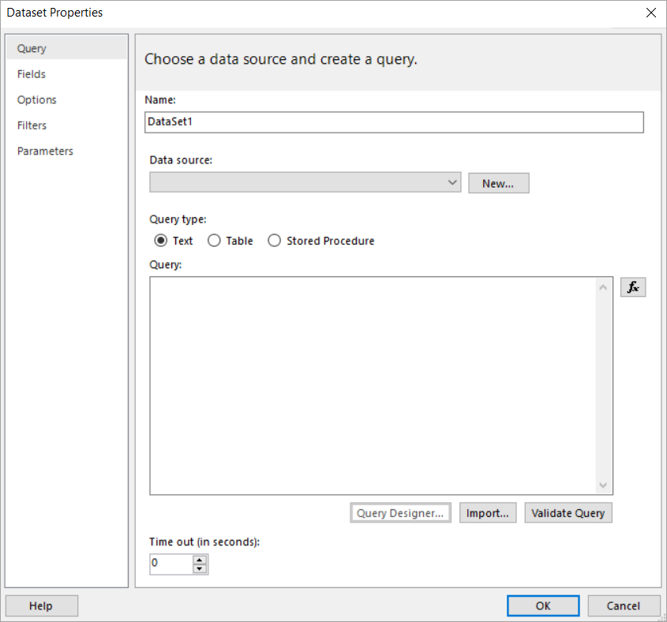

# Set time-out values for paginated report dataset processing (Power BI Report Builder)

[!INCLUDE [applies-yes-report-builder-yes-service-no-desktop](../../includes/applies-yes-report-builder-yes-service-no-desktop.md)]

Most time-out errors occur during query processing. If you are encountering time-out errors, try increasing the dataset query time-out value. 
  
## Set a query time-out for a dataset in a report  

 Query time-out values are specified during report authoring when you define an embedded dataset. The time-out value is stored with the report, in the Timeout element of the report definition. By default, this value is set to 0 seconds, which results in an infinite timeout. 
 
  
 
 Users who have permission to modify the properties of a published report can reset this value by editing the report definition file.
 The value you specify determines how long the Power BI service waits for query processing to complete when retrieving data from the report’s data source.

## Considerations and limitations

- The Power BI on-premises data gateway has a 600-second query timeout. A paginated report dataset query set to 0 seconds doesn't override the gateway timeout. The report fails with the error “_Unable to render paginated report. Data for this report could not be fetched in the allocated time. If you continue to experience this error, contact the report author or data source owner to increase the time-out._” To override the gateway timeout, set the dataset query timeout greater than 600 seconds.
- The maximum possible timeout value is 2147483646. However, configuring the dataset query timeout for this long could result in a timeout outside of the paginated report.
- The report will abort after 12 hours and you get an error. [Process large Power BI paginated reports](process-large-reports.md) has recommendations.

## Related content

- [Understand paginated report data in Power BI Report Builder](../../report-builder-data.md) 
- [Create an embedded dataset for a Power BI paginated report](../../paginated-reports-create-embedded-dataset.md)   
