# Tables in paginated reports (Power BI Report Builder)

[!INCLUDE [applies-yes-report-builder-no-desktop](../../includes/applies-yes-report-builder-no-desktop.md)]

 In Power BI Report Builder, you can use a table to display detail data or grouped data, or a combination of both in a paginated report.   
   
 You can group data by a single field, by multiple fields, or by writing your own expression. You can create nested groups or independent, adjacent groups. To display aggregated values for grouped data, add totals to groups. Format the rows and columns to highlight the data you want to emphasize. You can initially hide detail or grouped data, and include drilldown toggles to enable a user to interactively choose how much data to show.  
  
 To quickly get started with tables, see [Tutorial: Creating a Basic Table Report &#40;Power BI Report Builder&#41;](/sql/reporting-services/tutorial-creating-a-basic-table-report-report-builder) or [Create a Basic Table Report &#40;SSRS Tutorial&#41;](/sql/reporting-services/create-a-basic-table-report-ssrs-tutorial).  
  
##   Add a table to display detail data  
 Add a table to the design surface from the Insert tab on the ribbon. You can add a table by using the Table or Matrix Wizard, which includes creating a data source connection and dataset and configuring the table, or a table based on the table template, which you configure manually.  
  
  
 To describe how to configure a table from beginning to end, this topic uses the table template.  
  
 By default, a new table has a fixed number of columns with a header row for labels and a data row for detail data. The following figure shows a new table added to the design surface.  
  
 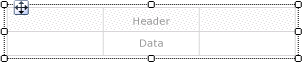  
  
 When you select the table, row and column handles appear on the outside of the table and brackets appear inside cells. Row handles display graphics that help you understand the purpose of each row. Brackets indicate group membership for a selected cell. The following figure shows a selected empty cell in a default table.  
  
 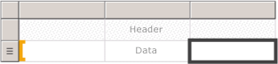  
  
 The row handle for the Data row shows the details symbol (). To display data on these rows, drag fields from the Report Data pane to the table cells in either the header or the details row. Both rows are filled in simultaneously. To add additional columns, drag the field to the table until you see an insertion point. After you add dataset fields to the table, you can change the default format for dates and currency to control the way they display in the report. The following diagram shows a table data region with these fields: Date, Order, Product, Qty, and Line Total.  
  
 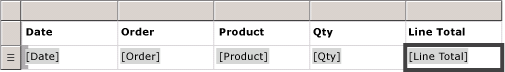  
  
 Check your design by viewing the report in Preview. The table expands down the page as needed. The label row and the details row each display once for every row in the dataset query result set. Each product sold in the order is listed on a separate row, along with the quantity and the line total for the item, as shown in the following figure:  
  
 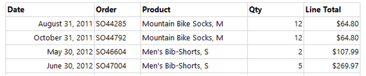  
  
 The table that you start with is a template based on the tablix data region. You can enhance the design of your table by adding features that are supported by the underlying tablix data region. For more information, see [Controlling the Tablix Data Region Display on a Report Page &#40;Power BI Report Builder&#41;](control-tablix-data-region-display-report-page.md). You can also continue to develop your table by adding row groups, column groups, and by adding or removing detail groups. For more information, see [Exploring the Flexibility of a Tablix Data Region &#40;Power BI Report Builder&#41;](explore-flexibility-tablix-data-region-report-builder.md).  
  
### Add totals for detail data  
 To add totals, select cells with numeric data, and then use the shortcut menu to automatically add labels and totals for detail data for numeric fields. You can also specify other labels and totals manually. The following figure shows a typical totals row that includes both automatic and manually specified totals:  
  
 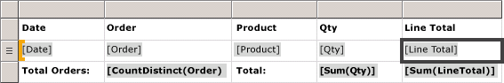  
  
 In Preview, the report displays the header row and the details row once for every row in the dataset query result set, and it displays the totals row. The following figure shows the last few rows of the table including the total row.  
  
 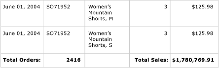  
  
 For more information, see [Add a Total to a Group or Tablix Data Region &#40;Power BI Report Builder&#41;](add-total-group-tablix-data-region-report-builder.md).  
  
##   Add row groups to a table  
 Just as you can drag a field from the Report Data pane to a cell to display detail data, you can drag a field to the Grouping pane to add a group. For a table, drag the field to the Row Groups pane. After you add a group, the table automatically adds cells in new columns in the row group area in which to display the group values. For more information about areas, see [Tablix Data Region Areas &#40;Power BI Report Builder&#41;](../../paginated-reports/report-design/render-data-regions-report-builder-service.md).  
  
 The following figure shows a table with two nested row groups in Design view. The row groups were created by dragging the Order field and then the Date field to the Row Groups pane and inserting each group as a parent of the existing groups. The figure shows a parent group based on date and a child group based on order number, as well as the details group that was defined by default.  
  
 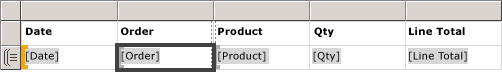  
  
 In Preview, the report displays the order data grouped first by date, and then by order, as shown in the following figure.  
  
 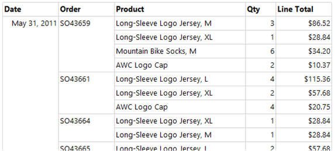  
  
 An alternative way of displaying grouped data is to indent the group hierarchy to display the nested relationship of groups instead of presenting each value in its own column. This style of formatting is called a stepped report. For more information about how to format group information as a stepped report, see [Create a Stepped Report &#40;Power BI Report Builder&#41;](../../paginated-reports/report-design/create-stepped-report-report-builder.md).  
  
### Add totals to row groups  
 To show totals for a group, you can use the context-sensitive **Add Total** command. For a row group, the Add Total command adds a row outside the group so that it repeats only once in relation to the group. For nested groups, the total row for the child group is outside the child group but inside the parent group. In such a case, it is useful to set the background color of the total row for the child group to distinguish it from the detail rows. You can also use a different background color to distinguish the table header and footer rows. The following figure shows the table with a total row added for the group based on order numbers.  
  
 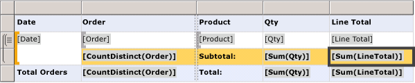  
  
 When you view the report, the row displaying the order subtotals repeats once for every order number. The table footer displays totals for all dates. In the following figure, the last few rows show the last three detail rows, the subtotal for the last order number SO71952, and the totals for all dates in the table.  
  
 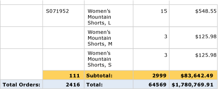  
  
 For more information, see [Add a Total to a Group or Tablix Data Region &#40;Power BI Report Builder&#41;](add-total-group-tablix-data-region-report-builder.md).  
  
##   Remove or hide detail rows  
 After you preview a table in a report, you may decide to remove existing detail rows. Or you might decide to hide them by default and allow the user to toggle between viewing more or less detail, as in a drilldown report.  
  
 To remove detail rows from a table, use the Grouping pane. Select the detail group, and use the shortcut menu to delete the group and the rows that display the detail data. The following figure shows the design view for a table grouped by date and order number, but with no detail rows. No total rows have been added to this table.  
  
 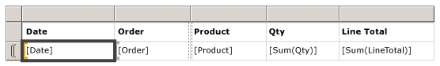  
  
 After you delete the details row, values are scoped to the row groups. The detail data no longer displays.  
  
> [!NOTE]  
>  Verify that after you remove a details row, the expression in each cell specifies an aggregate expression where appropriate. If necessary, edit the expression to specify aggregate functions as needed.  
  
 The following figure shows this report in Preview.  
  
 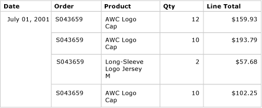  
  
 To add or remove rows from the table, see [Insert or Delete a Row &#40;Power BI Report Builder&#41;](insert-delete-row-report-builder.md).  
  
 You can also hide the detail rows when the report is initially viewed. To do so, you can create a drilldown report, in which only the parent group data is displayed. For each inner group (including the details group), add a visibility toggle to the grouping cell of the containing group. For example, for the details group, add a toggle to the text box that displays the order number group value. For the order number group, add a toggle to the text box that displays the date group value. The following figure shows the row for September 01, 2001, expanded to display the first few orders.  
  
 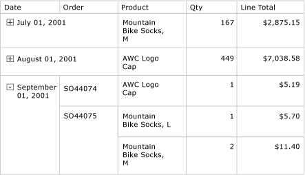  
  
 For more information, see [Add an Expand or Collapse Action to an Item &#40;Power BI Report Builder&#41;](/sql/reporting-services/report-design/add-an-expand-or-collapse-action-to-an-item-report-builder-and-ssrs).  
  
## Related content

- [Filter, Group, and Sort Data &#40;Power BI Report Builder&#41;](../../paginated-reports/report-design/filter-group-sort-data-report-builder.md)   
- [Expressions &#40;Power BI Report Builder&#41;](../../paginated-reports/expressions/report-builder-expressions.md)   
- [Expression Examples &#40;Power BI Report Builder&#41;](../../paginated-reports/expressions/report-builder-expression-examples.md)   
- [Tables, Matrices, and Lists &#40;Power BI Report Builder&#41;](../../paginated-reports/report-builder-tables-matrices-lists.md)  
  
  
