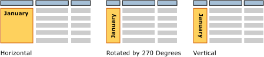

# Text boxes in paginated reports (Power BI Report Builder)

[!INCLUDE [applies-yes-report-builder-no-desktop](../../../includes/applies-yes-report-builder-no-desktop.md)]

  When you think of a text box in a Power BI paginated report, you probably think of a stand-alone box containing text on a surface like in [!INCLUDE[msCoName](../../../includes/msconame-md.md)] Office PowerPoint. In paginated reports, some text boxes are like that, and they can display static text for titles, descriptions, and labels, or dynamic text based on expressions. But every cell in a table or matrix (a tablix data region) also contains a text box, which you can format the same way you format stand-alone text boxes in your report.  
  
If you drag a report dataset field value directly to the report design surface, or to a text box on the report design surface, you only see the first value in the result set when you run the report. To see all the values for a field, you need to create a table, matrix, or list *data region* first, and drag the field to a cell in the data region. That way, when you run the report, you will see all the values in that field.  
  
 To show repeating text in a free-form layout, create a *list* data region and place the text box in it. Use a list when you want to repeat a form for multiple values, for example, a customer invoice form repeated once for each customer. Read more about [creating invoices and forms with lists](/sql/reporting-services/report-design/create-invoices-and-forms-with-lists-report-builder-and-ssrs).  
  
 Use a *rectangle* container when you want to control the text box layout and white space below the last text box. For more information, see [Rectangles and Lines &#40;Report Builder and Service&#41;](/sql/reporting-services/report-design/rectangles-and-lines-report-builder-and-ssrs).  
  
 The expressions in a text box can contain literal text, point to a field in the database, or calculate data. All expressions are shown as placeholder text so that you can format numbers, colors, and other appearance properties. You can also combine placeholders with literal text in the same text box.  
  
 You can format text in any single text box with multiple fonts, colors, styles, and actions. For more information, see [Formatting Text and Placeholders &#40;Report Builder and Service&#41;](/sql/reporting-services/report-design/formatting-text-and-placeholders-report-builder-and-ssrs).  

##   Grow or shrink a text box  
 By default, text boxes are a fixed size. You can allow a text box to shrink or expand vertically based on its contents. For more information, see [Allow a Text Box to Grow or Shrink &#40;Report Builder and Service&#41;](/sql/reporting-services/report-design/allow-a-text-box-to-grow-or-shrink-report-builder-and-ssrs).  
  
## Rotate a text box  
 Rotating text boxes can help you create more readable reports, support locale-specific text orientation, fit more columns on a printed report that has fixed page size, and create reports with more graphical appeal. A text box can be rotated in different directions: horizontal, vertical (rotated 90 degrees), or rotated by 270 degrees. The vertical option is most commonly used for East Asian languages that are written top to bottom. In most renderers the vertical option handles the glyph rotation properly so that the text is written top to bottom, but the characters are not on their sides. For other languages, in the vertical and 270-degree options the text is written sideways.  
  
 You can rotate text boxes that contain static text, fields from a report dataset, or calculated data. The text box can be stand-alone in the report body, in a table or matrix, or in a report header and footer.  
  
 The following picture shows three versions of a table report that groups data by month. The text box that contains the month value uses a different text box orientation.  
  
  
  
 Orientation is set on the text box and applies to all the text in the box. You can't specify a different orientation for parts of the text box.  
  
 To get started, see [Set Text Box Orientation &#40;Power BI Report Builder&#41;](set-text-box-orientation-report-builder-and-service.md). Then try it in the section on rotating text in the [Tutorial: Format Text &#40;Report Builder&#41;](/sql/reporting-services/tutorial-format-text-report-builder).  
  
##   How-to topics  

- [Add, Move, or Delete a Text Box &#40;Power BI Report Builder&#41;](add-move-or-delete-a-text-box-report-builder-and-service.md)  
- [Format Text in a Text Box &#40;Power BI Report Builder&#41;](format-text-in-a-text-box-report-builder-and-service.md)
- [Set Text Box Orientation &#40;Power BI Report Builder&#41;](set-text-box-orientation-report-builder-and-service.md)
- [Allow a Text Box to Grow or Shrink &#40;Power BI Report Builder&#41;](allow-a-text-box-to-grow-or-shrink-report-builder-and-service.md)
  
## Related content

- [Formatting Text and Placeholders &#40;Report Builder&#41;](/sql/reporting-services/report-design/formatting-text-and-placeholders-report-builder-and-ssrs)   
- [Formatting Numbers and Dates &#40;Report Builder&#41;](/sql/reporting-services/report-design/formatting-numbers-and-dates-report-builder-and-ssrs)  
  
  
