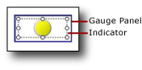

# Add or delete an indicator in Power BI paginated report (Power BI Report Builder)

[!INCLUDE [applies-yes-report-builder-no-desktop](../../../includes/applies-yes-report-builder-no-desktop.md)]

  In a Power BI paginated report, indicators are minimal gauges that convey the state of a single data value at a glance. For more information about them, see [Indicators &#40;Power BI Report Builder&#41;](/sql/reporting-services/report-design/indicators-report-builder-and-ssrs).  
  
 Indicators are commonly placed in cells in a table or matrix, but you can also use indicators by themselves, side-by-side with gauges, or embedded in gauges.  
  
 When you first add an indicator, it is by default configured to use percentages as measurement units. The percentage ranges are evenly distributed across members of the indicator set, and the scope of values shown by the indicator is the parent of the indicator such as a table or matrix.  
  
 You can update the values and states of indicators. For more information, see the following topics:  
  
- [Change indicator icons and indicator sets in Power BI paginated report (Power BI Report Builder)](change-indicator-icons-indicator-sets-report-builder.md)
  
- [Set and Configure Measurement Units &#40;Power BI Report Builder&#41;](/sql/reporting-services/report-design/set-and-configure-measurement-units-report-builder-and-ssrs)  
  
- [Set Synchronization Scope &#40;Power BI Report Builder&#41;](/sql/reporting-services/report-design/set-synchronization-scope-report-builder-and-ssrs)  
  
 Because an indicator is positioned inside the gauge panel, you need to select the indicator instead of the panel when you want to configure the indicator by using the **Indicators Properties** dialog box or the **Properties** pane. The following picture shows a selected indicator in its gauge panel.  
  
   
  
> [!NOTE]  
> Depending on column width and the length of data values, the text in table or matrix cells might wrap and display text on multiple lines. When this occurs, the indicator icon might be stretched and change shape. This can make the indicator icon less readable. Place the indicator inside a rectangle to ensure that the icon is never stretched.  
  
## Add an indicator to a table or matrix  
  
1.  Open an existing report or create a new report that contains a table and matrix with the data you want to display. For more information, see [Tables &#40;Power BI Report Builder&#41;](/sql/reporting-services/report-design/tables-report-builder-and-ssrs) or [Matrices](/sql/reporting-services/report-design/create-a-matrix-report-builder-and-ssrs).  
  
2.  Insert a column in your table or matrix. For more information, see [Insert or Delete a Column &#40;Power BI Report Builder&#41;](/sql/reporting-services/report-design/insert-or-delete-a-column-report-builder-and-ssrs).  
  
3.  Optionally, on the **Insert** tab, select **Rectangle**, and then select a cell in the new column.  
  
4.  On the **Insert** tab, select **Indicator**, and then select a cell in the new column.  
  
     If you added a rectangle to a cell, select that cell.  
  
5.  In the **Select Indicator Style** dialog box, in the left pane, select the indicator type you want, and then select the indicator set.  
  
6.  Select **OK**.  
  
7.  Select the indicator. The **Gauge Data** pane opens.  
  
8.  In the **Values** area, in the **(Unspecified)** drop-down list, select the field whose values you want to display as an indicator.  
  
     The indicator is configured to use default values. By default, indicators are configured use percentages as measurement units and the percentage ranges are evenly distributed across the members of the indicator and the value that the indicator conveys uses the scope of the nearest group.  
  
## Delete an indicator to a table or matrix  
  
1.  Right-click the indicator to delete and select **Delete**.  
  
    > [!NOTE]  
    >  An indicator might be positioned inside a gauge panel that contains other indicators or gauges. If the gauge panels contain multiple items, be sure to select the indicator to delete it, not the gauge panel. If you select and then delete the gauge panel, the gauge panels and all the items in it are deleted.  
  
2.  Select **Delete**.  
  
## Related content  

- [Indicators &#40;Power BI Report Builder&#41;](/sql/reporting-services/report-design/indicators-report-builder-and-ssrs)  
  
  
