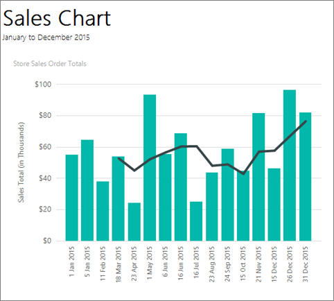

# Add a moving average to a chart in Power BI paginated report (Power BI Report Builder)

[!INCLUDE [applies-yes-report-builder-no-desktop](../../../includes/applies-yes-report-builder-no-desktop.md)]

A moving average is an average of the data in your series, calculated over a defined period of time. In Power BI paginated reports, the moving average can be shown on the chart to identify significant trends.  

  
 The Moving Average formula is the most popular price indicator used in technical analyses. Many other formulas, including mean, median and standard deviation, can also be derived from a series on the chart. When you specify a moving average, each formula may have one or more parameters that must be specified.  
 
 The [Tutorial: Add a Column Chart to Your Report (Power BI Report Builder)](/sql/reporting-services/tutorial-add-a-column-chart-to-your-report-report-builder) walks you through adding a moving average to a chart, if you'd like to try it with sample data.
  
 When a moving average formula is added in Design mode, the line series that is added is only a visual placeholder. The chart will calculate the data points of each formula during report processing.  
  
 Built-in support for trend lines isn't available in Power BI services.
  
 
  
## Add a calculated moving average to a series on the chart  
  
1.  Right-click on a field in the **Values** area and select **Add Calculated Series**. The **Calculated Series Properties** dialog box opens.  
  
2.  Select the **Moving average** option from the **Formula** drop-down list.  
  
3.  Specify an integer value for the **Period** that represents the period of the moving average.  
  
    > [!NOTE]  
    >  The period is the number of days used to calculate a moving average. If date/time values are not specified on the x-axis, the period is represented by the number of data points used to calculate a moving average. If there is only one data point, the moving average formula does not calculate. The moving average is calculated starting at the second point. If you specify the **Start from first point** option, the chart will start the moving average at the first point. If there is only one data point, the point in the calculated moving average will be identical to the first point in your original series.  
  
## Related content

- [Tutorial: Add a Column Chart to Your Report (Power BI Report Builder)](/sql/reporting-services/tutorial-add-a-column-chart-to-your-report-report-builder)
- [Formatting a Chart &#40;Power BI Report Builder&#41;](/sql/reporting-services/report-design/formatting-a-chart-report-builder-and-ssrs)   
- [Charts &#40;Power BI Report Builder&#41;](charts-report-builder.md)   
- [Add empty points to chart in Power BI paginated report (Power BI Report Builder)](add-empty-points-chart-report-builder.md)
  
  
