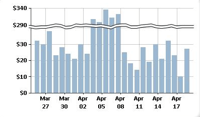

# Add scale breaks to a paginated report chart (Power BI Report Builder)

[!INCLUDE [applies-yes-report-builder-no-desktop](../../../includes/applies-yes-report-builder-no-desktop.md)]

  A scale break is a stripe drawn across the plotting area of a chart to denote a break in continuity between the high and low values on a value axis (usually the vertical, or y-axis). Use a scale break to display two distinct ranges in the same chart area in Power BI paginated report.  
  
   
  
> [!NOTE]  
>  You cannot specify where to place a scale break on your chart. The chart uses its own calculations based on the values in your dataset to determine whether there is sufficient separation between data ranges to draw a scale break on the value axis (y-axis) at run time.  
  

## Enable scale breaks on the chart  
  
1. Right-click the vertical axis and then select **Axis Properties**. The **VerticalAxis Properties** dialog box opens.  
  
1. Select the **Enable scale breaks** check box.  
  
## Change the style of the scale break  
  
1. Open the Properties pane.  
  
1. On the design surface, right-click on the y-axis of the chart. The properties for the y-axis object (named Chart Axis by default) are displayed in the Properties pane.  
  
1. In the **Scale** section, expand the ScaleBreakStyle property.  
  
1. Change the values for ScaleBreakStyle properties, such as BreakLineType and Spacing. For more information about scale break properties, see [Displaying a Series with Multiple Data Ranges on a Chart &#40;Power BI Report Builder&#41;](/sql/reporting-services/report-design/displaying-a-series-with-multiple-data-ranges-on-a-chart).  

## Related content

- [Charts](charts-report-builder.md)
- [Formatting a Chart](formatting-chart-report-builder.md)
