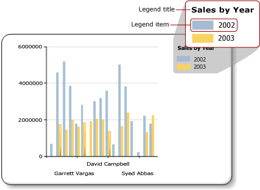

# Format the legend on a paginated report chart (Power BI Report Builder)

[!INCLUDE [applies-yes-report-builder-no-desktop](../../../includes/applies-yes-report-builder-no-desktop.md)]

The chart legend contains descriptions for each category in a Power BI paginated report chart. A legend always contains one or more legend items, where each legend item consists of a colored box that represents the series, and a text string that describes the series, as indicated in the following illustration.  
  
   
  
 A legend item is connected to an individual series on the chart, except for Shape charts, where the legend is connected to individual data points. The chart automatically adds items into the legend based on the series that are generated from your data.  
  
 You can format a legend by using the **Legend Properties** dialog box or by using the Properties pane. Right-click the legend and select **Legend Properties** to change values for the legend text, background color, borders, and 3D effects. To change values for the legend title, select the legend, right-click the legend title, and select **Legend Title Properties**.  
  
 You cannot add images, extra columns or other supplementary items to the legend.  

## Order legend items in the legend  
 Series are ordered in the legend according to the order that they are processed by the Power BI Report Builder processing engine. You can change the order by changing the order of fields in the data fields drop-zone. If you are using series grouping, the series data is not known until processing, so that there is no way for you to re-order these items. The changes can be seen in Preview. For more information about series grouping, see [Charts &#40;Power BI Report Builder&#41;](charts-report-builder.md).  
  
 You can hide any series from being shown in the legend. If you are using series grouping, all series related to the data field will be hidden. For more information, see [Hide Legend Items on the Chart &#40;Power BI Report Builder&#41;](/sql/reporting-services/report-design/chart-legend-hide-items-report-builder).  
  
## Change the text or color of a legend item in the legend  
 When a field is placed in the data field drop-zone of a chart, a legend item is automatically generated that contains the name of this field. By default, the text of each legend item is taken from the name of the data field. Every legend item is connected to an individual series on the chart with the exception of Shape charts, where the legend is connected to individual data points instead of individual series. When a category group is defined on a Shape chart, the text of each legend item is taken from the string representation of the category group. You can specify custom label text for pie, doughnut and funnel charts to show information other than the category group label that relates to each individual data point in the legend. To do this, select the legend and specify legend text in either the **Series Properties** dialog box or the **LegendText** property in the Properties pane. For more information, see [Change the Text of a Legend Item &#40;Power BI Report Builder&#41;](/sql/reporting-services/report-design/chart-legend-change-item-text-report-builder).  
  
 You can also specify chart-specific, case-sensitive keywords for commonly referenced attributes in the **LegendText** property or in the **Series Properties** dialog box. The chart control replaces these keywords at run time with their data representation. This approach is useful on Shape charts because you are able to show information relating to specific data points. For more information, see [Formatting Data Points on a Chart &#40;Power BI Report Builder&#41;](/sql/reporting-services/report-design/formatting-data-points-on-a-chart-report-builder-and-ssrs).  
  
 The colored box displayed for each legend item is inherited from the fill color of its corresponding series. If you want to change the color displayed in a legend item, you will have to change the color of the corresponding series. For more information, see [Formatting Series Colors on a Chart &#40;Power BI Report Builder&#41;](/sql/reporting-services/report-design/formatting-series-colors-on-a-chart-report-builder-and-ssrs).  
  
## Remove extra legend items from the legend  
 The legend is always connected to a series. If a legend item appears in the legend but the corresponding series is not displayed in the chart, the most likely cause is that the series does not contain any values. You must remove this series in order to remove the legend item from the legend. To remove a series from your chart, you can right-click the specified series and select the Delete Series option.  
  
## Reposition the legend  
 The chart area is the rectangular area that encompasses the axis labels and the plotting area. You can drag the legend to one of twelve different positions when the legend is placed outside the chart area. By default, the legend is shown outside the chart area. You can also set the position in the **Legend Properties** dialog box.  
  
 You cannot drag the legend inside or outside the chart area. If you want to position the legend inside the chart area, on the **Legend Properties** dialog box, under **Docking**, select **Default** from the drop-down list and clear the **Show legend outside chart area** option. By placing the legend inside the chart area, you can maximize space for data points on the chart. However, depending on the dataset, it can cause the legend to overlap some data points on the chart area, making the chart more difficult to read.  
  
## Display legend items horizontally  
 By default, the legend is formatted as a list of one or more rows containing one legend item each. The legend area expands to accommodate the number of legend items. If the legend cannot expand, an ellipsis (...) is displayed. Depending on the specified legend style, the legend can expand vertically or horizontally. You can change the layout style on the **Legend Properties** dialog box or change the allocated space to display all the legend items.  
  
 To display the legend horizontally, dock the legend to the top or bottom of the chart. This causes the legend to expand horizontally. You can also set the Layout property to **Row** or **Wide Table**. Set the MaxAutoSize property in the Properties pane to control the vertical space allocated to the legend when it is docked at the top or bottom of the chart area.  
  
## Format the legend text  
 You can change the font, size, style, and color of legend text on the **Font** page of the **Legend Properties** dialog box.  
  
 By default, the legend text is not optimized to fit the legend area. To cause the legend text to automatically fit the allocated space, set the AutoFitTextDisabled property to **False** and set a minimum font size for the MinFontSize property to the lowest font size that you think will be presentable and still allow for legend optimization.  
  
## Related content

- [Legend Properties Dialog Box, General &#40;Power BI Report Builder&#41;](/sql/reporting-services/report-design/chart-legend-formatting-report-builder)   
- [Change the Text of a Legend Item &#40;Power BI Report Builder&#41;](/sql/reporting-services/report-design/chart-legend-change-item-text-report-builder)   
- [Formatting a Chart &#40;Power BI Report Builder&#41;](formatting-chart-report-builder.md) 
- [Formatting Series Colors on a Chart &#40;Power BI Report Builder&#41;](/sql/reporting-services/report-design/formatting-series-colors-on-a-chart-report-builder-and-ssrs)   
- [Charts &#40;Power BI Report Builder&#41;](charts-report-builder.md)   
- [Hide Legend Items on the Chart &#40;Power BI Report Builder&#41;](/sql/reporting-services/report-design/chart-legend-hide-items-report-builder)   
- [Define Colors on a Chart Using a Palette &#40;Power BI Report Builder&#41;](/sql/reporting-services/report-design/define-colors-on-a-chart-using-a-palette-report-builder-and-ssrs)  
  