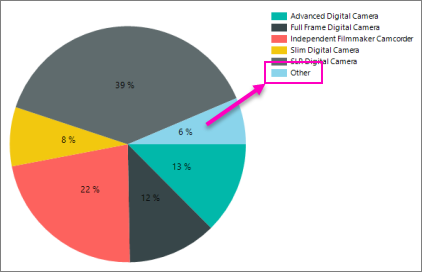

# Display percentage values on pie charts in Power BI paginated report (Power BI Report Builder)

[!INCLUDE [applies-yes-report-builder-no-desktop](../../../includes/applies-yes-report-builder-no-desktop.md)]

In Power BI paginated reports, by default the legend shows categories. You may also want percentages in the legend or the pie slices themselves.

 

 The [Tutorial: Add a Pie Chart to Your Report (Power BI Report Builder)](/sql/reporting-services/tutorial-add-a-pie-chart-to-your-report-report-builder) walks you through adding percentages to pie slices, if you'd like to try this with sample data first.
 
  
## Display percentage values as labels on a pie chart  
  
1. Add a pie chart to your report. For more information, see [Add a Chart to a Report &#40;Power BI Report Builder&#41;](add-chart-report-report-builder.md).  
  
1. On the design surface, right-click on the pie and select **Show Data Labels**. The data labels should appear within each slice on the pie chart.  
  
1. On the design surface, right-click on the labels and select **Series Label Properties**. The **Series Label Properties** dialog box appears.  
  
1. Type **#PERCENT** for the **Label data** option.  
  
1. (Optional) To specify how many decimal places the label shows, type "#PERCENT{P*n*}" where *n* is the number of decimal places to display. For example, to display no decimal places, type "#PERCENT{P0}".  
  
## Display percentage values in the legend of a pie chart  
  
1. On the design surface, right-click on the pie chart and select **Series Properties**. The **Series Properties** dialog box displays.  
  
1. In **Legend**, type **#PERCENT** for the **Custom legend text** property.  
  
## Related content

* [Tutorial: Add a Pie Chart to Your Report (Power BI Report Builder)](/sql/reporting-services/tutorial-add-a-pie-chart-to-your-report-report-builder)
* [Pie Charts &#40;Power BI Report Builder&#41;](/sql/reporting-services/report-design/pie-charts-report-builder-and-ssrs)   
* [Formatting the Legend on a Chart &#40;Power BI Report Builder&#41;](/sql/reporting-services/report-design/chart-legend-formatting-report-builder)   
* [Display Data Point Labels Outside a Pie Chart &#40;Power BI Report Builder&#41;](/sql/reporting-services/report-design/display-data-point-labels-outside-a-pie-chart-report-builder-and-ssrs)   
