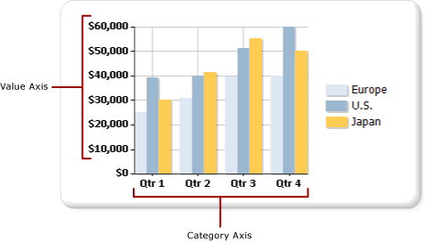

# Format axis labels on a paginated report chart (Power BI Report Builder)

[!INCLUDE [applies-yes-report-builder-no-desktop](../../../includes/applies-yes-report-builder-no-desktop.md)]

Coordinate-based chart types (column, bar, area, point, line, and range) have two axes that are used to categorize and display data relationships in a paginated report. Different types of formatting are applied to each axis.  
  
 You can format axes by using the **Axis Properties** dialog box or by using the Properties pane. Right-click the axis you want to format and click **Axis Properties** to change values for the axis text, numeric and date formats, major and minor tick marks, auto-fitting for labels, and the thickness, color, and style of the axis line. To change values for the axis title, right-click the axis title, and click **Axis Title Properties**.  
  
 Axis labels identify major intervals on the chart. By default, the chart uses an algorithm to determine how the labels should be optimally placed on the axis to avoid overlapping text.  
  
  
## Types of axes  
 The chart has two primary axes: the value axis and the category axis.  
  
   
  
 When you drag a field from your dataset onto the chart surface, the chart determines whether this field belongs on the category or value axis.  
  
 The value axis is usually the vertical axis, or y-axis, of the chart. It is used to display numeric data values that are being charted. A field that you drag into the data fields region is plotted on the value axis. The category axis is usually the horizontal axis, or x-axis, of the chart. For bar charts, these axes are reversed. In bar chart types, the category axis is the vertical axis and the value axis is the horizontal axis. For more information, see [Bar Charts &#40;Power BI Report Builder&#41;](/sql/reporting-services/report-design/bar-charts-report-builder-and-ssrs).  
  
## How the chart calculates axis label intervals  
 Before you format axis labels, you should understand how the chart calculates axis label intervals. This understanding enables you to set the properties necessary to achieve the axis labeling behavior that you want.  
  
 The axis scale is bound by a minimum and a maximum value that define the data range to be displayed along the axis. The chart calculates the minimum and maximum value along each axis based on the values in your result set. On the value axis, the scale is always determined by the smallest and largest number in the value field. On the category axis, the minimum and maximum value types are determined depending on the type of your category field. Any field in a dataset can be categorized into one of three category field types. The following table illustrates these three types of category fields.  
  
|Category Field Type|Description|Example|  
|-------------------------|-----------------|-------------|  
|Numeric|Categories are plotted in numeric order along the x-axis.|A sales report by employee identification number displays the employee identification numbers along the x-axis.|  
|Date/time|Categories are plotted in chronological order along the x-axis.|A sales report by month displays formatted dates along the x-axis.|  
|Strings|Categories are plotted in the order it first appears in the data source along the x-axis.|A sales report by region displays region names along the x-axis.|  
  
 All chart types with two axes are designed to suppress some axis labels when there are too many categories to fit. Suppressing some labels produces a cleaner image on the chart and avoids label collisions.  
  
 The application calculates where labels are placed on an axis according to the following steps:  
  
1. Minimum and maximum values are identified based on the values in the result set.  
  
1. An equidistant number of axis intervals, usually between four and six, are calculated based on these minimum and maximum values.  
  
1. Based on the axis label properties, labels are displayed at these intervals. Properties that affect label placement include font size, the angle at which the labels are displayed, and text wrapping properties. These axis label auto-fit options can be changed.  
  
### Example of how the chart calculates axis labels  
 The table shown here contains sample sales data to be plotted on a column chart. The Name field is added to the Category Groups area, and the Quantity field is added to the Values area.  
  
|Name|Quantity|  
|----------|--------------|  
|Michael Blythe|229|  
|Jae Pak|112|  
|Ranjit Varkey Chudukatil|494|  
|Jillian Carson|247|  
|Linda Mitchell|339|  
|Rachel Valdez|194|  
  
 The Quantity field is plotted along the value -axis. The lowest value is 112 and the highest value is 494. In this case, the chart calculates the scale to start at 0 and end at 500. The chart also calculates five equidistant intervals of 100, and creates labels at 0, 100, 200, 300, 400, and 500.  
  
 The Name field is plotted along the category axis. The chart calculates between four and six labels and it calculates auto-fit settings to determine how the labels can fit on the category axis without causing label collisions. As a result, some category labels might be omitted. You can override auto-fitting options for each axis independently.  
  
## Display all labels on the category axis  
 On the value axis, axis intervals provide a consistent measure of the data points on the chart. However, on the category axis, this functionality can cause categories to appear without axis labels. Typically, you want all categories to be labeled. You can set the number of intervals to 1 to show all categories.  For more information, see [Specify an axis interval in a Power BI paginated report (Power BI Report Builder)](specify-axis-interval-report-builder.md).  
  
> [!NOTE]  
>  By superseding the automatic labeling features with a manual interval on an axis, the chart must resize all other elements appropriately. As a result, you may encounter unpredictable results with the sizing and positioning of the labels, or the size of other elements on the chart.  
  
## Variable axis intervals  
 The chart calculates approximately five axis label intervals regardless of the size of the chart. On wider or taller charts, if you show only five labels on an axis, large gaps can appear between each label. This makes it more difficult to identify the value of each data point against the axis. To avoid this behavior on wider or taller charts, you can set a variable axis interval. The chart calculates the optimal number of labels that can appear on the axis based on the width or height of the chart, depending on the corresponding axis. For more information, see [Specify an axis interval in a Power BI paginated report (Power BI Report Builder)](specify-axis-interval-report-builder.md).  
  
## Sort axis values  
 Categories appear along the x-axis in the order that they appear in the result set. You can change the group order by adding a SORT command to the query or by sorting the dataset using an expression. Chart data regions are sorted the same as all other data regions. For more information about how to sort data, see [Sort Data in a Data Region &#40;Power BI Report Builder&#41;](/sql/reporting-services/report-design/sort-data-in-a-data-region-report-builder-and-ssrs).  
  
## Specify scalar values on the category axis  
 By default, the chart only displays axis labels for data points in the dataset that contain valid values. For example, if you have values of 1, 2, and 6 on the category axis, the chart only shows categories 1, 2, and 6. To maintain the scale of category values, you can specify the chart to use a scalar axis. In this scenario, the chart shows labels for 1-6 on the x-axis of the chart, even though your dataset does not contain values for 3-5.  
  
 There are two ways to set a scalar axis:  
  
- Select the **Scalar axis** option in the **Axis Properties** dialog box. This option adds numeric or date/time values to the axis where no data grouping values exist.
  
- Select a field or type an expression for the **Category field** option in the **Series Properties** dialog box. The chart adds axis intervals for all values in the category field you specified.  
  
## Add or remove side margins from the category axis  
 In Bar, Column and Scatter chart types, the chart automatically adds side margins on the ends of the x-axis. You cannot change the size of the margin. In all other chart types, the chart does not add side margins. For more information, see [Add or Remove Margins from a Chart &#40;Power BI Report Builder&#41;](/sql/reporting-services/report-design/add-or-remove-margins-from-a-chart-report-builder-and-ssrs).  
  
## In this section  

 [Format Axis Labels as Dates or Currencies &#40;Power BI Report Builder&#41;](format-axis-labels-dates-currencies-report-builder.md)  
  
 [Position Labels in a Chart &#40;Power BI Report Builder&#41;](position-labels-chart-report-builder.md)  
  
 [Specify an axis interval in a Power BI paginated report (Power BI Report Builder)](specify-axis-interval-report-builder.md)  
  
 [Add or Remove Margins from a Chart &#40;Power BI Report Builder&#41;](/sql/reporting-services/report-design/add-or-remove-margins-from-a-chart-report-builder-and-ssrs)  
  
 [Specify a Logarithmic Scale &#40;Power BI Report Builder&#41;](/sql/reporting-services/report-design/specify-a-logarithmic-scale-report-builder-and-ssrs)  
  
## Related content 

- [Formatting a Chart &#40;Power BI Report Builder&#41;](formatting-chart-report-builder.md)
- [Charts &#40;Power BI Report Builder&#41;](charts-report-builder.md)   
- [Formatting Data Points on a Chart &#40;Power BI Report Builder&#41;](/sql/reporting-services/report-design/formatting-data-points-on-a-chart-report-builder-and-ssrs)  