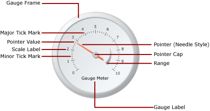
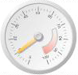
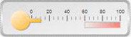

# Gauges in a paginated report (Power BI Report Builder)

[!INCLUDE [applies-yes-report-builder-no-desktop](../../../includes/applies-yes-report-builder-no-desktop.md)]

  In Power BI paginated reports, a gauge data region displays a single value from your dataset. An individual gauge is always positioned inside a gauge panel, where you can add child or adjacent gauges. Inside a single gauge panel, you can create multiple gauges that share common functions such as filtering, grouping, or sorting.  
  
 Gauges can perform many tasks in a report:  
  
- Display key performance indicators (KPIs) in a single radial or linear gauge.  
  
- Place a gauge inside a table or matrix to illustrate values inside each cell.  
  
- Use multiple gauges in a single gauge panel to compare data between fields.  
  
 There are two types of gauges: radial and linear. The following illustration shows the basic elements of a single radial gauge in the gauge panel.  
  
   
  
 For more information about using gauges as KPIs, see [Tutorial: Adding a KPI to Your Report &#40;Power BI Report Builder&#41;](/sql/reporting-services/tutorial-adding-a-kpi-to-your-report-report-builder).  

##   Gauge types  
 Power BI Report Builder provides two gauge types: radial and linear. The radial gauge is typically used when you want to express the data as a velocity. The linear gauge is used to express the data as a temperature or scale value.  
  
 The key differences between the two types are the overall shape of the gauge and the available gauge pointers. Radial gauges are circular, or degrees of circular, and resemble speedometers. The gauge pointers are often needles, but can be markers or bars.  
  
 Linear gauges are rectangular, oriented horizontally or vertically, and resemble rulers. The gauge pointers are often thermometers, but can be markers or bars. Because of its shape, this gauge type is useful for integrating into the table or matrix data regions to show progress data.  
  
 Other than these differences, the two gauge types are interchangeable. However, if you have to use a simple gauge in your report, you should consider using an indicator instead of a gauge. For more information, see [Indicators in a paginated report (Power BI Report Builder)](indicators-report-builder.md).  
  
 The following illustrations show radial and linear gauges. The radial gauge is round and uses the needle pointer. The linear gauge is horizontal and uses the thermometer pointer.  
  
### Radial gauge
  
   
  
 Radial gauge options: Radial, Radial with Mini Gauge, Two Scales, 90 Degrees Northeast, 90 Degrees Northwest, 90 Degrees Southwest, 90 Degrees Southeast, 180 Degrees North, 180 Degrees South, 180 Degrees West, 180 Degrees East, and Meter.  
  
### Linear gauge
  
   
  
 Linear gauge options: Horizontal, Vertical, Multiple Bar Pointers, Two Scales, Three Color Range, Logarithmic, Thermometer, Thermometer Fahrenheit/Celcius, and Bullet Graph.  
  
##   Add data to a gauge

 After you add a gauge to the design surface, drag a dataset field to the gauge data pane. By default, the gauge aggregates field values into one value that is shown on the gauge. That value is attached to the pointer by using the Value property. Depending on the data type of the field, the gauge uses the SUM or COUNT aggregate. When you use numeric data, appropriate to add, the gauge uses the SUM function. Otherwise, it uses the COUNT aggregate. The value of the pointer can use a different aggregate, or no aggregate.  
  
 You can add grouping to the gauge to view individual groups or individual rows on the gauge. When grouping and filtering is applied, the gauge uses the pointer value to display the last group or row in the returned dataset.  
  
 You can add multiple values to an individual gauge by adding another pointer. This pointer can belong to the same scale, or you can add another scale and then associate the pointer with that scale.  
  
 Unlike the chart types available in the **Select Chart Type** dialog box, the gauge types available in the **Select Gauge Type** dialog box are created by using a combination of gauge properties. Therefore, you cannot change the gauge type the same way you change a chart type. To change the gauge type, you must remove the gauge and re-add it to the design surface. A gauge has at least one scale and one pointer. You can have multiple scales by right-clicking the gauge and selecting **Add Scale**. By default, this creates a smaller scale that is positioned inside the first scale. The scale displays labels and tick marks. There are two sets of tick marks, minor and major.  
  
 You can have multiple pointers by right-clicking the gauge and selecting **Add Pointer**. This will create another pointer on the same scale, but if you have multiple scales, you can associate a pointer with any scale on the gauge.  
  
### Considerations when adding data to the gauge

 Like all other data regions, the gauge data region can be bound to only one dataset. If you have multiple datasets, consider using a JOIN or UNION to create one dataset, or use separate gauges for each dataset.  
  
 Numeric data types are aggregated with the SUM function. Non-numeric data types are aggregated with the COUNT function, which counts the number of instances for a particular value or field within the dataset or group.  
  
 After data is added, when you right-click the pointer, you get Clear Pointer Value and Delete Pointer options. The Clear Pointer Value option removes the field attached to the gauge, but the pointer will still appear on the gauge. The Delete Pointer option removes the field from the gauge and deletes the pointer from view. If you re-add a field to the gauge, the default pointer reappears. After you have added the field to the gauge, you must set the maximum and minimum values on the corresponding scale to give context to the value on the gauge. You can also set the minimum and maximum values on a range, which shows a critical area on the scale. The gauge will not automatically set the minimum or maximum values on the scale or the range because it cannot determine how the value should be perceived.  
  
### Methods of adding data to a gauge

 After you have defined a dataset for your report, you can add a data field to the gauge by using one of the following approaches:  
  
- Drag a field from your dataset into the data pane. Click the gauge and drag a field to it. You can open the data pane by clicking on the gauge or dragging a field across the gauge. If a pointer is not already on the gauge, a pointer is added to the gauge and bound to the field you have added.  
  
- Display the data pane and point to the field placeholder. Click the down arrow next to the field placeholder and select the field that you want to use. If there is a field already selected, click the down arrow, and then select a different field.  
  
    > [!NOTE]  
    > This approach is not applicable when there is no pointer on the gauge or the report contains more than one dataset and the gauge panel is not associated with a dataset.  
  
- Right-click on the gauge pointer and select **Pointer Properties**. For **Value**, select a field from the drop-down list or define a field expression by clicking the **Expression** (*fx*) button.  
  
### Aggregate fields into a single value

 When a field is added to a gauge, Power BI paginated reports calculates an aggregate for the field by default. Numeric data types are aggregated with the SUM function. Non-numeric data types are aggregated with the COUNT function, which counts the number of instances for a particular value or field within the dataset or group. If the data type of your value field is String, the gauge cannot display a numeric value, even if there are numerals in the fields. Instead, the gauge aggregates string fields using the COUNT function. To avoid this behavior, make sure that the fields you use have numeric data types, as opposed to strings that contain formatted numbers. You can use a Visual Basic expression to convert String values to a numeric data type using the CDbl or CInt constant. For example, the following expression converts a string field called MyField to numeric values.  
  
 `=Sum(CDbl(Fields!MyField.Value))`  
  
 For more information about aggregate expressions, see [Aggregate Functions Reference (Power BI Report Builder)](/sql/reporting-services/report-design/report-builder-functions-aggregate-functions-reference).  
  
### Define a group on a gauge

 After you have added a field to the gauge, you can add one data group. The gauge differs from all other data regions in Power BI paginated reports, which can display multiple groups in one data region. When you add a group by defining a group expression on the gauge, it is the same as when you add a row group on the Tablix data region. However, when the group is added, only the value of the last group is displayed as the pointer value on the gauge. For example, if you add a grouping expression on Year, the pointer will point to the value that represents the aggregate sales value for the last year in the dataset. For more information about groups, see [Understanding Groups &#40;Power BI Report Builder&#41;](/sql/reporting-services/report-design/understanding-groups-report-builder-and-ssrs).  
  
 You might want to add a group on the gauge if, for example, you are displaying multiple gauges in a table or list and you want to display data aggregated by group. For more information, see [Add or Delete a Group in a Data Region (Power BI Report Builder)](../add-delete-group-data-region-report-builder.md).  
  
##   Position elements in a gauge  
 The gauge panel is the top-level container that holds one or more gauges. You can view the **Gauge Panel Properties** dialog box by clicking just outside the gauge. Each gauge, in turn, contains several gauge elements: a gauge scale, a gauge range, and a gauge pointer. When you are using the gauge, you will need to understand how elements are measured in the gauge panel in order to modify the size and location of these elements.  
  
## Understand size and position measurements

 All size and position measurements on the gauge are calculated as a percentage of their parent element. When parent elements have different width and height values, the size of the gauge element is calculated as a percentage of the smaller of the two values. For example, on a linear gauge, all pointer measurements are calculated as a percentage of the width or height of the linear gauge, whichever is smaller.  
  
 Position measurements are also calculated as a percentage of their parent element using a coordinate system. The origin of this coordinate system is in the upper-left corner with the X axis pointing to the right and the Y axis pointing down. Coordinate values should be between 0 and 100, and all measurements are represented as a percentage. For example, when the X and Y positions of the linear gauge are set to 50 and 50, the linear gauge is positioned in the middle of the gauge panel.  
  
## Position multiple gauges inside the gauge panel  
 There are two ways to add a new gauge to a gauge panel that already contains one gauge. You can add a gauge as a child of the first one or you can add another gauge adjacent to the first one.  
  
 When a new gauge is added to a gauge panel, it is sized and positioned in equal proportion to all other gauges in the gauge panel. For example, if a radial gauge is added to a gauge panel that already contains a radial gauge, the two gauges will automatically be resized to each fit half of the panel.  
  
 You can add a new gauge to a gauge panel that already contains a gauge. To do this, right-click anywhere on the gauge panel, hover over **Add New Gauge** and select **Child**. The **Select Gauge Type** dialog box will appear. When the new gauge is added as a child, it is added in one of two ways. In a radial gauge, the child gauge is positioned in the top-left corner of the first gauge. In a linear gauge, the child gauge is positioned in the middle of the first gauge. You can position the child gauge, relative to the parent gauge, by using the Position properties. As with all other elements, position measurements are calculated as a percentage of their parent element.  
  
## Position gauge scale labels and gauge ranges  
 There are two properties that determine the position of labels on a gauge scale. You can set the gauge scale's **Placement** property to specify whether the labels are displayed inside, outside or across the scale bar. You can also specify a numeric value for the **Distance from scale** property, which specifies the number of units that are added or subtracted from the placement to determine the label position. For example, if **Placement** is set to **Outside** and you have set **Distance from scale** to 10, the labels will be positioned 10 units from the outer edge of the gauge scale, where 1 unit is either:  
  
- 1% of the gauge diameter on a radial gauge, or  
  
- 1% of the smallest value of the gauge height or width on a linear gauge.  
  
 The **Position** and **Distance from scale** properties also apply to gauge ranges.  
  
## Maintain aspect ratio on a linear gauge  
 The radial gauge assumes a circular form, so this gauge type usually maintains the same width and height values. However, on a linear gauge, which assumes a rectangular form, the proportion between the width and height is usually uneven. The aspect ratio of a gauge determines the proportion of width to height that should be maintained when the gauge is resized. For example, if this value is set to 2, the width of the gauge will always be twice the height of the gauge, no matter how the gauge is resized. To set the aspect ratio, you can set the AspectRatio property from the **Linear Gauge Properties** dialog box.  
  
##   How-to articles

 This section lists procedures that show you, step by step, how to work with gauges in your reports; how to get data to display effectively in gauges and how to add and configure gauges and their elements.  
  
- [Add a gauge to a paginated report (Power BI Report Builder)](add-gauge-to-report-report-builder.md) 
  
- [Set a minimum or maximum on a gauge &#40;Power BI Report Builder&#41;](/sql/reporting-services/report-design/set-a-minimum-or-maximum-on-a-gauge-report-builder-and-ssrs)  
  
- [Set a snapping interval on a gauge (Power BI Report Builder)](/sql/reporting-services/report-design/set-a-minimum-or-maximum-on-a-gauge-report-builder-and-ssrs)  
  
##   In this section  
 The following topics provide additional information about working with gauges.  
  
|Term|Definition|  
|-|-|  
|[Format scales on a gauge &#40;Power BI Report Builder&#41;](/sql/reporting-services/report-design/formatting-scales-on-a-gauge-report-builder-and-ssrs)|Provides general information about formatting scales on gauges and detailed information about the formatting options for scales on radial and linear gauges.|  
|[Format pointers on a gauge &#40;Power BI Report Builder&#41;](/sql/reporting-services/report-design/formatting-pointers-on-a-gauge-report-builder-and-ssrs)|Provides general information about formatting pointers on gauges and detailed information about the formatting options for pointer styles available for radial and linear gauges.|  
|[Format ranges on a gauge &#40;Power BI Report Builder&#41;](/sql/reporting-services/report-design/formatting-ranges-on-a-gauge-report-builder-and-ssrs)|Provides information about formatting ranges on gauges to indicate an important subsection of values on the gauge or visually indicate when the pointer value has gone into a certain span of values.|  
  
## Related content

- [Expressions in Power BI Report Builder](../../expressions/report-builder-expressions.md)
- [Filter, Group, and Sort Data &#40;Power BI Report Builder&#41;](../filter-group-sort-data-report-builder.md)
- [Report parameters in Power BI Report Builder](../../parameters/report-builder-parameters.md)
- [Charts in Power BI paginated reports (Power BI Report Builder)](charts-report-builder.md)
- [Tables, matrixes, and lists in Power BI Report Builder](../../report-builder-tables-matrices-lists.md)
