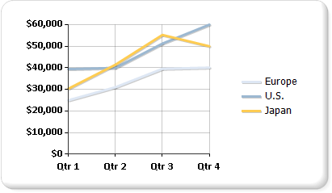

# Line charts in Power BI paginated reports (Power BI Report Builder)

[!INCLUDE [applies-yes-report-builder-no-desktop](../../../includes/applies-yes-report-builder-no-desktop.md)]

  A line chart displays a series as a set of points connected by a single line in a Power BI paginated report. Line charts are used to representing large amounts of data that occur over a continuous period of time. For more information about how to add data to a line chart, see [Charts &#40;Power BI Report Builder&#41;](charts-report-builder.md).  
  
 The following illustration shows a line chart that contains three series.  
  
   

## Variations on line charts
  
- **Smooth line**. A line chart that uses a curved line instead of a regular line.  
  
- **Stepped line**. A line chart that uses a stepped line instead of a regular line. The stepped line connects points by using a line that makes it look like steps on a ladder or staircase.  
  
- **Sparkline charts**. Variations of the line chart that show only the line series in the cell of a table or matrix. For more information, see [Sparklines and Data Bars &#40;Power BI Report Builder&#41;](/sql/reporting-services/report-design/sparklines-and-data-bars-report-builder-and-ssrs).  
  
## Data considerations for line charts  
  
- To improve the visual impact of the default line chart, consider changing the width of the series border to 3, and adding a shadow offset of 1. These changes create a bolder line chart. You need to revert these properties to their original values if you change the chart type from Line to another type.  
  
- If your dataset includes empty values, the line chart adds empty points, in the form of placeholder lines, in order to maintain continuity on the chart. If you'd rather not see these lines, consider displaying your dataset using a non-contiguous chart type such as a bar or column chart.  
  
- A line chart requires at least two points to draw a line.  If your dataset has only one data point, the line chart displays as a single data point marker.  
  
- A series that's drawn as a line doesn't take up much space within a chart area.  For this reason, line charts are frequently combined with other chart types such as column charts. However, you can't combine a line chart with bar, polar, pie or shape chart types.  
  
## Related content

- [Charts &#40;Power BI Report Builder&#41;](charts-report-builder.md)   
- [Bar Charts &#40;Power BI Report Builder&#41;](/sql/reporting-services/report-design/bar-charts-report-builder-and-ssrs)   
- [Column Charts &#40;Power BI Report Builder&#41;](column-charts-report-builder.md)   
- [Chart Types &#40;Power BI Report Builder&#41;](/sql/reporting-services/report-design/chart-types-report-builder-and-ssrs)   
- [Area Charts &#40;Power BI Report Builder&#41;](area-charts-report-builder.md)   
- [Empty and Null Data Points in Charts &#40;Power BI Report Builder&#41;](/sql/reporting-services/report-design/empty-and-null-data-points-in-charts-report-builder-and-ssrs)   
