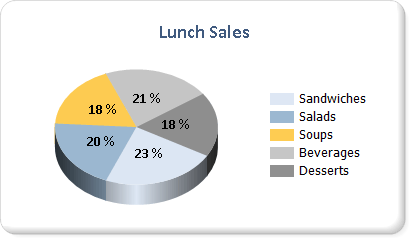
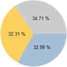

# Pie charts in Power BI paginated reports (Power BI Report Builder)

[!INCLUDE [applies-yes-report-builder-no-desktop](../../../includes/applies-yes-report-builder-no-desktop.md)]

  Pie charts and doughnut charts display data as a proportion of the whole in a paginated report. Pie charts are most commonly used to make comparisons between groups. Pie and doughnut charts, along with pyramid and funnel charts, comprise a group of charts known as shape charts. Shape charts have no axes. When a numeric field is dropped on a shape chart, the chart calculates the percentage of each value to the total. For more information on shape charts, see [Shape Charts &#40;Power BI Report Builder&#41;](shape-charts-report-builder.md).  
  
 The following illustration shows a 3-D pie chart with data labels formatted as percentages.  The legend is positioned in the right-center.  
  
   

## Variations  
  
- **Exploded pie**. A pie chart where all of the slices are moved away from the center of the pie. In addition to the exploded pie chart, in which all slices are separated, you can create an exploded slice chart, in which only one slice is called out.  
  
- **Doughnut**. A pie chart that has an open space in the center.  
  
- **Exploded doughnut**. A doughnut chart where all of the slices are moved away from the center of the doughnut.  
  
- **3D Pie**. A pie chart that has a 3-D style applied.  
  
- **3D Exploded Pie**. An exploded pie chart that has a 3-D style applied.  
  
## Data considerations for display on a pie chart  
  
- Pie charts are popular in reports because of their visual impact. However, pie charts are a very simplified chart type that may not best represent your data. Consider using a pie chart only after the data has been aggregated to seven data points or less.  
  
- Pie charts display each data group as a separate slice on the chart. You must add at least one data field and one category field to the pie chart. If more than one data field is added to a pie chart, the pie chart will display both data fields in the same chart.  
  
- Null, empty, negative, and zero values have no effect when calculating ratios. For this reason, these values are not shown on a pie chart. If you want to visually indicate these types of values on your chart, change the chart type to be something other than a pie chart.  
  
- If you are defining your own colors on a pie chart using a custom palette, be sure that you have enough colors in your palette to display each data point with its own unique color. For more information, see [Formatting Series Colors on a Chart &#40;Power BI Report Builder&#41;](/sql/reporting-services/report-design/formatting-series-colors-on-a-chart-report-builder-and-ssrs).  
  
- Unlike most other chart types, a pie chart will display individual data points, and not individual series, in its legend.  
  
- A pie chart requires at least two values in order to make a valid comparison between proportions. If your pie chart contains only one color, verify that you have added a category field to group by. When the pie chart does not contain categories, it aggregates the values from your data field into one value for display.  
  
- Like all other chart types, the pie chart generates colors based on the color values contained in the default palette. This approach might cause different pie charts to color data points differently when you are using multiple pie charts in a report. If you have several pie charts in your report, you might want to manually set colors for each category group in order to retain the same color across different charts. For more information about how to define colors on a chart, see [Formatting Series Colors on a Chart &#40;Power BI Report Builder&#41;](/sql/reporting-services/report-design/formatting-series-colors-on-a-chart-report-builder-and-ssrs).  
  
## Apply drawing styles to a pie chart

 You can add special drawing styles to the pie chart to increase its visual impact. Drawing styles include bevel and concave effects. These effects are available only on a 2-D pie chart. The following illustration shows an example of the bevel and concave drawing styles on a pie chart.  
  
   
  
 For more information, see [Chart effects: Add bevel, emboss, or texture to a paginated report chart (Power BI Report Builder)](chart-effects-add-bevel-emboss-or-texture-report-builder.md).  
  
## Display percentage values on a pie chart

 Like other shape charts, pie charts represent proportions of the total. As a result, it is common to format pie chart labels as percentages. In order to be consistent with other chart types, the chart does not display percentage labels by default. See the following articles for more information:

- How to display values as percentages on the chart: [Display Percentage Values on a Pie Chart &#40;Power BI Report Builder&#41;](/sql/reporting-services/report-design/display-percentage-values-on-a-pie-chart-report-builder-and-ssrs).
- How to format numbers as percentages in your report: [Formatting Numbers and Dates &#40;Power BI Report Builder&#41;](/sql/reporting-services/report-design/formatting-numbers-and-dates-report-builder-and-ssrs).  
  
  
  
## Prevent overlapped labels on a pie chart  

 If there are a lot of data points on a pie chart, the data labels will overlap. There are several ways to prevent labels from overlapping:  
  
- Decrease the font size of the data point labels.  
  
- Increase the width and height of your chart to allow more room for the labels.  
  
- Display pie labels outside the chart area. For more information, see [Display Data Point Labels Outside a Pie Chart &#40;Power BI Report Builder&#41;](display-data-point-labels-outside-pie-chart-report-builder.md).  
  
- Collect the small pie slices into one slice.  
  
## Consolidate small slices on a pie chart  

 When the pie chart has too many points, the data becomes obscured and hard to read. If your data has many small data points, there are two ways of collecting multiple pie slices:  
  
- Collect smaller data slices into one slice on the pie chart. This is useful in situations where, for example, you want the pie chart to have an "Other" data point that simply collects the remaining data. For more information, see [Collect small slices on Power BI paginated report pie chart (Power BI Report Builder)](collect-small-slices-pie-chart-report-builder.md).  
  
- Collect small slices into a supplementary pie chart. The second pie chart does not display in the designer. Instead, during report processing, the chart calculates if a second pie chart is necessary to be shown, based on the values of the data points. If so, the values are added into another pie chart.  
  
## Related content

- [Display Data Point Labels Outside a Pie Chart &#40;Power BI Report Builder&#41;](display-data-point-labels-outside-pie-chart-report-builder.md)
- [Collect small slices on a Power BI paginated report pie chart (Power BI Report Builder)](collect-small-slices-pie-chart-report-builder.md)
- [Display Percentage Values on a Pie Chart &#40;Power BI Report Builder&#41;](/sql/reporting-services/report-design/display-percentage-values-on-a-pie-chart-report-builder-and-ssrs)   
- [Tutorial: Add a Pie Chart to Your Report &#40;Power BI Report Builder&#41;](/sql/reporting-services/tutorial-add-a-pie-chart-to-your-report-report-builder)   
- [Formatting the Legend on a Chart &#40;Power BI Report Builder&#41;](chart-legend-formatting-report-builder.md)   
- [Empty and Null Data Points in Charts &#40;Power BI Report Builder&#41;](/sql/reporting-services/report-design/empty-and-null-data-points-in-charts-report-builder-and-ssrs)   
- [Formatting Series Colors on a Chart &#40;Power BI Report Builder&#41;](/sql/reporting-services/report-design/formatting-series-colors-on-a-chart-report-builder-and-ssrs)  
