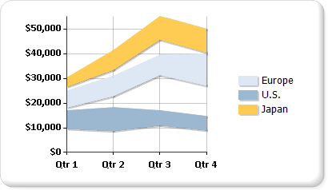

# Range charts in Power BI paginated report (Power BI Report Builder)

[!INCLUDE [applies-yes-report-builder-no-desktop](../../../includes/applies-yes-report-builder-no-desktop.md)]

  A range chart type in a Power BI paginated report displays a set of data points that are each defined by multiple values for the same category. Values are represented by the height of the marker as measured by the value axis. Category labels are displayed on the category axis. The plain range chart fills in the area between the top and bottom value for each data point.  
  
 The following illustration shows a plain range chart with three series.  
  
   
  
  
  
## Variations  
  
-   **Smooth range**. A smooth range chart displays curved lines rather than straight.  
  
-   **Column range**. A column range chart uses columns instead of areas to display the ranges.  
  
-   **Bar range**. A bar range chart uses bars instead of areas to display the ranges.  
  
## Data considerations for range charts  
  
-   Range chart types require two values per data point. These values correspond with a high value and a low value that defines the range for each data point.  
  
-   Range charts are useful for analysis only if the top values are always higher than the bottom values. If this is not the case, consider using a line chart. If the high value is lower the low value, the range chart will display the absolute value of the difference between these values.  
  
-   If only one value is specified, the range chart will display as if it were a regular area chart, with one value per data point.  
  
-   Range charts are often used to graph data that contains minimum and maximum values for each category group in the dataset.  
  
-   Displaying markers on each data point is not supported on the range chart.  
  
-   Like the area chart, in a plain range chart, if the values in multiple series are similar, the series will overlap. In this scenario, you may want to use a column range or bar range chart instead of a plain range chart.  
  
-   Gantt charts can be created using a range bar chart.  
  
## Related content

- [Charts &#40;Power BI Report Builder&#41;](charts-report-builder.md)   
- [Chart Types &#40;Power BI Report Builder&#41;](/sql/reporting-services/report-design/chart-types-report-builder-and-ssrs)   
- [Formatting a Chart &#40;Power BI Report Builder&#41;](/sql/reporting-services/report-design/formatting-a-chart-report-builder-and-ssrs)  
  
  
