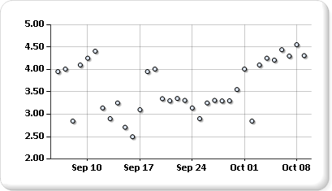

# Scatter charts in Power BI paginated report (Power BI Report Builder)

[!INCLUDE [applies-yes-report-builder-no-desktop](../../../includes/applies-yes-report-builder-no-desktop.md)]

  A scatter chart displays a series as a set of points in a Power BI paginated report. Values are represented by the position of the points on the chart. Categories are represented by different markers on the chart. Scatter charts are typically used to compare aggregated data across categories. For more information on how to add data to a scatter chart, see [Charts (Power BI Report Builder)](charts-report-builder.md)  
  
 The following illustration shows an example of a scatter chart.  
  
   
  
You create and modify Power BI paginated reports in [Power BI Report Builder](../../report-builder-power-bi.md).
  
## Variations  
  
- **Bubble.** Bubble charts display the difference between two values of a data point based on the size of the bubble. The larger the bubble, the larger the difference between the two values.  
  
- **3-D Bubble**. A bubble chart displayed in 3-D.  
  
## Data considerations for a scatter chart  
  
- Scatter charts are commonly used for displaying and comparing numeric values, such as scientific, statistical, and engineering data.  
  
- Use the scatter chart when you want to compare large numbers of data points without regard to time. The more data that you include in a scatter chart, the better the comparisons that you can make.  
  
- The bubble chart requires two values (top and bottom) per data point.  
  
- Scatter charts are ideal for handling the distribution of values and clusters of data points. This is the best chart type if your dataset contains many points (for example, several thousand points). Displaying multiple series on a point chart is visually distracting and should be avoided. In this scenario, consider using a line chart.  
  
- By default, scatter charts display data points as circles. If you have multiple series on a scatter chart, consider changing the marker shape of each point to be square, triangle, diamond, or another shape.  
  
## Related content

- [Charts (Power BI Report Builder)](charts-report-builder.md)   
- [Chart types &#40;Power BI Report Builder&#41;](/sql/reporting-services/report-design/chart-types-report-builder-and-ssrs)   
- [Formatting a chart &#40;Power BI Report Builder&#41;](formatting-chart-report-builder.md)   
- [Line charts &#40;Power BI Report Builder&#41;](/sql/reporting-services/report-design/line-charts-report-builder-and-ssrs)  
