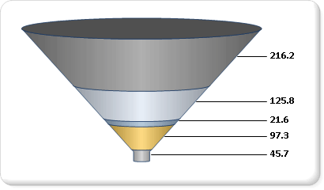

# Shape charts in Power BI paginated report (Power BI Report Builder)

[!INCLUDE [applies-yes-report-builder-no-desktop](../../../includes/applies-yes-report-builder-no-desktop.md)]

  A shape chart displays value data as percentages of a whole in a Power BI paginated report. Shape charts are typically used to show proportional comparisons between different values in a set. Individual segments of the shape represent the categories. The value determines the size of the segment. Shape charts are similar in use to pie charts, except that they order categories from largest to smallest.  
  
 A funnel chart displays values as progressively decreasing proportions. The size of the area is determined by the series value as a percentage of the total of all values. For example, you might use a funnel chart to display Web site visitor trends. The funnel chart probably displays a wide area at the top, indicating visitor page hits to the home page. The other areas are proportionally smaller. For more information about how to add data to a funnel chart, see [Charts (Power BI Report Builder)](charts-report-builder.md).  
  
 The following illustration shows an example of a funnel chart.  
  
   
  
You create and modify Power BI paginated reports in [Power BI Report Builder](../../report-builder-power-bi.md).
  
## Variations  
  
- **Pyramid**. A pyramid chart displays proportional data so that the chart looks like a pyramid.  
  
## Data considerations for shape charts  
  
- Shape charts are popular in reports because of their visual impact. However, shape charts are a simplified chart type that may not best represent your data. Consider using a shape chart only once the data has been aggregated to seven data points or less. In general, use the shape chart to display only one category per data region.  
  
- Shape charts display each data group as a separate segment of the chart. You must add at least one data field and one category field. If more than one data field is added to a shape chart, the shape chart displays both data fields in the same chart.  
  
- Shape charts are most effective for showing proportional percentages in sorted order. However, in order to maintain consistency, the chart does not sort the values in your dataset by default. Consider ordering your values from highest to lowest to most accurately represent your data as a funnel or a pyramid. For more information, see [Filter, group, and sort data (Power BI Report Builder)](../filter-group-sort-data-report-builder.md).  
  
- Null, empty, negative and zero values have no effect when calculating ratios. For this reason, these values are not shown on a shape chart. If you want to visually indicate these types of values on your chart, change the chart type to be something other than a shape chart. For more information about how to add empty points to a non-shape chart, see [Add empty points to a chart &#40;Power BI Report Builder&#41;](add-empty-points-chart-report-builder.md).  
  
- If you are defining your own colors on a shape chart using a custom palette, be sure that you have enough colors in your palette to highlight each data point with its own unique color. For more information, see [Formatting series colors on a chart &#40;Power BI Report Builder&#41;](/sql/reporting-services/report-design/formatting-series-colors-on-a-chart-report-builder-and-ssrs).  
  
- Unlike all other chart types, a shape chart displays individual data points, and not individual series, in its legend.  
  
- Settings for the value and category axis are ignored for funnel charts. If you have multiple category or series groups, the group labels are displayed in the chart legend.  
  
- Shape chart types cannot be combined with any other chart type in the same chart area. If you have to show comparisons between data displayed on a shape chart, and data displayed on another chart type, you need to add a second chart area.  
  
- You can apply more drawing styles to pie and doughnut charts for increased visual impact. See [Formatting series colors on a chart &#40;Power BI Report Builder&#41;](/sql/reporting-services/report-design/formatting-series-colors-on-a-chart-report-builder-and-ssrs) for more information.  
  
## Related content

- [Charts (Power BI Report Builder)](charts-report-builder.md)   
- [Formatting a chart &#40;Power BI Report Builder&#41;](formatting-chart-report-builder.md)   
- [Empty and null data points in charts &#40;Power BI Report Builder&#41;](/sql/reporting-services/report-design/empty-and-null-data-points-in-charts-report-builder-and-ssrs)   
- [Pie charts &#40;Power BI Report Builder&#41;](/sql/reporting-services/report-design/pie-charts-report-builder-and-ssrs)  
  
  
