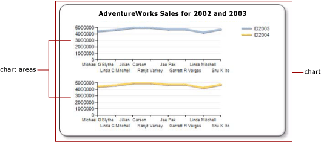

# Specify a chart area for a series in Power BI paginated report (Power BI Report Builder)

[!INCLUDE [applies-yes-report-builder-no-desktop](../../../includes/applies-yes-report-builder-no-desktop.md)]

  In Power BI paginated reports, the *chart* is the top-level container that includes the outer border, the chart title, and the legend. By default, the chart contains one *chart area*. The chart area is not visible on the chart surface, but you can think of the chart area as a container that encompasses only the axis labels, the axis title and the plotting area of one or more series. The following illustration shows the concept of multiple chart areas within a single chart.  
  
   
  
 By default, all series are added to the default chart area. When you are area, column, line, and scatter charts, any combination of these series can be displayed on the same chart area. If you have several series in the same chart area, the readability of the chart is reduced. You may want to separate the chart types into multiple chart areas. Using multiple chart areas will increase readability for easier comparisons. For example, price-volume stock charts often have different ranges of values, but comparisons can be made between the price and volume data over the same period of time.  
  
 The bar, polar, or shape series can only be combined with series of the same chart types in the same chart area. If you are using a Polar or Shape chart, consider using a separate chart data region for each field that you wish to show.  
  
You create and modify Power BI paginated reports in [Power BI Report Builder](../../report-builder-power-bi.md).
  
## Associate a series with a new chart area  
  
1. Right-click anywhere on the chart and select **Add New Chart Area**. A new, blank chart area appears on the chart.  
  
1. Right-click the series on the chart or right-click a series or data field in the appropriate area in the Chart Data pane, and then click **Series Properties**.  
  
1. In **Axes and Chart Areas**, select the chart area that you want the series to be shown in.  
  
1. (Optional) Align the chart areas vertically. To do this, right-click the chart and select **Chart Area Properties**. In **Alignment**, select another chart area that you want to align the selected chart area with.  
  
## Next steps  

 [Multiple series on a chart &#40;Power BI Report Builder&#41;](/sql/reporting-services/report-design/multiple-series-on-a-chart-report-builder-and-ssrs)   
 [Formatting data points on a chart &#40;Power BI Report Builder&#41;](/sql/reporting-services/report-design/formatting-data-points-on-a-chart-report-builder-and-ssrs)   
 [Define colors on a chart using a palette &#40;Power BI Report Builder&#41;](/sql/reporting-services/report-design/define-colors-on-a-chart-using-a-palette-report-builder-and-ssrs)   
 [Polar charts &#40;Power BI Report Builder&#41;](/sql/reporting-services/report-design/polar-charts-report-builder-and-ssrs)   
 [Shape charts &#40;Power BI Report Builder&#41;](/sql/reporting-services/report-design/shape-charts-report-builder-and-ssrs)   
 [Pie charts &#40;Power BI Report Builder&#41;](/sql/reporting-services/report-design/pie-charts-report-builder-and-ssrs)  
  
  
