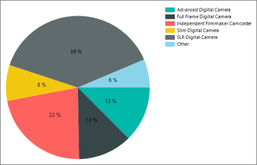
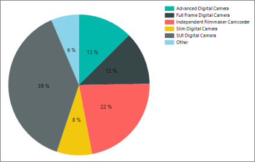

# Start pie chart values at the top of the pie in Power BI paginated report (Power BI Report Builder)

[!INCLUDE [applies-yes-report-builder-no-desktop](../../../includes/applies-yes-report-builder-no-desktop.md)]

In pie charts in Power BI paginated reports, by default the first value in the dataset starts at 90 degrees from the top of the pie. 

*Chart values start at 90 degrees.*

You might want the first value to start at the top instead.

*Chart values start at the top of the chart.*
  
## Start the pie chart at top of the pie  
  
1. Select the pie itself.  

1. If the **Properties** pane is not open, on the **View** tab, select **Properties**.  

1. In the **Properties** pane, under **Custom Attributes**, change **PieStartAngle** from **0** to **270**.  
  
1. Select **Run** to preview your report.  
  
 The first value now starts at the top of the pie chart.  
  
## Related content

- [Formatting a chart &#40;Power BI Report Builder&#41;](formatting-chart-report-builder.md)
- [Pie charts &#40;Power BI Report Builder&#41;](/sql/reporting-services/report-design/pie-charts-report-builder-and-ssrs)  
  
  
