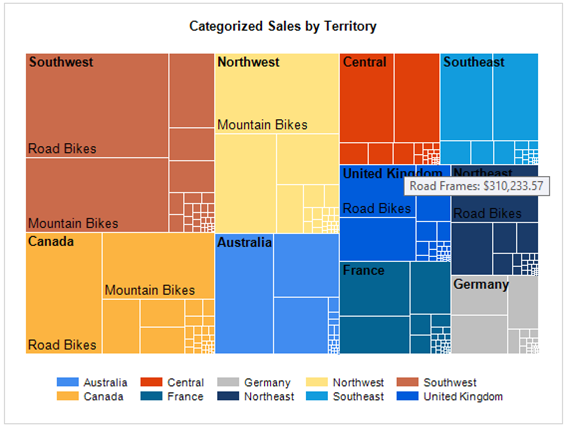
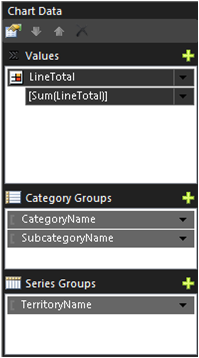
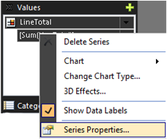
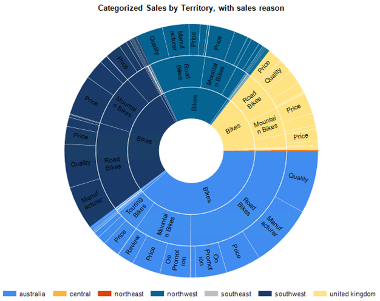
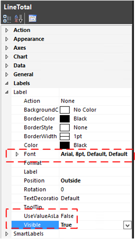
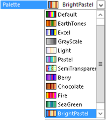

# Treemap and sunburst charts in a paginated report in SQL Server Reporting Services ( Power BI Report Builder)

Power BI Report Builder treemap and sunburst visualizations are great for visually representing hierarchical data in a paginated report. This article is an overview of how to add a treemap or sunburst chart to a report. The article also includes an AdventureWorks sample query to help you get started. 
  
##  <a name="bkmk_treemap_chart"></a> Treemap chart  

A treemap chart divides the chart area into rectangles that represent the different levels and relative sizes of the data hierarchy. The map is similar to branches on a tree that start with a trunk and divide into smaller and smaller branches. Each rectangle is broken into smaller rectangles that represent the next level in the hierarchy. The top-level treemap rectangles are arranged with the largest rectangle in the upper left corner of the chart to the smallest rectangle in the lower right corner.  Within a rectangle, the next level of the higher is also arranged with rectangles from the upper left to the lower right.  

For example,  in the following image of the sample treemap, the Southwest territory is the largest and Germany is the smallest. Within the Southwest, Road Bikes are larger than Mountain Bikes.  

  
  
### Insert a treemap chart and set up the sample AdventureWorks data  

> [!NOTE]
> Before you add a chart to your report, create a data source and dataset.  For sample data and a sample query, see [Sample AdventureWorks data](#bkmk_sample_data).  
  
1. Right-click the design surface, then select **Insert** > **Chart**. Select the **Treemap** icon.

      

2. Reposition and resize the chart. To use with the sample data, a chart that is 5 inches wide is a good start.  
  
3. Add the following fields from the sample data:  
  
    * **Values**: LineTotal
    * **Category Groups** (in the following order):
        1. CategoryName
        2. SubcategoryName
    * **Series Groups**: TerritoryName  

    
  
4. To optimize the page size for the general shape of a treemap, set the legend position to the bottom.  
  
5. To add tooltips that display the subcategory and the line total, right-click **LineTotal**, and then select **Series Properties**.  
  
       
  
     Set the **Tooltip** property to the following value:  
  
    ```
    =Fields!SubcategoryName.Value &": " &Format(Sum(Fields!LineTotal.Value),"C")  
    ```  
  
    For more information, see [Show ToolTips on a series &#40;Power BI Report Builder&#41;](/sql/reporting-services/report-design/show-tooltips-on-a-series-report-builder-and-ssrs).  
  
6. Change the default chart title to **Categorized Sales by Territory**.  
  
7. The number of label values that are displayed are affected by the size of the font, the size of the overall chart area, and the size of specific rectangles. To see more labels, change the **Label Font** property of **LineTotal** to **10pt** from the default of **8pt**.  

##  <a name="bkmk_sunburst_chart"></a> Sunburst chart  

In a sunburst chart, the hierarchy is represented by a series of  circles. The highest level of  the hierarchy is in the center, and lower levels of the hierarchy are rings displayed outside the center.  The lowest level of the hierarchy is the outside ring.  
  
  
  
### To insert a sunburst chart and set up the sample AdventureWorks data

> [!NOTE]
> Before you add a chart to your report, create a data source and dataset. For sample data and a sample query, see [Sample AdventureWorks data](#bkmk_sample_data).  
  
1. Right-click the design surface, and then select **Insert** > **Chart**. Select the **Sunburst** icon.

       
  
2. Reposition and resize the chart. To use with the sample data, a chart that is 5 inches wide is a good start.  
  
3. Add the following fields from the sample data:  

    * **Values**: LineTotal
    * **Category Groups** (in the following order):
        1. CategoryName
        2. SubcategoryName
        3. SalesReasonName
    * **Series Groups**: TerritoryName  

    
  
4. To optimize the page size for the general shape of a sunburst chart, set the legend position to the bottom.  
  
5. Change the default chart title to **Categorized Sales by Territory, with sales reason**.  
  
6. To add the values of the category groups to the sunburst as labels, set the label properties **Visible=true** and **UseValueAsLabel=false**.<br /><br /> The label values that are displayed are affected by the size of the font, the size of the overall chart area, and the size of specific rectangles.  To see more labels, change the **Label Font** property of **LineTotal** to **10pt** from the default of **8pt**.

    
  
7. If you want a different range of colors, change the chart **Palette** property.  

       

##  <a name="bkmk_sample_data"></a> Sample AdventureWorks data

This section includes a sample query and the basic steps for creating a data source and dataset in Power BI Report Builder. If your report already contains a data source and dataset, you can skip this section.  
  
The query returns AdventureWorks sales order detail data with sales territory, product category,  product subcategory, and sales reason data.  
  
1. **Get the data**.  
  
     The query in this section is based on the AdventureWorks database, which is available for download from GitHub: [AdventureWorks 2016 full database backup](https://github.com/Microsoft/sql-server-samples/releases).  

2. **Create a data source**.  
  
    1. Under **Report Data**,  right-click **Data Sources**, and then select **Add data source**.  
  
    2. Select **Use a connection embedded in my report**.  
  
    3. For connection type, select **Microsoft SQL Server**.  
  
    4. Enter the connection string to your server and database. For example:  
  
        ```
        Data Source=[server name];Initial Catalog=AdventureWorks2016  
        ```  
  
    5. To verify the connection, select the **Test Connection** button, and then select **OK**.  
  
     For more information about creating a data source, see [Add and verify a data connection &#40;Power BI Report Builder&#41;](/sql/reporting-services/report-data/add-and-verify-a-data-connection-report-builder-and-ssrs).  
  
3. **Create a dataset**.  
  
    1. Under **Report Data**,  right-click **Datasets**, and then select **Add dataset**.  
  
    2. Select **Use a dataset embedded in my report**.  
  
    3. Select the data source that you created.  
  
    4. Select the **Text** query type, and then copy and paste the following query into the **Query** text box:  
  
        ```sql
        SELECT    Sales.SalesOrderHeader.SalesOrderID, Sales.SalesOrderHeader.OrderDate, Sales.SalesOrderDetail.SalesOrderDetailID, Sales.SalesOrderDetail.ProductID, Sales.SalesOrderDetail.LineTotal,   
                                 Sales.SalesOrderDetail.UnitPrice, Sales.SalesOrderDetail.OrderQty, Production.Product.Name, Production.Product.ProductNumber, Sales.SalesTerritory.TerritoryID, lower(Sales.SalesTerritory.Name) AS TerritoryName,   
                                 Production.ProductSubcategory.Name AS SubcategoryName, Production.ProductCategory.Name AS CategoryName, Sales.SalesReason.SalesReasonID, Sales.SalesReason.Name AS SalesReasonName  
        FROM            Sales.SalesOrderDetail INNER JOIN  
                                 Sales.SalesOrderHeader ON Sales.SalesOrderDetail.SalesOrderID = Sales.SalesOrderHeader.SalesOrderID INNER JOIN  
                                 Production.Product ON Sales.SalesOrderDetail.ProductID = Production.Product.ProductID INNER JOIN  
                                 Sales.SalesTerritory ON Sales.SalesOrderHeader.TerritoryID = Sales.SalesTerritory.TerritoryID AND Sales.SalesOrderHeader.TerritoryID = Sales.SalesTerritory.TerritoryID AND   
                                 Sales.SalesOrderHeader.TerritoryID = Sales.SalesTerritory.TerritoryID INNER JOIN  
                                 Production.ProductSubcategory ON Production.Product.ProductSubcategoryID = Production.ProductSubcategory.ProductSubcategoryID AND   
                                 Production.Product.ProductSubcategoryID = Production.ProductSubcategory.ProductSubcategoryID AND   
                                 Production.Product.ProductSubcategoryID = Production.ProductSubcategory.ProductSubcategoryID INNER JOIN  
                                 Production.ProductCategory ON Production.ProductSubcategory.ProductCategoryID = Production.ProductCategory.ProductCategoryID AND   
                                 Production.ProductSubcategory.ProductCategoryID = Production.ProductCategory.ProductCategoryID AND   
                                 Production.ProductSubcategory.ProductCategoryID = Production.ProductCategory.ProductCategoryID INNER JOIN  
                                 Sales.SalesOrderHeaderSalesReason ON Sales.SalesOrderHeader.SalesOrderID = Sales.SalesOrderHeaderSalesReason.SalesOrderID AND   
                                 Sales.SalesOrderHeader.SalesOrderID = Sales.SalesOrderHeaderSalesReason.SalesOrderID AND Sales.SalesOrderHeader.SalesOrderID = Sales.SalesOrderHeaderSalesReason.SalesOrderID AND   
                                 Sales.SalesOrderHeader.SalesOrderID = Sales.SalesOrderHeaderSalesReason.SalesOrderID INNER JOIN  
                                 Sales.SalesReason ON Sales.SalesOrderHeaderSalesReason.SalesReasonID = Sales.SalesReason.SalesReasonID AND   
                                 Sales.SalesOrderHeaderSalesReason.SalesReasonID = Sales.SalesReason.SalesReasonID AND Sales.SalesOrderHeaderSalesReason.SalesReasonID = Sales.SalesReason.SalesReasonID AND   
                                 Sales.SalesOrderHeaderSalesReason.SalesReasonID = Sales.SalesReason.SalesReasonID  
        ```  
  
    5. Select **OK**.  
  
     For more information about creating a dataset, see [Create a shared dataset or embedded dataset &#40;Power BI Report Builder&#41;](/sql/reporting-services/report-data/create-a-shared-dataset-or-embedded-dataset-report-builder-and-ssrs).  
  
## Related content

* [Shared dataset design view &#40;Power BI Report Builder&#41;](/sql/reporting-services/report-builder/shared-dataset-design-view-report-builder)

* [Show ToolTips on a series &#40;Power BI Report Builder&#41;](/sql/reporting-services/report-design/show-tooltips-on-a-series-report-builder-and-ssrs)

* [Tutorial: Treemaps in Power BI](https://support.powerbi.com/knowledgebase/articles/556200-tutorial-treemaps-in-power-bi)

* [Treemap: Microsoft Research Data Visualization Apps for Office](https://research.microsoft.com/projects/msrdatavis/treemap.aspx)