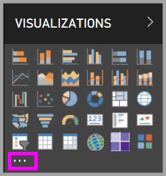
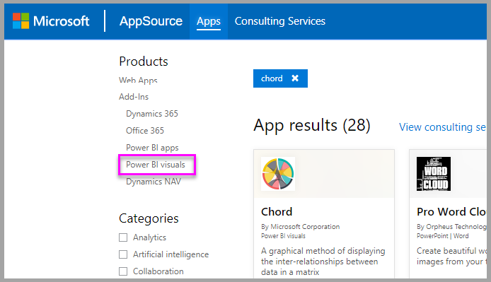
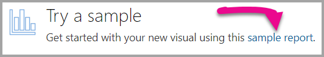

# Custom visuals in Power BI

When creating or editing a Power BI report, there are many different types of visuals available for you to use. These visuals display in the **Visualizations** pane. When you download [Power BI Desktop](https://powerbi.microsoft.com/en-us/desktop/) or open [Power BI service](https://app.powerbi.com), this set of visuals comes "pre-packaged."

But you aren't limited to this set of visuals, selecting the ellipses opens up another source of report visuals: *custom visuals*.

Custom visuals are created by developers, using the custom visuals SDK, to enable business users to see their data in a way that fits the business best. Report authors can then import the custom visuals files into their reports and use them as any other Power BI visuals. Custom visuals are first class citizens in Power BI and can be filtered, highlighted, edited, shared, etc.

Custom visuals can be in the form of three deployment channels:

* Custom visual files
* Organization visuals
* Marketplace visuals

## Custom visual files

Custom visuals are packages that include code for rendering the data that is served to them. Anyone can create a custom visual and package it as a single `.pbiviz` file, that can be imported into a Power BI report.

> [!WARNING]
> A custom visual could contain code with security or privacy risks; Make sure you trust the author and the source of the custom visual before importing it to your report.

## Organization visuals

Power BI admins can deploy custom visuals into their organization, so that report authors can easily discover and use the custom visuals that the admin has approved to use inside of the organization. The admin then has control to choose specific custom visuals to deploy in the organization, as well as an easy way to manage (for example, update version, disable/enable) those visuals. For the report author, it is an easy way to discover visuals that are unique to the organization, as well as a seamless support for updating those visuals.

To get more information about organization custom visuals, [read more about organizational visuals](power-bi-custom-visuals-organization.md).

## Marketplace visuals

Members of the community, as well as Microsoft, have contributed their custom visuals to the benefit of the public and published them to [AppSource](https://appsource.microsoft.com/en-us/marketplace/apps?product=power-bi-visuals) marketplace. These visuals can be downloaded and added to Power BI reports. All of these custom visuals have been tested and approved by Microsoft for functionality and quality.

What is [AppSource](developer/office-store.md)? Put, it is the place to find apps, add-ins, and extensions for your Microsoft software. [AppSource](https://appsource.microsoft.com/en-us/) connects millions of users of products like Office 365, Azure, Dynamics 365, Cortana, and Power BI to solutions that help them get work done more efficiently, more insightfully, or more beautifully than before.

### Certified visuals

Power BI certified visuals are marketplace visuals that have passed additional rigorous testing for quality, and are supported in additional scenarios, such as [email subscriptions](https://docs.microsoft.com/power-bi/service-report-subscribe), and [export to PowerPoint](https://docs.microsoft.com/power-bi/service-publish-to-powerpoint).
To see the list of certified custom visuals or to submit your own, see [Certified custom visuals](https://docs.microsoft.com/power-bi/power-bi-custom-visuals-certified).

Are you a Web developer and interested in creating your own visualizations and adding them to AppSource? See [Developing a Power BI custom visual](developer/custom-visual-develop-tutorial.md) and learn how to [publish custom visuals to AppSource](https://appsource.microsoft.com/en-us/marketplace/apps?product=power-bi-visuals).

### Import a custom visual from a file

1. Select the ellipses from the bottom of the Visualizations pane.

    

2. From the dropdown, select **Import from file**.

    

3. From the Open file menu, select the `.pbiviz` file that you want to import and then select Open. The icon for the custom visual is added to the bottom of your Visualizations pane and is now available for use in your report.

    

### Import organization visuals

1. Select the ellipses from the bottom of the Visualizations pane.

    

2. From the dropdown, select Import from marketplace.

    

3. Select **MY ORGANIZATION** from the top tab menu.

    

4. Scroll through the list to find the visual to import.

    

5. Import the custom visual by selecting **Add**. The icon for the custom visual is added to the bottom of your Visualizations pane and is now available for use in your report.

    

## Download or import custom visuals from Microsoft AppSource

You have two options for downloading and importing custom visuals; from within Power BI and from the AppSource website.

### Import custom visuals from within Power BI

1. Select the ellipses from the bottom of the Visualizations pane.

    

2. From the dropdown, select **Import from marketplace**.

    

3. Scroll through the list to find the visual to import.

    

4. To learn more about one of the visuals, highlight and select it.

    

5. On the detail page you can view screenshots, videos, detailed description and more.

    

6. Scroll to the bottom to see reviews.

    

7. Import the custom visual by selecting Add. The icon for the custom visual is added to the bottom of your Visualizations pane and is now available for use in your report.

    

### Download and import custom visuals from Microsoft AppSource

1. Start at [Microsoft AppSource](https://appsource.microsoft.com) and select the tab for **Apps**. 

    

2. Go to the [Apps results page](https://appsource.microsoft.com/en-us/marketplace/apps) where you can view top apps in each category, including *Power BI Apps*. But we're looking for custom visuals, so let's narrow down the results by selecting **Power BI visuals** from the left navigation list.

    

3. AppSource displays a tile for each custom visual.  Each tile has a snapshot of the custom visual and gives a brief description and a download link. To see more details, select the tile.

    

4. On the detail page you can view screenshots, videos, detailed description and more. Download the custom visual by selecting **Get it now** and then agreeing to the Terms of use.

    

5. Select the link to download the custom visual.

    

    The download page also includes instructions on how to import the custom visual into Power BI Desktop and Power BI service.

    You can also download a sample report that includes the custom visual and showcases its capabilities.

    

6. Save the '.pbiviz' file and then open Power BI.

7. Import the '.pbiviz' file into your report (See [Import a custom visual from a file](#import-a-custom-visuals-from-a-file) section above)

## Considerations and limitations

* A custom visual is added to a specific report when imported. If you'd like to use the visual in another report, you need to import it into that report as well. When a report with a custom visual is saved using the **Save As** option, a copy of the custom visual is saved with the new report.

* If you don't see a **Visualizations** pane, that means you do not have edit permissions for the report.  You can only add custom visuals to reports you can edit, not to reports that have been shared with you.

## Troubleshoot

For information about troubleshooting, visit [Troubleshooting your Power BI custom visuals](power-bi-custom-visuals-troubleshoot.md).

## FAQ

For more information and answers to questions, visit [Frequently asked questions about Power BI custom visuals](power-bi-custom-visuals-faq.md#organizational-custom-visuals).

More questions? [Try the Power BI Community](http://community.powerbi.com/).
