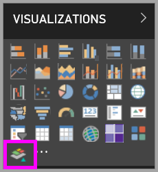
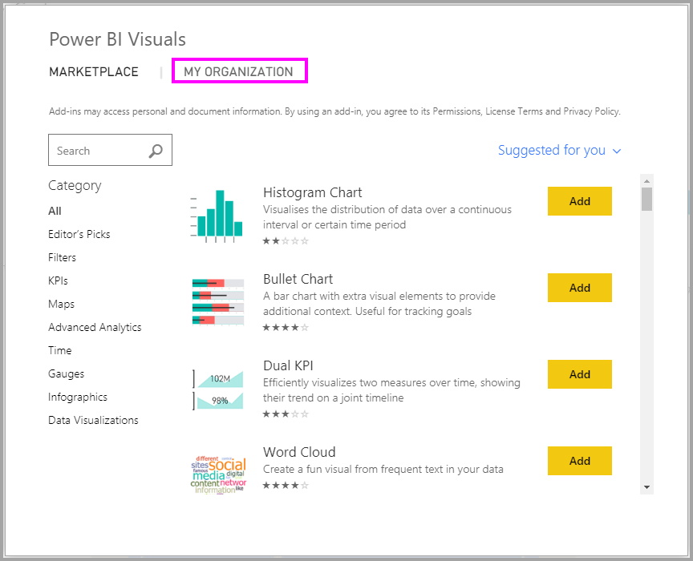
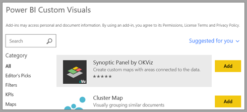
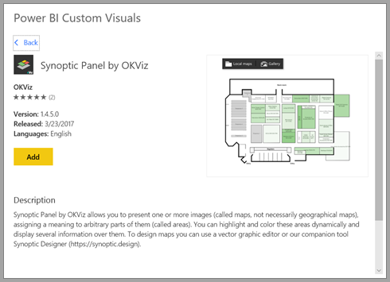

# Custom visuals in Power BI

When creating or editing a Power BI report, you can use many different types of visuals. The icons for these visuals appear in the **Visualizations** pane. These visuals come pre-packaged when you download [Power BI Desktop](https://powerbi.microsoft.com/desktop/) or open the [Power BI service](https://app.powerbi.com).

However, you aren't limited to this set of visuals. If you select the ellipses (...) at the bottom, another source of report visuals becomes available -*custom visuals*.

Developers create custom visuals using the custom visuals SDK. These visuals enable business users to see their data in a way that best fits their business. Report authors can then import the custom visual files into their reports and use them as they would any other Power BI visuals. Custom visuals are first class citizens in Power BI and can be filtered, highlighted, edited, shared, and so on.

Custom visuals are deployed in three ways:

* Custom visual files
* Organizational visuals
* Marketplace visuals

## Custom visual files

Custom visuals are packages that include code for rendering the data served to them. Anyone can create a custom visual and package it as a single `.pbiviz` file, that can then be imported into a Power BI report.

> [!WARNING]
> A custom visual could contain code with security or privacy risks. Make sure you trust the author and custom visual source before importing it to your report.

## Organizational visuals

Power BI admins approve and deploy custom visuals into their organization, which report authors can easily discover, update, and use. Admins can easily manage (for example, update version, disable/enable) these visuals.

 [Read more about organizational visuals](power-bi-custom-visuals-organization.md).

## Marketplace visuals

Community members and Microsoft have both contributed their custom visuals for public benefit and published them to the [AppSource](https://appsource.microsoft.com/marketplace/apps?product=power-bi-visuals) marketplace. You can download these visuals add them to your Power BI reports. Microsoft has tested and approved these custom visuals for functionality and quality.

What is [AppSource](developer/office-store.md)? It's the place you can find apps, add-ins, and extensions for your Microsoft software. AppSource connects millions of users of products like Office 365, Azure, Dynamics 365, Cortana, and Power BI, to solutions that help them get work done more efficiently, insightfully, and beautifully than before.

### Certified visuals

Power BI certified visuals are marketplace visuals that have passed additional rigorous quality testing and are supported in additional scenarios, such as [email subscriptions](service-report-subscribe.md), and [export to PowerPoint](service-publish-to-powerpoint.md).
To see the list of certified custom visuals or to submit your own, see [Certified custom visuals](power-bi-custom-visuals-certified.md).

Are you a Web developer and interested in creating your own visualizations and adding them to AppSource? See [Developing a Power BI custom visual](developer/custom-visual-develop-tutorial.md) and learn how to [publish custom visuals to AppSource](developer/office-store.md).

### Import a custom visual from a file

1. Select the ellipses from the bottom of the **Visualizations** pane.

    

2. From the dropdown, select **Import from file**.

    

3. From the **Open** file menu, select the `.pbiviz` file that you want to import and then select **Open**. The custom visual's icon is added to the bottom of your **Visualizations** pane and is now available for use in your report.

    

### Import organizational visuals

1. Select the ellipses from the bottom of the **Visualizations** pane.

    

2. From the dropdown, select **Import from marketplace**.

    

3. Select **MY ORGANIZATION** from the top tab menu.

    

4. Scroll through the list to find the visual to import.

    

5. Select **Add** to import the custom visual. Its icon is added to the bottom of your **Visualizations** pane and is now available for use in your report.

    

## Download or import custom visuals from Microsoft AppSource

You have two options for downloading and importing custom visuals: from within Power BI and from the [AppSource website](https://appsource.microsoft.com/).

### Import custom visuals from within Power BI

1. Select the ellipses from the bottom of the **Visualizations** pane.

    

2. From the dropdown, select **Import from marketplace**.

    

3. Scroll through the list to find the visual to import.

    

4. To learn more about one of the visuals, highlight and select it.

    

5. On the detail page you can view screenshots, videos, detailed description and more.

    

6. Scroll to the bottom to see reviews.

    

7. Select **Add** to import the custom visual. Its icon is added to the bottom of your **Visualizations** pane and is now available for use in your report.

    

### Download and import custom visuals from Microsoft AppSource

1. Start at [Microsoft AppSource](https://appsource.microsoft.com) and select the tab for **Apps**.

    

2. Go to the [Apps results page](https://appsource.microsoft.com/marketplace/apps) where you can view top apps in each category, including *Power BI Apps*. We're looking for custom visuals, so let's select **Power BI visuals** from the left navigation list to narrow down the results.

    

3. AppSource displays a tile for each custom visual.  Each tile has a custom visual snapshot with a brief description and a download link. To see more details, select the tile.

    

4. On the detail page you can view screenshots, videos, detailed description and more. Select **Get it now** to download the custom visual and then agree to the Terms of use.

    

5. Select the link to download the custom visual.

    

    The download page also includes instructions on how to import the custom visual into Power BI Desktop and the Power BI service.

    You can also download a sample report that includes the custom visual and showcases its capabilities.

    

6. Save the `.pbiviz` file and then open Power BI.

7. Import the `.pbiviz` file into your report. (See the [Import a custom visual from a file](#import-a-custom-visual-from-a-file) section above.)

## Considerations and limitations

* A custom visual is added to a specific report when imported. If you'd like to use the visual in another report, you need to import it into that report as well. When a report with a custom visual is saved using the **Save As** option, a copy of the custom visual is saved with the new report.

* If you don't see a **Visualizations** pane, that means you don't have report edit permissions.  You can only add custom visuals to reports you can edit, not to reports that have only been shared with you.

## Troubleshoot

To troubleshoot, see [Troubleshooting your Power BI custom visuals](power-bi-custom-visuals-troubleshoot.md).

## FAQ

For more information and answers to questions, visit [Frequently asked questions about Power BI custom visuals](power-bi-custom-visuals-faq.md#organizational-custom-visuals).

## Next steps

* [Visualizations in Power BI Reports](visuals/power-bi-report-visualizations.md)

More questions? [Try the Power BI Community](http://community.powerbi.com/).
