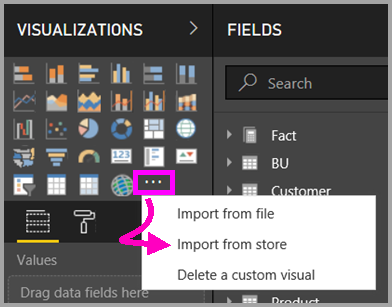

# Custom visuals in Power BI
When creating or editing a Power BI report, there are many different types of visuals available for you to use. These visuals display in the **Visualizations** pane. When you download Power BI Desktop or open Power BI service (app.powerbi.com), this set of visuals comes "pre-packaged." 

But you are not limited to this set of visuals, selecting the ellipses opens up another source of report visuals: *custom visuals*.

Custom visuals are created by members of the community and by Microsoft and are hosted on [AppSource](https://appsource.microsoft.com/marketplace/apps?product=power-bi-visuals). These visuals can be downloaded and added to Power BI reports. All of these custom visuals have been approved by Microsoft and they behave similar to the pre-packaged visualizations included with Power BI; they can be filtered, highlighted, edited, shared, etc.

What is AppSource? Simply put, it is the place to find apps, add-ins, and extensions for your Microsoft software. [AppSource](https://appsource.microsoft.com) connects millions of users of products like Office 365, Azure, Dynamics 365, Cortana, and Power BI to solutions that help them get work done more efficiently, more insightfully, or more beautifully than before.

Custom visuals can be in the form of 3 deployment channels:
* Custom visuals files
* Marketplace visuals
* Organization visuals

## Custom visual files

Custom visuals are packages that include code for rendering the data that is served to them. Anyone can create a custom visual and package it as a single .pbiviz file, that can be imported into a Power BI report.

## Marketplace visuals

Members of the community, as well as Microsoft, have contributed their custom visuals to the benefit of the public and published them to AppSource marketplace. These visuals can be downloaded and added to Power BI reports. All of these custom visuals have been tested and approved by Microsoft for functionality and quality.
What is AppSource? Simply put, it is the place to find apps, add-ins, and extensions for your Microsoft software. AppSource connects millions of users of products like Office 365, Azure, Dynamics 365, Cortana, and Power BI to solutions that help them get work done more efficiently, more insightfully, or more beautifully than before.
 
### Certified visuals

Power BI certified visuals are marketplace visuals that have passed additional rigorous testing for quality, and are supported in additional scenarios, such as email subscriptions, and export to PowerPoint.
To see the list of certified custom visuals or to submit your own, see Certified custom visuals.
Are you a Web developer and interested in creating your own visualizations and adding them to AppSource? See Get started with Developer Toolsand learn how to publish custom visuals to AppSource.
 
## Organization visuals (Preview)

Power BI admins can deploy custom visuals into their organization, so that report authors can easily discover and use the custom visuals that the admin has approved to use inside of the organization. This gives the admin the control to choose specific custom visuals to deploy in the organization, as well as an easy way to manage (i.e. update version, disable/enable) those visuals. For the report author, it is an easy way to discover visuals that are unique to the organization, as well as a seamless support for updating those visuals.

To get more information about organization custom visuals please [read more about organizational visuals](power-bi-custom-visuals-organization.md).

## Two types of custom visuals

The Power BI custom visuals available from AppSource fall into 2 categories: **approved** and **certified**. *AppSource approved* visuals can be run in browsers, reports, and dashboards.  *Power BI certified* visuals have passed rigorous testing, and are supported in additional scenarios, such as [email subscriptions](service-report-subscribe.md), and [export to PowerPoint](service-publish-to-powerpoint.md).

To see the list of certified custom visuals or to submit your own, see [Certified custom visuals](power-bi-custom-visuals-certified.md).

Are you a Web developer and interested in creating your own visualizations and adding them to AppSource?  See [Get started with Developer Tools](service-custom-visuals-getting-started-with-developer-tools.md) and learn how to [publish custom visuals to AppSource](https://appsource.microsoft.com/marketplace/apps?product=power-bi-visuals).

## Download or import custom visuals from Microsoft AppSource
You have two options for downloading and importing custom visuals; from within Power BI and from the AppSource website. 

###    Import custom visuals from within Power BI
1. Select the ellipses from the bottom of the Visualizations pane. 

    

2. From the dropdown, select **Import from store**.

    

3. Scroll through the list to find the visual to import. 

    

4.  To learn more about one of the visuals, highlight and select it.

    

5.  On the detail page you can view screenshots, videos, detailed description and more. 

    

6. Scroll to the bottom to see reviews.

    

7.    Import the custom visual by selecting **Add**. The icon for the custom visual is added to the bottom of your Visualizations pane and is now available for use in your report.

       

###    Download and import custom visuals from Microsoft AppSource

1. Start at [Microsoft AppSource](https://appsource.microsoft.com) and select the tab for **Apps**. 

    

2. This takes you to the [Apps results page](https://appsource.microsoft.com/en-us/marketplace/apps) where you can view top apps in each category, including *Power BI Apps*. But we're looking for custom visuals, so let's narrow down the results by selecting **Power BI visuals** from the left navigation list.

    

3. AppSource displays a tile for each custom visual.  Each tile has a snapshot of the custom visual and gives a brief description and a download link. To see more details, select the tile. 

    

4. On the detail page you can view screenshots, videos, detailed description and more. Dowload the custom visual by selecting **Get it now** and then agreeing to the Terms of use. 

    

5. Select the link to download the custom visual.

    

    The download page also include instructions on how to import the custom visual into Power BI Desktop and Power BI service.

    You can also download a sample report that includes the custom visual and showcases its capabilities.

    

6. Save the .pbiviz file and then open Power BI.    
7. Open the report where you'd like to add the custom visual and from the bottom of the **Visualizations** pane select the ellipses > **Import from file**.  

      

8. Select the custom visual file to add the icon for that custom visual to the bottom of your **Visualizations** pane. The custom visual is now available for use in your report.

    
    
##    Considerations and troubleshooting

- A custom visual is added to a specific report when imported. If you'd like to use the visual in another report, you need to import it into that report as well. When a report with a custom visual is saved using the **Save As** option, a copy of the custom visual is saved with the new report.

- If you don't see a **Visualizations** pane, that means you do not have edit permissions for the report.  You can only add custom visuals to reports you can edit, not to reports that have been shared with you.

More questions? [Try the Power BI Community](http://community.powerbi.com/)

