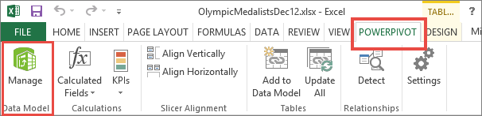
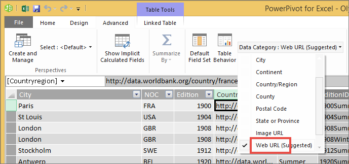

# Add hyperlinks to a table
This topic teaches you how to use Power BI Desktop to create hyperlinks. Then use either Desktop or Power BI service to add those hyperlinks to your report tables and matrixes. 

> **NOTE**:
> Hyperlinks in [tiles on dashboards](service-dashboard-edit-tile.md) and [text boxes on dashboards](service-dashboard-add-widget.md) can be created on-the-fly using Power BI service. Hyperlinks in [text boxes in reports](service-add-hyperlink-to-text-box.md) can be created on-the-fly using Power BI service and Power BI Desktop.
> 
> 

## To create a hyperlink in a table or matrix using Power BI Desktop
Hyperlinks in tables and matrixes can be created in Power BI Desktop, but not from Power BI Service. Hyperlinks can also be created in Excel Power Pivot before the workbook is imported into Power BI. Both methods are described below.

## Create a table or matrix hyperlink in Power BI Desktop
The procedure for adding a hyperlink depends on whether you've imported the data or connected to it using DirectQuery. Both scenarios are described below.

### For data imported into Power BI
1. If the hyperlink doesn't already exist as a field in your dataset, use Desktop to add it as a [custom column](desktop-common-query-tasks.md).
2. In Data view, select the column and in the **Modeling** tab choose the dropdown for **Data Category**.
   
    
3. Select **Web URL**.
4. Switch to Report view and create a table or matrix using the field categorized as a Web URL. The hyperlinks will be blue and underlined.

    

    > **NOTE**: The URLS must start with **http:// , https://** or **www**.
    > 
    >
   
1. If you don't want to display a long URL in a table, you can display a hyperlink icon   instead. Note that you can't display icons in matrixes.
   
   * Select the chart to make it active.
   * Select the paint roller icon  to open the Formatting tab.
   * Expand **Values**, locate **URL icon** and turn it to **On.**
6. (Optional) [Publish the report from Desktop to Power BI service](guided-learning/publishingandsharing.yml?tutorial-step=2) and open the report in Power BI service. The hyperlinks will work there as well.

### For data connected with DirectQuery
You won't be able to create a new column in DirectQuery mode.  But if your data already contains URLs, you can turn those into hyperlinks.

1. In Report view, create a table using a field that contains URLs.
2. Select the column, and in the **Modeling** tab, choose the dropdown for **Data Category**.
3. Select **Web URL**. The hyperlinks will be blue and underlined.
4. (Optional) [Publish the report from Desktop to Power BI service](guided-learning/publishingandsharing.yml?tutorial-step=2) and open the report in Power BI service. The hyperlinks will work there as well.

## Create a table or matrix hyperlink in Excel Power Pivot
Another way to add hyperlinks to your Power BI tables and matrixes is to create the hyperlinks in the dataset before you import/connect to that dataset from Power BI. This example uses an Excel workbook.

1. Open the workbook in Excel.
2. Select the **PowerPivot** tab and then choose **Manage**.
   
   
1. When PowerPivot opens, select the **Advanced** tab.
   
   
4. Place your cursor in the column that contains the URLs that you'd like to turn into hyperlinks in Power BI tables.
   
   > **NOTE**: The URLS must start with **http:// , https://** or **www**.
   > 
   > 
5. In the **Reporting Properties** group, select the **Data Category** dropdown and choose **Web URL**. 
   
   

6. From the Power BI service or Power BI Desktop, connect to or import this workbook.
7. Create a table visualization that includes the URL field.
   
   

## Considerations and troubleshooting
Q: Can I use a custom URL as a hyperlink in a table or matrix?    
A: No. You can use a link icon. If you need custom text for your hyperlinks and your list of URLs is short, consider using a text box instead.

## Next steps
[Visualizations in Power BI reports](visuals/power-bi-report-visualizations.md)

[Power BI - Basic Concepts](consumer/end-user-basic-concepts.md)

More questions? [Try the Power BI Community](http://community.powerbi.com/)

