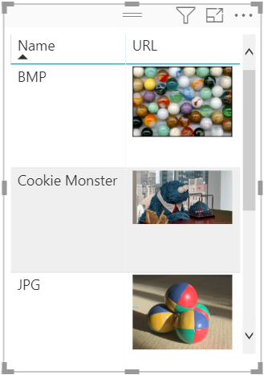
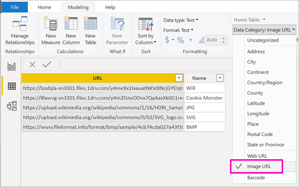

# Display images in a table, matrix, or slicer in a report

This topic teaches you how to display images in a table, matrix, slicer, or multi-row card. A good way to enhance your reports is to add images to them. Standalone images on the page are fine, but sometimes you want images that relate to the data in your report.

1. Create a column with the URLs of the images.

1. Select that column. On the **Modeling** ribbon, for **Data category**, select **Image URL**.

    

1. Add the column to a table, matrix, slicer, or multi-row card.

## Considerations

- The image needs to be bmp, jpg, jpeg, gif, png, svg
- The URL needs to be anonymously accessible, not on a site that requires a sign-in, such as SharePoint. However, if images are hosted on SharePoint or OneDrive, you may be able to get an embed code that points directly to them. 

## Next steps

[Basic concepts for designers in the Power BI service](service-basic-concepts.md)

More questions? [Try the Power BI Community](http://community.powerbi.com/)

