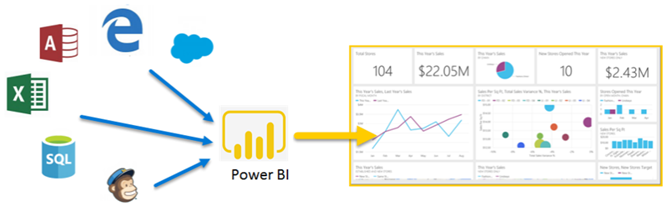

# What is Power BI?
**Power BI** is a collection of software services, apps, and connectors that work together to turn your unrelated sources of data into coherent, visually immersive, and interactive insights. Whether your data is a simple Excel spreadsheet, or a collection of cloud-based and on-premises hybrid data warehouses, **Power BI** lets you easily connect to your data sources, visualize (or discover) what’s important, and share that with anyone or everyone you want.

**Power BI** can be simple and fast – capable of creating quick insights from an Excel spreadsheet or a local database. But **Power BI** is also robust and enterprise-grade, ready for extensive modeling and real-time analytics, as well as custom development. So it can be your personal report and visualization tool, and can also serve as the analytics and decision engine behind group projects, divisions, or entire corporations.

## The parts of Power BI
Power BI consists of a Windows desktop application called **Power BI Desktop**, an online SaaS (*Software as a Service*) service called the **Power BI service**, and mobile Power BI **apps** available on Windows phones and tablets, as well as for iOS and Android devices.

These three elements – the **Desktop**, the **service**, and **Mobile** – are designed to let people create, share, and consume business insights in the way that serves them, or their role, most effectively.

## How Power BI matches your role
How you use Power BI may depend on your role in a project or on a team. And other people, in other roles, might use Power BI differently, which is just fine.

For example, you might primarily use the **Power BI service**, but your number-crunching, business-report-creating coworker might make extensive use of **Power BI Desktop** (and publish Desktop reports to the Power BI service, which you then view). And another coworker, in sales, might mainly use her Power BI phone app to monitor progress on her sales quotas, and to drill into new sales lead details.

If you're a developer, you might use Power BI APIs to push data into datasets or to embed dashboards and reports into your own custom applications. Have an idea for a new visual? Build it yourself and share it with others.  

You also might use each element of **Power BI** at different times, depending on what you’re trying to achieve or what your role is for a given project or effort.

Perhaps you view inventory and manufacturing progress in a real-time dashboard in the service, and also use **Power BI Desktop** to create reports for your own team about customer engagement statistics. How you use Power BI can be based on which feature or service of Power BI is the best tool for your situation – but each part of Power BI is available to you, which is why it’s so flexible and compelling.

To explore documents that pertain to your role:
- Power BI for [***designers***](desktop-what-is-desktop.md)
- Power BI for [***consumers***](consumer/end-user-consumer.md)
- Power BI for [***developers***](developer/what-can-you-do.md)
- Power BI for [***administrators***](service-admin-administering-power-bi-in-your-organization.md)

## The flow of work in Power BI
A common flow of work in Power BI begins by connecting to data sources and building a report in **Power BI Desktop**. That report is then published from **Desktop** to **Power BI service**, and shared so users in **service** and **mobile** can *consume* (view and interact with) the report.
Sometimes, you may want to give colleagues permissions similar to your own (*creator* permissions) so that they can use **service** to edit reports, create dashboards, and share their work too.

It doesn’t always happen this way, although this is one of the more common workflows, and it shows how the three main Power BI elements complement one another.

But what if you're not ready to move to the cloud, and want to keep your reports behind a corporate firewall?  Read on.

## On-premises reporting with Power BI Report Server
Create, deploy, and manage Power BI, mobile and paginated reports on premises with the range of ready-to-use tools and services that Power BI Report Server provides.

Power BI Report Server is a solution that you deploy behind your firewall and then deliver your reports to the right users in different ways, whether that’s viewing them in a web browser, on a mobile device, or as an email. And because Power BI Report Server is compatible with Power BI in the cloud, you can move to the cloud when you're ready.

## Next steps
[Sign in, get some data, and learn your way around Power BI service](service-the-new-power-bi-experience.md)   
[Tutorial: Get started with Power BI service](service-get-started.md)
