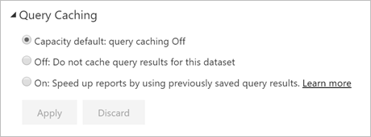

# Query caching in Power BI Premium

Organizations with Power BI Premium can take advantage of *query caching* to speed up reports associated with a dataset. Query caching instructs the Premium capacity to use its local caching service to maintain query results, avoiding having the underlying data source compute those results.

> [!IMPORTANT]
> Query caching is only available on Power BI Premium. It is not applicable to LiveConnect datasets leveraging Azure Analysis Services or SQL Server Analysis Services.

Cached query results are specific to user and dataset context and always respect security rules. At present the service only does query caching for the initial page that you land on. In other words, queries aren't cached when you interact with the report. The cache reflects personal bookmarks and persistent filters. [Dashboard tiles](service-dashboard-tiles.md) that are powered by the same queries also benefit once the query is cached. Performance especially benefits when a dataset is accessed frequently and doesn't need to be refreshed often. Query caching can also reduce load on your Premium capacity by reducing the overall number of queries.

You control query caching behavior on the **Settings** page for the dataset in the Power BI service. It has two possible settings:

- **Off**: Don't use query caching for this dataset.

- **On**: Use query caching for this dataset.

> [!NOTE]
> When you change caching settings from **On** to **Off**, all previously saved query results for the dataset are removed from the capacity cache. You can turn off caching either explicitly or by reverting to capacity default setting that an administrator has set to **Off**. Turning it off can introduce a small delay the next time any report runs queries against this dataset. The delay is caused by those report queries running on demand and not leveraging saved results. Also, the required dataset may need to be loaded into memory before it can service queries.

