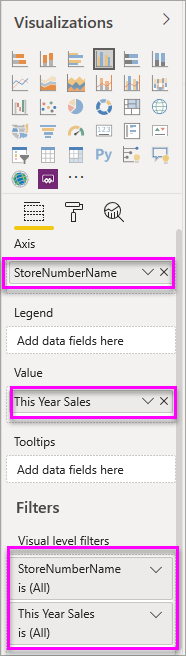
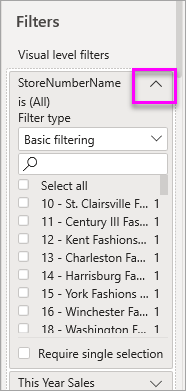

# Add a visualization, page, drillthrough, or report filter to a Power BI report

This article illustrates how to add filters to a visualization, a page, even a whole report, in Power BI Desktop and the Power BI service. The examples in this article show the Power BI service. The steps are almost identical in Power BI Desktop.

> [!TIP]
> We recommend first reading [About filters and highlighting in Power BI reports](power-bi-reports-filters-and-highlighting.md).
> 
> 

## Report filters in Editing View versus Reading View
There are two modes for interacting with reports: [Reading View](consumer/end-user-reading-view.md) and [Editing View](service-interact-with-a-report-in-editing-view.md). The filtering capabilities available to you depend on which mode you're in.

* In Editing View, you can add report, page, and visual filters. When you save the report, the filters are saved with it. People looking at the report in Reading View can interact with the filters you've added.
* In Reading View, you can interact with any report, drillthrough, page, and visual filters that already exist in the report, but you cannot add new filters. However, the changes you make in the Filters pane are saved with the report -- even if you view the report in a mobile app and even if you leave the report and return to it later.  

> [!NOTE]
> This article describes how to create filters in report **Editing View**.  For more information on filters in Reading View, see [interacting with filters in report Reading View](consumer/end-user-reading-view.md).

## Filters available in the Power BI Filters pane
Whether you're using Power BI Desktop or the Power BI service, the Filters pane displays along the right side of the report canvas. If you don't see the Filters pane, select the ">" icon from the upper-right corner to expand it.

There are four types of filters.

- **page filter** applies to all the visuals on the report page     
- **visual filter** applies to a single visual on a report page    
- **drillthrough filter** applies to a single entity in a report    
- **report filter** applies to all pages in the report    

    

Because filters *persist*, when you navigate away from the report, Power BI retains the filter, slicer, and other data view changes that you've made. So you'll be able to pick up where you left off when you return to the report. If you do not want your filter changes to persist, select **Reset to default** from the top menubar.

## Add a filter to a specific visualization (aka visual filter)
There are 2 ways to do this: 

* by filtering a field that is already being used by the visualization
* by identifying a field that is not already being used by the visualization, and adding that field directly to the **Visual level filters** bucket.

### By filtering the fields already in the visualization
1. Open your [report in Editing View](consumer/end-user-reading-view.md).
   
   
2. Open the Visualizations and Filters pane and the Fields pane (if they're not already open).
   
   
3. Select a visual to make it active. All the fields being used by the visual are identified in the **Fields** pane and also listed in the **Filters** pane, under the **Visual level filters** heading.
   
   
4. At this point we'll add a filter to a field already being used by the visualization. 
   
   * Scroll down to the **Visual level filters** area and select the arrow to expand the field you'd like to filter. In this example we'll filter **StoreNumberName**
     
       
   * Set either **Basic**, **Advanced**, or **Top N** filtering controls (see [How to use report filters](consumer/end-user-report-filter.md)). In this example we'll select Basic filtering and place checkmarks next to numbers 10, 11, 15, and 18.
     
       
   * The visual changes to reflect the new filter. If you save your report with the filter, report readers can interact with the filter in Reading View, selecting or clearing values.
     
      
5. Now let's add a totally new field, as a Visual level filter, to our visualization.
   
   * From the Fields pane, select the field you want to add as a new visual level filter, and drag it into the **Visual level filters area**.  In this example we'll drag **District Manager** into the **Visual level filters** bucket and select only Andrew Ma. 
     
      
   * Notice that **District Manager** is *not* added to the visualization itself. The visualization is still composed of **StoreNumberName** as the Axis and **This Year Sales** as the Value.  
     
      
   * And, the visualization itself is now filtered to show only Andrew's sales this year for the specified stores.
     
     

## Add a filter to an entire page (aka page view filter)
1. Open your [report in Editing View](consumer/end-user-reading-view.md).
2. Open the Visualizations and Filters pane and the Fields pane (if they're not already open).
3. From the Fields pane, select the field you want to add as a new page level filter, and drag it into the **Page level filters** area.  
4. Select the values you want to filter and set either  **Basic** or **Advanced** filtering controls (see [How to use report filters](consumer/end-user-report-filter.md)).
   
   All the visualization on the page, impacted by this filter, are re-drawn to reflect the change. 
   
   

If you save your report with the filter, report readers can interact with the filter in Reading View, selecting or clearing values.

## Add a drillthrough filter
With drillthrough in Power BI service and Power BI Desktop, you can create a *destination* report page that focuses on a specific entity - such as a supplier, or customer, or manufacturer. Now, from the other report pages, users can right-click on a data point for that entity and drillthrough to the focused page.

### Create a drillthrough filter
To follow along, open the Customer Profitability sample in Editing view. Let's say that you want a page that focuses on Executive business areas.   

1. Add a new page to the report and name it **Team Executive**. This will be the drillthrough *destination* page.
2. Add visualizations that track key metrics for the team executives' business areas.    
3. Add **Executive > Executive Name** to the Drillthrough filters well.    
   
    
   
    Notice that Power BI adds a back arrow to the report page.  Selecting the back arrow returns users to the *originating* report page -- the page they were on when they opted to drillthrough. The back arrow only works in Reading view.
   
     

### Use the drillthrough filter
Let's see how the drillthrough filter works.

1. Start on the **Team Scorecard** report page.    
2. Let's say you're Andrew Ma and you want to see the Team Executive report page filtered to just your data.  From the top-left area chart, right click any green data point to open the Drillthrough menu option.
   
    
3. Select **Drillthrough > Team Executive** to drillthrough to the report page named **Team Executive**. The page is filtered to show information about the data point from which you right-clicked; in this case Andrew Ma. Only the field that is in the Drillthrough filters well gets passed through to the drillthrough report page.  
   
    

## Add a filter to an entire report (aka Report filter)
1. Open your [report in Editing View](consumer/end-user-reading-view.md).
2. Open the Visualizations and Filters pane and the Fields pane (if they're not already open).
3. From the Fields pane, select the field you want to add as a new report level filter, and drag it into the **Report level filters** area.  
4. Select the values you want to filter (see [How to use report filters](consumer/end-user-report-filter.md)).

    The visuals on the active page, and on all pages in the report, change to reflect the new filter. If you save your report with the filter, report readers can interact with the filter in Reading View, selecting or clearing values.

1. Select the back arrow to return to the previous report page.

## Considerations and troubleshooting

- There are situations where your visual level filter and page level filter may return different results.  For example, when you add a visual level filter, Power BI filters on the aggregated results.  The default aggregation is Sum, but you can [change the aggregation type](service-aggregates.md).  

    Then, when you add a page level filter, Power BI filters without aggregating.  It does this because a page can have many visuals which can each utilize different aggregation types.  So the filter is applied on each data row.

- If you do not see the Fields pane, make sure you're in report [Editing view](service-interact-with-a-report-in-editing-view.md)    
- If you've made lots of changes to the filters and want to return to the report author default settings, select **Reset to default** from the top menubar.

## Next steps
 [How to use report filters](consumer/end-user-report-filter.md)

  [Filters and highlighting in reports](power-bi-reports-filters-and-highlighting.md)

[Interact with filters and highlighting in report Reading View](consumer/end-user-reading-view.md)

[Change how report visuals cross-filter and cross-highlight each other](consumer/end-user-interactions.md)

More questions? [Try the Power BI Community](http://community.powerbi.com/)

