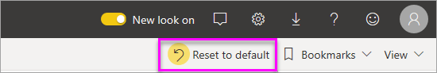
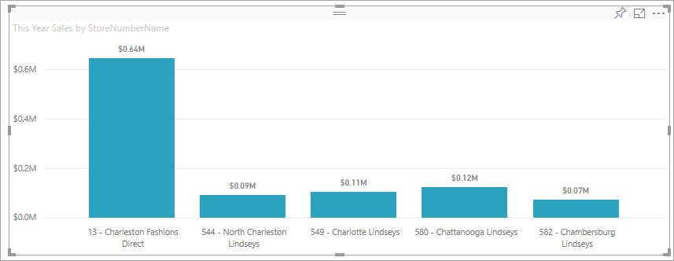
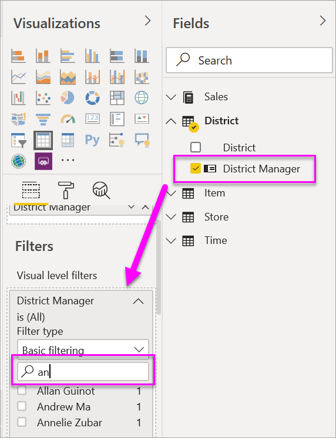
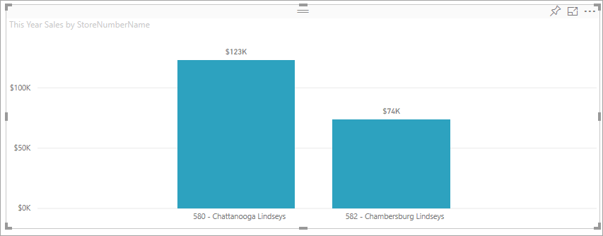
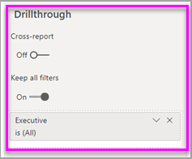

# Add a filter to a report in Editing view

This article explains how to add a page filter, visualization filter, report filter, or drillthrough filter to a report in Power BI. The examples in this article are in the Power BI service. The steps are almost identical in Power BI Desktop.

**Did you know?** Power BI has a new filter experience, currently in preview. Read more about [the new filter experience in Power BI reports](power-bi-report-filter-preview.md).

## Filters in Editing view or Reading view
You can interact with reports in two different views: Reading view and Editing view. The filtering capabilities available to you depend on which view you're in. Read all [about filters and highlighting in Power BI reports](power-bi-reports-filters-and-highlighting.md) for details.

This article describes how to create filters in report **Editing view**.  For more information on filters in Reading view, see [interacting with filters in report Reading view](consumer/end-user-report-filter.md).

## Filter types in the Filters pane
Whether you're using Desktop or Power BI service, the Filters pane displays along the right side of the report canvas. If you don't see the Filters pane, select the ">" icon from the upper-right corner to expand it.

There are four types of filters: **page filter**, **visual filter**, **drillthrough filter**, and **report filter**.

Because filters *persist*, when you navigate away from the report Power BI retains the filter, slicer, and other data view changes that you've made. So you can pick up where you left off when you return to the report. If you don't want your filter changes to persist, select **Reset to default** from the top menubar.

## Add a filter to a visual
You can add a filter to a specific visual in two different ways (aka, a "visual filter"). 

* Filter a field that is already being used by the visualization.
* Identify a field that is not already being used by the visualization, and add that field directly to the **Visual level filters** bucket.

By the way, this procedure uses the Retail Analysis sample, if you'd like to download it and follow along. Download the [Retail Analysis sample](sample-retail-analysis.md).

### Filter the fields in the visual

1. Select **Edit report** to open your report in Editing view.
   
   

2. Open the Visualizations and Filters pane and the Fields pane (if they're not already open).
   
   
3. Select a visual to make it active. All the fields being used by the visual are in the **Fields** pane and also listed in the **Filters** pane, under the **Visual level filters** heading.
   
   
4. At this point, we'll add a filter to a field already being used by the visualization. 
   
    Scroll down to the **Visual level filters** area and select the arrow to expand the field you'd like to filter. In this example, we'll filter **StoreNumberName**.
     
     
    
    Set either **Basic**, **Advanced**, or **Top N** filtering controls. In this example, we'll search in Basic filtering for **cha** and select those five stores.
     
     
   
    The visual changes to reflect the new filter. If you save your report with the filter, report readers will see the visual filtered to begin with, and can interact with the filter in Reading view, selecting or clearing values.
     
    

### Filter with a field that's not in the visual

Now let's add a new field to our visualization as a visual-level filter.
   
1. From the Fields pane, select the field you want to add as a new visual-level filter, and drag it into the **Visual level filters area**.  In this example, we'll drag **District Manager** into the **Visual level filters** bucket, search for **an**, and select those three managers. 
     
    

    Notice **District Manager** is *not* added to the visualization itself. The visualization is still composed of **StoreNumberName** as the Axis and **This Year Sales** as the Value.  
     
    

    And the visualization itself is now filtered to show only those managers' sales this year for the specified stores.
     
    

    If you save your report with this filter, report readers can interact with the **District Manager** filter in Reading view, selecting or clearing values.

## Add a filter to an entire page

You can also add a page-level filter to filter an entire page.

1. Select **Edit report** to open your report in Editing view.
   
   
2. Open the Visualizations and Filters pane and the Fields pane (if they're not already open).
3. From the Fields pane, select the field you want to add as a new page-level filter, and drag it into the **Page level filters** area.  
4. Select the values you want to filter and set either  **Basic** or **Advanced** filtering controls.
   
   All the visualizations on the page are redrawn to reflect the change.
   
   

    If you save your report with the filter, report readers can interact with the filter in Reading view, selecting or clearing values.

## Add a drillthrough filter
With drillthrough in Power BI service and Power BI Desktop, you can create a *destination* report page that focuses on a specific entity - such as a supplier, or customer, or manufacturer. Now, from the other report pages, users can right-click on a data point for that entity and drillthrough to the focused page.

### Create a drillthrough filter
To follow along, download the [Customer Profitability sample](sample-customer-profitability.md). Let's say that you want a page that focuses on Executive business areas.

1. Select **Edit report** to open the report in Editing view.
   
   

1. Add a new page to the report and name it **Team Executive**. This page will be the drillthrough *destination*.
2. Add visualizations that track key metrics for the team executives' business areas.    
3. Add **Executive > Executive Name** to the Drillthrough filters well.    
   
    
   
    Notice that Power BI adds a back arrow to the report page.  Selecting the back arrow returns users to the *originating* report page -- the page they were on when they opted to drillthrough. The back arrow only works in Reading view.
   
     

### Use the drillthrough filter
Let's see how the drillthrough filter works.

1. Start on the **Team Scorecard** report page.    
2. Let's say you're Andrew Ma and you want to see the Team Executive report page filtered to just your data.  From the top-left area chart, right click any green data point to open the Drillthrough menu option.
   
    
3. Select **Drillthrough > Team Executive** to drillthrough to the report page named **Team Executive**. The page is filtered to show information about the data point from which you right-clicked; in this case Andrew Ma. Only the field that is in the Drillthrough filters well gets passed through to the drillthrough report page.  
   
    

## Add a report-level filter to filter an entire report

1. Select **Edit report** to open the report in Editing view.
   
   

2. Open the Visualizations and Filters pane and the Fields pane, if they're not already open.
3. From the Fields pane, select the field you want to add as a new report-level filter, and drag it into the **Report level filters** area.  
4. Select the values you want to filter.

    The visuals on the active page, and on all pages in the report, change to reflect the new filter. If you save your report with the filter, report readers can interact with the filter in Reading view, selecting or clearing values.

1. Select the back arrow to return to the previous report page.

## Considerations and troubleshooting

- There are situations where your visual-level filter and page-level filter may return different results.  For example, when you add a visual-level filter, Power BI filters on the aggregated results.  The default aggregation is Sum, but you can [change the aggregation type](service-aggregates.md).  

    Then, when you add a page-level filter, Power BI filters without aggregating.  It doesn't aggregate because a page can have many visuals, each of which can utilize different aggregation types.  So the filter is applied on each data row.

- If you do not see the Fields pane, make sure you're in report [Editing view](service-interact-with-a-report-in-editing-view.md)    
- If you've made lots of changes to the filters and want to return to the report author default settings, select **Reset to default** from the top menubar.

## Next steps
[Take a tour of the report Filters pane](consumer/end-user-report-filter.md)

[Filters and highlighting in reports](power-bi-reports-filters-and-highlighting.md)

[Interact with filters and highlighting in report Reading view](consumer/end-user-reading-view.md)

[Change how report visuals cross-filter and cross-highlight each other](consumer/end-user-interactions.md)

More questions? [Try the Power BI Community](http://community.powerbi.com/)

