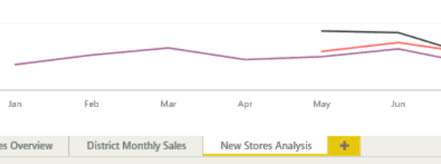

# Add a page to a Power BI report in Power BI service and Power BI Desktop
No reason to crowd up a report page -- just add a new blank page. 

Adding and duplicating report pages require edit permissions to the report. In Power BI service, this means opening the report in [Editing view](consumer/end-user-reading-view.md). 

## Add a new blank page
Select the yellow plus icon and then type a new name for the page.  

## Duplicate a page
From the top control bar, in [Editing view](service-interact-with-a-report-in-editing-view.md), select the **Duplicate this page** icon.

Your new page is created and becomes the active page. To rename it, double-click the name on the tab to highlight it, and type a new name.  For more information, see [renaming in Power BI service](service-rename.md)

## Next steps
Read more about [reports in Power BI](consumer/end-user-reports.md)

[Power BI - Basic Concepts](consumer/end-user-basic-concepts.md)

More questions? [Try the Power BI Community](http://community.powerbi.com/)

