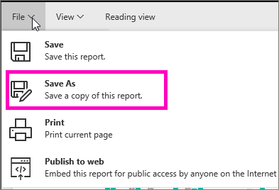
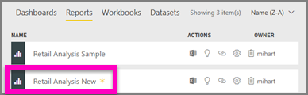

# Create a new report from an existing report (copy a report)
Maybe you have a report that already connects to your dataset and has some visuals that you'd like to re-use or modify.  Why not simply copy that report as a basis for a new report?  To do that:

1. [Open a report](consumer/end-user-report-open.md).
2. From the **File** menu, select **Save As**.
   
   
3. Type a name for the new report and select **Save**.
   
   
   
   A Success message lets you know that the new report was saved to your current workspace in Power BI.
   
   
4. Open the **Reports** tab of your workspace and select the new report to open it. Optionally, delete visuals you don't want to keep, modify other visuals, and add new ones.
   
   
5. Have fun updating and editing your new report.

## Next Steps:
[Create new visualizations](visuals/power-bi-report-add-visualizations-ii.md)

[Delete visualizations](service-delete.md) you don't need

[Create a report using Power BI Desktop](desktop-report-view.md)
