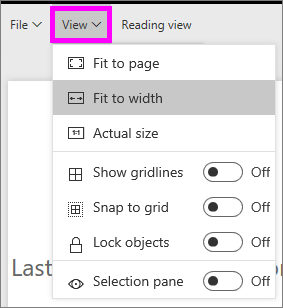
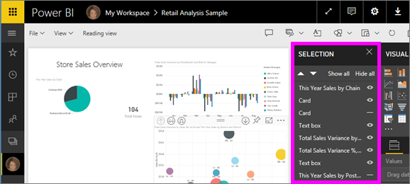

# Page display settings in a Power BI report
We understand it is critical to keep your report layout pixel perfect. Sometimes, it can be challenging, because you and your colleagues view those reports on screens with different aspect ratios and sizes. 

The default display view is **Fit to page** and the default display size is **16:9**. If you want to lock in a different aspect ratio, or want to fit your report in a different way, there are two tools to help you: ***Page View*** settings and ***Page Size*** settings.

<iframe width="560" height="315" src="https://www.youtube.com/embed/5tg-OXzxe2g" frameborder="0" allowfullscreen></iframe>

## Where to find Page view settings in Power BI service and Power BI Desktop
Page view settings are available in both Power BI service and Power BI Desktop but the interface is a little different. The two sections below explain where you can find View settings in each Power BI tool.

### In Power BI Desktop
In Report view, select the **View** tab to open Page view settings as well as phone layout settings.

  

### In Power BI service (app.powerbi.com)
In Power BI service, open a report and select **View** from the upper left menubar.

Page View settings are available in both [Reading view and Editing view](consumer/end-user-reading-view.md). In Editing View, a report owner can assign page view settings to individual report pages, and those settings are saved with the report. When colleagues open that report in Reading view, they see the report pages display using the owner's settings.  In Reading view colleagues can change *some* of the Page view settings, but the changes are not saved when they exit the report.

##    Page view settings
The first set of *Page view* settings control the display of your report page relative to the browser window.  Choose between:

* **Fit to Page** (default): contents are scaled to best fit the page
* **Fit to Width**: contents are scaled to fit within the width of the page
* **Actual Size**: contents are displayed at full size

The second set of *Page view* settings control the positioning of objects on the report canvas

* **Show gridlines**: turn on gridlines to help you position objects on the report canvas
* **Snap to grid**: use with **Show gridlines** to precisely position and align objects on the report canvas 
* **Lock objects**: lock all objects on the canvas so that they cannot be moved or resized
* **Selection pane**: the Selection pane lists all objects on the canvas and you can decide which to show and which to hide

    

## Page Size settings

*Page Size* settings are only available for report owners. In Power BI service (app.powerbi.com), this means being able to open the report in [Editing view](consumer/end-user-reading-view.md). These settings control the display ratio and actual size (in pixels) of the report canvas.   

* 4:3 ratio
* 16:9 ratio (default)
* Cortana
* Letter
* Custom (height and width in pixels)

## Next Steps
[Learn how to use Page view and Page size settings in your own Power BI reports](consumer/end-user-report-view.md).

Read more about [reports in Power BI](consumer/end-user-reports.md)

[Power BI - Basic Concepts](consumer/end-user-basic-concepts.md)

More questions? [Try the Power BI Community](http://community.powerbi.com/)

