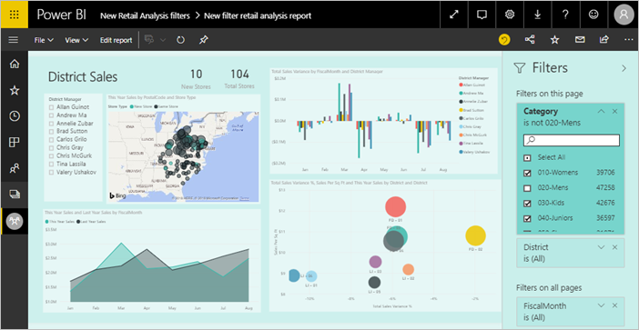
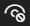
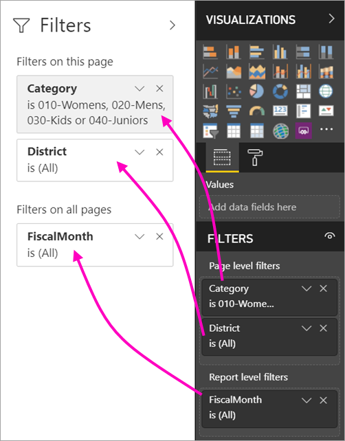
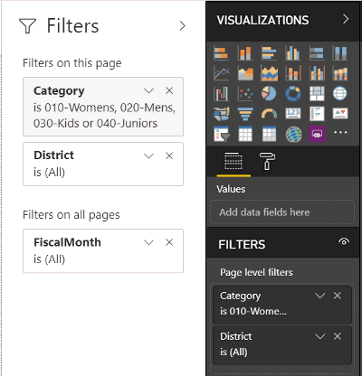
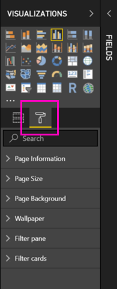
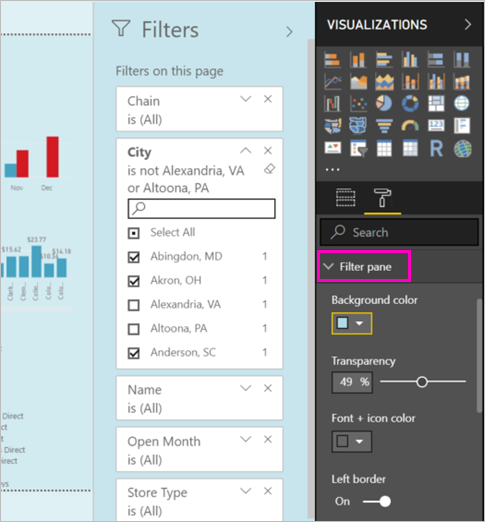
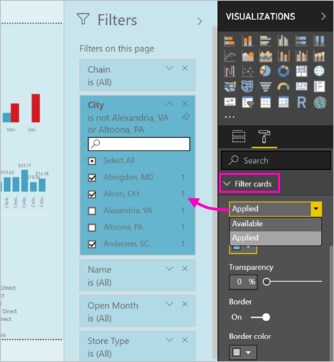
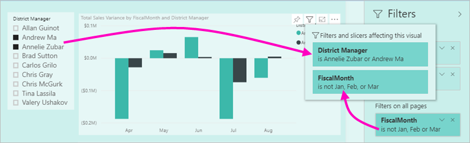

# The new filter experience in Power BI reports (Preview)

This article spells out the new filter experience: Filters in Power BI are getting new functionality and a new design. When you design reports in Power BI Desktop or in the Power BI service, you can make the Filters pane to look like and act with the whole report. In the new experience, the old Filters pane acts as a filter editing pane, and the new Filter pane is the only one your report consumers see. 
 

As a report designer, here's what you can do with the new filters:

- Show a read-only view of filters in the visual header, so consumers know exactly what filters or slicers are affecting a given visual.
- Format and customize the filter pane so that it feels part of your report.
- Define whether the Filters pane is open or collapsed by default when a consumer opens the report.
- Hide the entire filter pane or specific filters that you don’t want report consumers to see.
- Control and even bookmark the visibility, open, and collapsed state of the new filter pane.
- Lock filters that you don’t want consumers to edit.

## Turn on the new filter experience 

You enable the new experience in Power BI Desktop. Then you can modify filters there or in the Power BI service (https://app.powerbi.com). Because this new filter experience is in Preview, you must first enable it in Power BI Desktop. If you start by creating a report in the Power BI service, it can't have the new filters.

### Turn on new filters for all new reports

1. In Power BI Desktop, select **File** > **Options and Settings** > **Options** > **Preview Features**, then select the **New filter experience** checkbox. 
2. Restart Power BI Desktop to see the new filter experience in all new reports.

After you restart Power BI Desktop, it's enabled by default for all new reports you create.  

### Turn on new filters for an existing report

You can also enable the new filters for existing reports.

1. In Power BI Desktop in an existing report, select **File** > **Options and Settings** > **Options**
2. Under **Report settings**, select **Enable the updated filter pane, and show filters in the visual header for this report**.

## Build the new filter pane

After you enable the new filter pane, you see it to the right of the report page, formatted by default based on your current report settings. The old filter pane now acts as the filter editing pane. The new filter pane shows you what your report consumers will see when you publish your report. You can update existing filters in the new pane, but you use the older filter pane to configure which filters to include.

1. First decide if you want your report consumers to see the filter pane. If you want them to see it, select the eye icon  next to Filters.

2. To start building your new filter pane, drag fields of interest into the filter editing pane either as visual, page, or report level filters. You see them in the new Filters pane.

    

When you add a visual to a report canvas, Power BI automatically adds a filter for each field in the visual. Power BI doesn't add those automatic filters to the read-only filter pane. You have to select the eye icon to add them explicitly.

 
## Lock or hide filters

You can lock or hide individual filter cards. If you lock a filter, your report consumers can see but not change it. If you hide it, they can't even see it. Hiding filter cards is typically useful if you need to hide data cleanup filters that exclude nulls or unexpected values. 

- In the filter editing pane, select or clear the **Lock filter** or **Hide filter** icons in a filter card.

   

As you turn these settings on and off in the filter editing pane, you see the changes reflected in the new filter pane. Hidden filters don't show up in the filter pop-up for a visual.

You can also configure your filter pane state to flow with your report bookmarks. The pane’s open, close, and visibility state are all bookmarkable.
 
## Format the new Filters pane

A big part of this new experience is that you can now format the filter pane to match the look and feel of your report. You can format the filter pane differently for each page in the report. Here are elements you can format: 

- Background color
- Background transparency
- Filter pane border on or off
- Filter pane border color

You can also format these elements for filter cards, depending on if they're applied (set to something) or available (cleared): 

- Background color
- Background transparency
- Border: on or off
- Border color

### Set the format for the Filters pane and cards

1. In the report, click the report itself, or the background (*wallpaper*), then in the **Visualizations** pane, select **Format**. 
    You see options for formatting the report page, the wallpaper, and also the Filter pane and Filter cards.

        

1. Expand **Filter pane** to set color for the background, icon, and left border, to complement the report page.

    

1. Expand **Filter cards** to set the **Available** and **Applied** color and border. If you make available and applied cards different colors, it's obvious which filters are applied. 
  
    

## View filters for a visual in Reading mode

In Reading mode, you can hover over a visual and see a pop-up with all the filters, slicers, and so on, affecting that visual. The formatting of the pop-up is the same as the filter pane formatting. 

Here are the types of filters this view shows: 
- Basic filters
- Slicers
- Cross-highlighting 
- Cross-filtering
- Advanced filters
- Top N filters
- Relative Date filters
- Sync-slicers
- Include/Exclude filters
- Filters passed through a URL

## Coming soon

In coming months we plan to incorporate the following improvements:
- Ability to change the order of filter cards
- Single filter pane experience for report creators 
- More formatting options

Give the new filter experience a try. Provide us your feedback for this feature and how we can continue to improve this experience. 

## Next steps
[How to use report filters](consumer/end-user-report-filter.md)

[Filters and highlighting in reports](power-bi-reports-filters-and-highlighting.md)

[Interact with filters and highlighting in report Reading View](consumer/end-user-reading-view.md)

[Change how report visuals cross-filter and cross-highlight each other](consumer/end-user-interactions.md)

More questions? [Try the Power BI Community](http://community.powerbi.com/)

