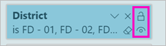
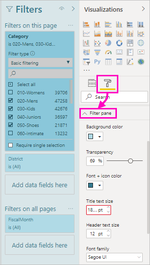
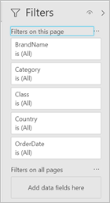

# Work with filters in Power BI reports

Filters in Power BI have new functionality and a new design. When you opt in to the new filter experience, you can format the Filters pane to look like the rest of the report. You can lock and even hide filters. When designing your report, you no longer see the old Filters pane at all in the Visualizations pane. You do all your filter editing and formatting in a single Filters pane. 


As a report designer, here are some of the tasks you can do in the new Filters pane:

- Add and remove fields to filter on. 
- Change the filter state.
- Format and customize the Filters pane so that it feels part of your report.
- Define whether the Filters pane is open or collapsed by default when a consumer opens the report.
- Hide the entire Filters pane or specific filters that you don’t want report consumers to see.
- Control and even bookmark the visibility, open, and collapsed state of the new Filters pane.
- Lock filters that you don’t want consumers to edit.

With the new filter experience, report consumers can also hover over any visual to see a read-only list of all the filters or slicers affecting that visual.


## Turn on the new filter experience 

The new filter experience is turned on by default for new reports. You can enable the new experience for existing reports in Power BI Desktop or the Power BI service.

### Turn on new filters for an existing report in Power BI Desktop

1. In Power BI Desktop in an existing report, select **File** > **Options and Settings** > **Options**
2. In the nav pane, under **Current file**, select **Report settings**.
3. Under **Filtering experience**, select **Enable the updated Filters pane, and show filters in the visual header for this report**.

### Turn on new filters for an existing report in the service

If you've turned on the **New look** in the Power BI service , the new filter experience is turned on automatically. Read more about the [new look in the Power BI service](service-new-look.md).

If you haven't turned on the new look, you can still see the new filter experience by following these steps.

1. In the Power BI service, open the content list for a workspace.
2. Find the report you want to enable, select **More options (...)**, then select **Settings** for that report.

    

3. Under **Filtering experience**, select **Enable the updated Filters pane, and show filters in the visual header for this report**.

    

## View filters for a visual in Reading mode

In Reading mode, hover over the filter icon for a visual to see a pop-up filter list with all the filters, slicers, and so on, affecting that visual. The formatting of the pop-up filter list is the same as the Filters pane formatting. 


Here are the types of filters this view shows: 
- Basic filters
- Slicers
- Cross-highlighting 
- Cross-filtering
- Advanced filters
- Top N filters
- Relative Date filters
- Sync-slicers
- Include/Exclude filters
- Filters passed through a URL

## Build the new Filters pane

After you enable the new Filters pane, you see it to the right of the report page, formatted by default based on your current report settings. You use the new Filters pane to configure which filters to include, and to update existing filters in the new pane. The new Filters pane shows you what your report consumers will see when you publish your report. 

1. By default, your report consumers can see the Filters pane. If you don't want them to see it, select the eye icon next to **Filters**.

    

2. To start building your new Filters pane, drag fields of interest into the new Filters pane either as visual, page, or report level filters.

When you add a visual to a report canvas, Power BI automatically adds a filter to the Filters pane for each field in the visual. 

## Hide the Filters pane while editing

Power BI Desktop has a new ribbon in preview. On the **View** tab, the **Filters** toggle button allows you to show or hide the Filters pane. This feature is useful when you aren't using the Filters pane and need extra space on the screen. This addition aligns the Filters pane with the other panes that you can open and close, such as the Bookmarks and Selection panes. 


This setting only hides the Filters pane in Power BI Desktop. If you want to hide the Filters pane for your end-users, you instead select the **eye** icon next to **Filters**.

 

## Lock or hide filters

You can lock or hide individual filter cards. If you lock a filter, your report consumers can see but not change it. If you hide it, they can't even see it. Hiding filter cards is typically useful if you need to hide data cleanup filters that exclude nulls or unexpected values. 

- In the new Filters pane, select or clear the **Lock filter** or **Hide filter** icons in a filter card.

   

As you turn these settings on and off in the new Filters pane, you see the changes reflected in the report. Hidden filters don't show up in the pop-up filter list for a visual.

You can also configure the new Filters pane state to flow with your report bookmarks. The pane’s open, close, and visibility state are all bookmarkable.
 
## Format the new Filters pane

A big part of this new experience is that you can format the Filters pane to match the look and feel of your report. You can format the Filters pane differently for each page in the report. Here are elements you can format: 

- Background color
- Background transparency
- Border on or off
- Border color
- Title and header font, color, and text size

You can also format these elements for filter cards, depending on if they're applied (set to something) or available (cleared): 

- Background color
- Background transparency
- Border: on or off
- Border color
- Font, color, and text size
- Input box color

### Format the Filters pane and cards

1. In the report, click the report itself, or the background (*wallpaper*), then in the **Visualizations** pane, select **Format**. 
    You see options for formatting the report page, the wallpaper, and also the Filters pane and Filter cards.

1. Expand **Filters pane** to set color for the background, icon, and left border, to complement the report page.

    

1. Expand **Filter cards** to set the **Available** and **Applied** color and border. If you make available and applied cards different colors, it's obvious which filters are applied. 
  
    

## Theming for Filters pane
You can now modify the default settings of the Filters pane with the theme file. Here’s a sample theme snippet to get you started:

 
```
"outspacePane": [{ 

"backgroundColor": {"solid": {"color": "#0000ff"}}, 

"foregroundColor": {"solid": {"color": "#00ff00"}}, 

"transparency": 50, 

"titleSize": 35, 

"headerSize": 8, 

"fontFamily": "Georgia", 

"border": true, 

"borderColor": {"solid": {"color": "#ff0000"}} 

}], 

"filterCard": [ 

{ 

"$id": "Applied", 

"transparency": 0, 

"backgroundColor": {"solid": {"color": "#ff0000"}}, 

"foregroundColor": {"solid": {"color": "#45f442"}}, 

"textSize": 30, 

"fontFamily": "Arial", 

"border": true, 

"borderColor": {"solid": {"color": "#ffffff"}}, 

"inputBoxColor": {"solid": {"color": "#C8C8C8"}} 

}, 

{ 

"$id": "Available", 

"transparency": 40, 

"backgroundColor": {"solid": {"color": "#00ff00"}}, 

"foregroundColor": {"solid": {"color": "#ffffff"}}, 

"textSize": 10, 

"fontFamily": "Times New Roman", 

"border": true, 

"borderColor": {"solid": {"color": "#123456"}}, 

"inputBoxColor": {"solid": {"color": "#777777"}} 

}] 
```

## Sort the Filters pane

Custom sort functionality is part of the new Filters pane experience. Report creators can drag and drop filters to rearrange them in any order.


The default sort order is alphabetical for filters. To start custom sort mode, just drag any filter to a new position. You can only sort filters within the level they apply to -- for example, a visual-level, page-level, or report-level filter.

## Improved Filters pane accessibility

We've improved the keyboard navigation for the new Filters pane. You can tab through every part of the Filters pane and use the context key on your keyboard or Shift+F10 to open the context menu.



## Rename filters
When you're editing the Filters pane, you can double-click the title to edit it. Renaming is useful if you want to update the filter card to make more sense for your end users. Keep in mind renaming the filter card does *not* rename the display name of the field in the fields list. It just changes the display name used in the filter card.


## Filters pane search

The Filters pane search feature allows you to search which fields (titles) are being filtered or which fields you can filter on. This feature is helpful if you have several different filter cards in your Filters pane and need help finding the ones of interest.


You can also format the search box, just as you can format the other elements of the Filters pane.


While this Filters pane search feature will be on by default, you can also choose to turn it on or off by selecting **Enable search for Filters pane** in the Report settings of the Options dialog.


## Restrict changes to filter type

Under the Filtering experience section of the report settings, you have an option to control if users can change the filter type.


## Next steps

Give the new filter experience a try. Give us your feedback for this feature, and how we can continue to improve it, on the [Power BI Ideas site](https://ideas.powerbi.com/forums/265200-power-bi). 

- [How to use report filters](consumer/end-user-report-filter.md)
- [Filters and highlighting in reports](power-bi-reports-filters-and-highlighting.md)
- [Different kinds of filters in Power BI](power-bi-report-filter-types.md)

More questions? [Try the Power BI Community](https://community.powerbi.com/)

