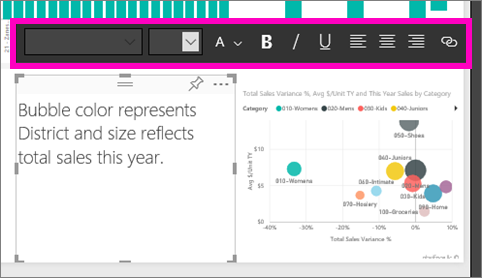
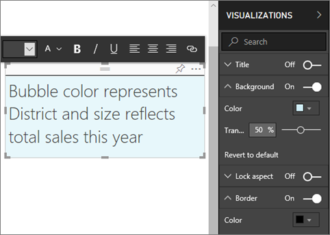

# Text boxes and shapes Power BI reports
Text boxes and shapes can be added to reports using Power BI service and Power BI Desktop. In both cases, you must have editing permissions for the report. If a report has been shared with you in Power BI service, you will not have editing permissions. 

Watch Will use Power BI Desktop to [add static images to a report](guided-learning/visualizations.yml?tutorial-step=11), and then follow the steps below to try it out yourself using Power BI service instead.
> 
> <iframe width="560" height="315" src="https://www.youtube.com/embed/_3q6VEBhGew" frameborder="0" allowfullscreen></iframe>
> 

## Add a text box to a report
1. Open a report in Editing view.

2. Place your cursor in any blank area on the report canvas and select **Text Box**.
   
   
2. Type your text into the text box and, optionally, format font, color, and text alignment. 
   
   
3. To position the text box, select the grey area at the top and drag. And to resize the text box, select and drag any of the outline handles. 
   
   

4. With the text box still selected, add additional formatting in the VISUALIZATIONS pane. In this example we've formatted the background and border. You can also create an exact size and position for a text box.  

   

5. To close the text box, select any blank space on the report canvas. 

5. Select the pin icon   to pin the text box to a dashboard. 

## Add a shape to a report
1. Place your cursor anywhere on the report canvas and select **Shapes**.
   
   
2. From the dropdown, select a shape to add it to your report canvas. Let's add an arrow to direct attention to the bubble with the highest total sales variance. 
   
   In the **Format shape** pane, customize your shape. In this example we've created a red arrow with a dark red border, rotated 90 degrees.
   
   
3. To position the shape, select the grey area at the top and drag. And to resize the shape, select and drag any of the outline handles. As with the text box, you can also create an exact size and position for a shape.

> **NOTE**: Shapes cannot be pinned to a dashboard, except as one of the visuals when you [pin a live page](service-dashboard-pin-live-tile-from-report.md). 
> 
> 

### Next steps
[Add a hyperlink to a text box](service-add-hyperlink-to-text-box.md)

[Power BI - Basic Concepts](consumer/end-user-basic-concepts.md)

More questions? [Try the Power BI Community](http://community.powerbi.com/)
