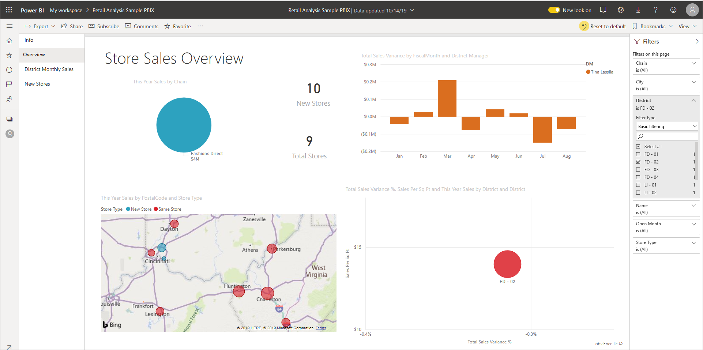
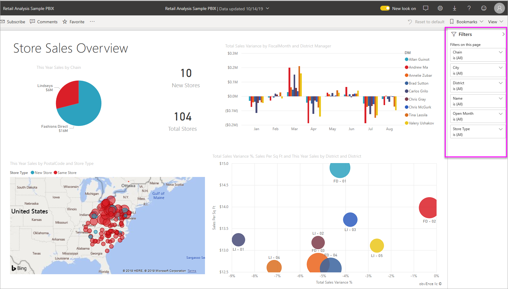
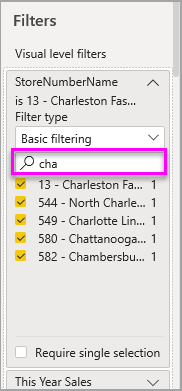
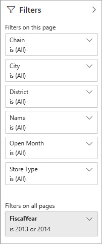
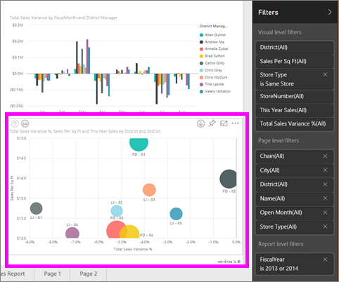
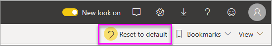
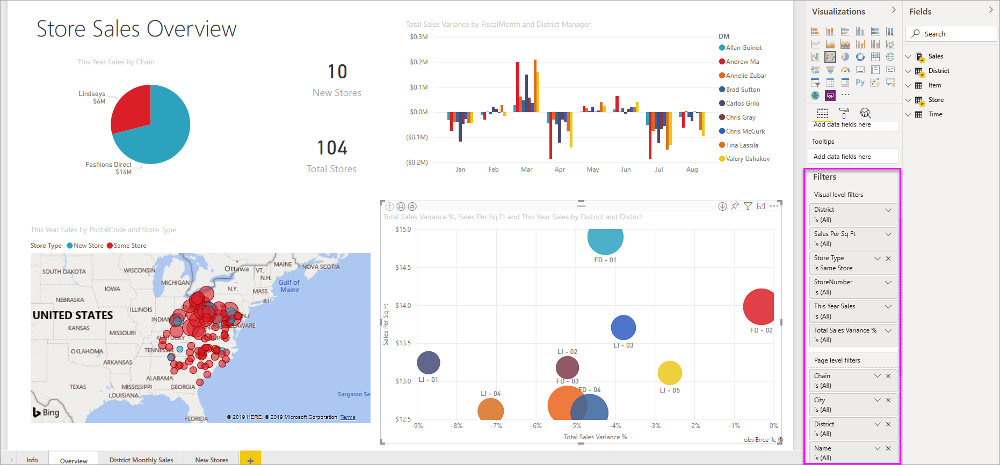

# Filters and highlighting in Power BI reports
 This article introduces you to filtering and highlighting in the Power BI service. The experience is almost exactly the same in Power BI Desktop. *Filters* remove all but the data you want to focus on. *Highlighting* isn't filtering. It doesn't remove data, but instead highlights a subset of the visible data; the data that isn't highlighted remains visible but dimmed.

There are many different ways you can filter and highlight reports in Power BI. Putting all of that information in one article would get confusing, so we've broken it into these sections:

* Introduction to filters and highlighting, the article you're reading now.
* How to [create and use filters in Editing view](power-bi-report-add-filter.md) in reports in Power BI Desktop and the Power BI service. When you have editing permissions for a report, you can create, modify, and delete filters in reports.
* How visuals [filter and highlight in a report shared with you](consumer/end-user-interactions.md), in report Reading view in the Power BI service. What you can do is more limited, but you still have a wide range of filtering and highlighting options.  
* A detailed tour of the [filter and highlighting controls available in Editing view](power-bi-report-add-filter.md) in Power BI Desktop and the Power BI service. The article takes an in-depth look at types of filters such as date and time, numeric, and text. It also covers the differences between basic and advanced options.
* After you've learned how filters and highlighting work by default, learn how to [change the way visualizations on a page filter and highlight each other](service-reports-visual-interactions.md)

**Did you know?** Power BI has a new filter experience, currently in preview. Read more about [the new filter experience in Power BI reports](power-bi-report-filter-preview.md).

## Intro to the Filters pane

You can apply filters in the **Filters** pane or by [making selections in slicers](visuals/power-bi-visualization-slicers.md) directly on the report itself. The Filters pane shows the tables and fields used in the report and the filters that have been applied, if any. 

There are four types of filters.

- **page filter** applies to all the visuals on the report page     
- **visual filter** applies to a single visual on a report page. You only see visual level filters if you've selected a visual on the report canvas.    
- **report filter** applies to all pages in the report    
- **drillthrough filter** applies to a single entity in a report    

You can search in page, visual, and report filters, in Reading or Editing view, to find and select the value you want. 

If the filter has the word **All** next to it, that means all the values in the field are included in the filter.  For example, **Chain(All)** in the screenshot below means this report page includes data about all the store chains.  On the other hand, the report-level filter **FiscalYear is 2013 or 2014** tells us that the report only includes data for the fiscal years of 2013 and 2014.

## Filters in Reading or Editing view
There are two modes for interacting with reports: [Reading view](consumer/end-user-reading-view.md) and Editing view. The filtering capabilities available to you depend on which mode you're in.

* In Editing view, you can add report, page, drillthrough, and visual filters. When you save the report, the filters are saved with the report, even if you open it in a mobile app. People looking at the report in Reading view can interact with the filters you added, but can't add new filters.
* In Reading view, you can interact with any filters that already exist in the report, and save the selections you make. You can't add new filters.

### Filters in Reading view
If you only have access to a report in Reading view, the Filters pane looks similar to this:

So this page of the report has six page-level filters and one report-level filter.

Each visual can have filters for all the fields in the visual, and a report author may add more. In the image below, the bubble chart has six filters.

In Reading view, explore the data by modifying the existing filters. The changes you make are saved with the report, even if you open the report in a mobile app. Learn how when you [take a tour of the report Filters pane](consumer/end-user-report-filter.md)

When you exit the report, your filters are saved. To undo your filtering and return to the default filtering, slicing, drill, and sorting set by the report author, select **Reset to default** from the top menubar.

### Filters in Editing view
When you have owner permissions for a report and open it in Editing view, you see that **Filters** is just one of several editing panes available.

As in Reading view, we see this page of the report has six page-level filters and one report-level filter. And by selecting the bubble chart, we'd see it has six visual level filters applied.

We can do more with filters and highlighting in Editing view. Mainly, we can add new filters. Learn how to [Add a filter to a report](power-bi-report-add-filter.md) and much more.

## Ad-hoc highlighting
Select a value or axis label in a visual to highlight the other visuals on the page. To remove the highlighting, select the value again, or select any empty space in the same visual. Highlighting is a fun way to quickly explore data impacts. To fine-tune how this type of cross-highlighting works, see [Visual interactions](service-reports-visual-interactions.md).

## Next steps

[The new filter experience in Power BI reports](power-bi-report-filter-preview.md)

[Add a filter to a report (in Editing view)](power-bi-report-add-filter.md)

[Take a tour of report filters](consumer/end-user-report-filter.md)

[Change how report visuals cross-filter and cross-highlight each other](consumer/end-user-interactions.md)

More questions? [Try the Power BI Community](http://community.powerbi.com/)

