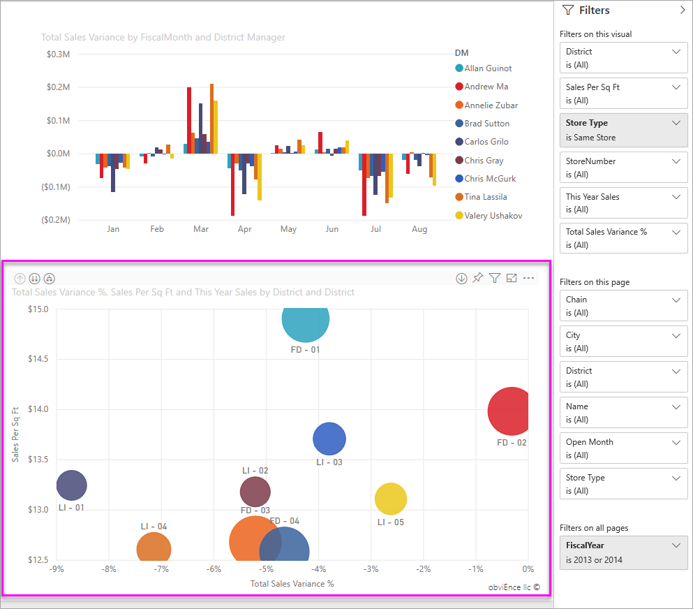

# About filters and highlighting in Power BI reports
***Filters*** remove all but the data you want to focus on.  ***Highlighting*** is not filtering since it does not remove data but instead highlights a subset of the visible data; the unhighlighted data remains visible but dimmed.

There are many different ways you can filter and highlight reports in Power BI. Putting all of that information in one article would get confusing, so we've broken it down like this:

* Introduction to filters and highlighting (the article you're reading now)
* The ways you can [create and use filters and highlighting in Editing View/reports that you own](power-bi-report-add-filter.md). When you have editing permissions for a report, you can create, modify, and delete filters and highlighting in reports.
* The ways you can [use filters and highlighting in a report shared with you or in report Reading View](service-reading-view-and-editing-view.md). What you can do is more limited, but Power BI still gives you a wide range of filtering and highlighting options.  
* [A detailed tour of the filter and highlighting controls available in Editing View](power-bi-how-to-report-filter.md) including an in-depth look at types of filters (e.g., date and time, numeric, text) and the difference between basic and advanced options.
* Now that you've learned how filers and highlighting work by default, [learn how to change the way visualizations on a page filter and highlight each other](service-reports-visual-interactions.md)

> [!TIP]
> How does Power BI knows how data is related?  It uses the relationships between the different tables and fields in the underlying [data model](https://support.office.com/article/Create-a-Data-Model-in-Excel-87e7a54c-87dc-488e-9410-5c75dbcb0f7b?ui=en-US&rs=en-US&ad=US) to make items on a report page interact with each other.
> 
> 

## Introduction to filters and highlighting in reports using the Filters pane
 This article introduces you to filtering and highlighting in Power BI service.  But the experience is almost exactly the same in Power BI Desktop.  

Filters and highlighting can be applied using the **Filters** pane or by making selections directly on the report itself (ad-hoc, see bottom of page). The Filters pane shows the tables and fields used in the report and the filters that have been applied, if any. The filters are divided up into **Page level**, **Report level**, **Drillthrough**, and **Visual level**.  You'll only see visual level filters if you've selected a visualization on the report canvas.

> [!TIP]
> If the filter has the word **All** next to it, that means that entire field is being included as a filter.  For example, **Chain(All)** in the screenshot below tells us that this report page includes data about all the store chains.  On the other hand, the report level filter of **FiscalYear is 2013 or 2014** tells us that the report only includes data for the fiscal years of 2013 and 2014.
> 
> 

## Filters in Reading view versus Editing view
There are two modes for interacting with reports: [Reading view and Editing view](service-reading-view-and-editing-view.md).  And the filtering capabilities available to you depend on which mode you're in.

* In Editing View, you can add report, page, drillthrough, and visual filters. When you save the report, the filters are saved with the report -- even if you open it in a mobile app. People looking at the report in Reading View can interact with the filters you added, but cannot add new filters.
* In Reading View, you can interact with any filters that already exist in the report, and save the selectiona you make.  But you won't be able to add new filters.

### The Filters pane in Reading View
If you only have access to a report in Reading View, the Filters pane looks similar to this:

So this page of the report has 6 page level filters and 1 report level filter.

To see if any visual level filters exist, select a visual. In the image below, the bubble chart has 6 filters applied.

In Reading View, explore the data by modifying the existing filters. The changes you make are saved with the report, even if you open the report in a mobile app. Learn how in the article [Reading view and Editing view in Power BI service](service-reading-view-and-editing-view.md)

### The Filters pane in Editing View
When you have owner permissions for a report and open it in Editing View, you see that **Filters** is just one of several editing panes available.

As in Reading View (above) we see that this page of the report has 6 page level filters and 1 report level filter. And by selecting the bubble chart, we'd see it has 6 visual level filters applied.

But in Editing View, there is so much more that we can do with filters and highlighting. The main difference being that we can add new filters. Learn how to do this and so much more in the article [Add a filter to a report](power-bi-report-add-filter.md)

## Ad-hoc filtering and highlighting
Select a field on the report canvas to filter and highlight the rest of the page. Select any empty space in the same visual to remove it. This type of filtering and highlighting is a fun way to quickly explore data impacts. To fine-tune how this type of cross-filtering and cross-highlighting works, see [Visual interactions](service-reports-visual-interactions.md).

When you exit the report, your changes are saved. To undo your filtering, and return to the default filtering, slicing, drill, and sorting set by the report author -- select **Reset to default** from the top menubar.

## Next steps
[Interact with filters and highlighting (in Reading View)](service-reading-view-and-editing-view.md)

[Add a filter to a report (in Editing View)](power-bi-report-add-filter.md)

[Take a tour of report filters](power-bi-how-to-report-filter.md)

[Change how report visuals cross-filter and cross-highlight each other](service-reports-visual-interactions.md)

Read more about [reports in Power BI](service-reports.md)

More questions? [Try the Power BI Community](http://community.powerbi.com/)

