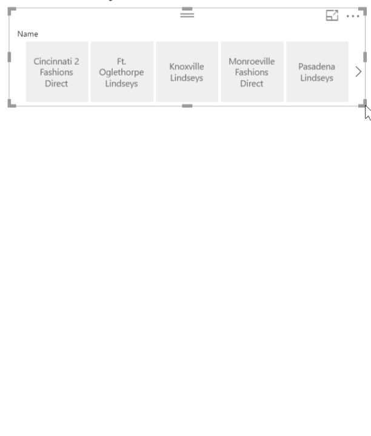
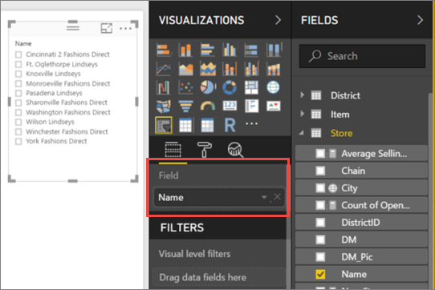
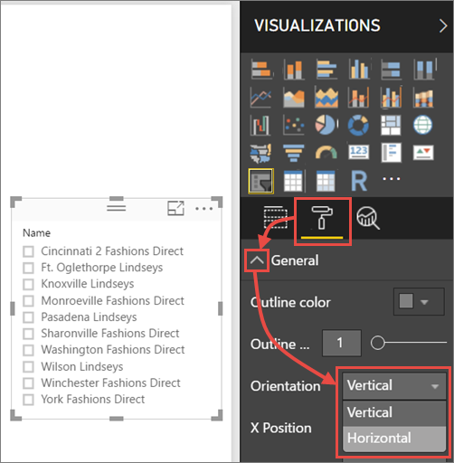
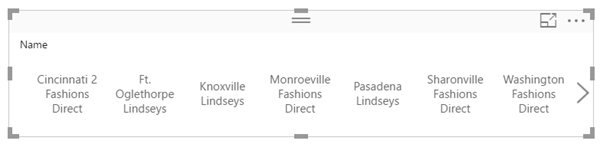
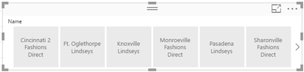
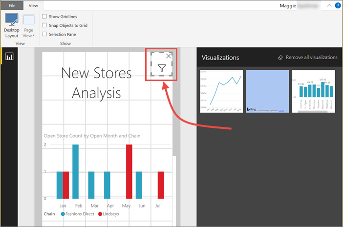

# Create a responsive slicer you can resize in Power BI (Preview)

Responsive slicers resize to fit any space on your report. With responsive slicers, you can resize them to different sizes and shapes, from horizontal to square to vertical, and the values in the slicer rearrange themselves as you do. In Power BI Desktop and in the Power BI service, you can make horizontal slicers and date/range slicers responsive. Date/range slicers also have improved touch areas so it’s easier to change them with a fingertip. You can make responsive slicers as small or as large as you want; they also resize automatically to fit well on reports in the Power BI service and also in the Power BI mobile apps. 

## Create a slicer

The first step to creating a dynamic slicer is to create a basic slicer. 

1. Select the **Slicer** icon  in the **Visualizations** pane.
2. Drag the field you want to filter on to **Field**.

    

## Convert to a horizontal slicer

1. With the slicer selected, in the **Visualizations** pane select the **Format** tab.
2. Expand the **General** section, then for **Orientation**, select **Horizontal**.

     

1.  You'll probably want to make it wider, to show more values.

     

## Make it responsive and experiment with it

This step is easy. 

1. Right under **Orientation** in the **General** section of the **Format** tab, slide **Responsive (Preview)** to **On**.  

    

1. Now you can play with it. Drag the corners to make it short, tall, wide, and narrow. If you make it small enough, it becomes just a filter icon.

    

## Add it to a phone report layout

In Power BI Desktop, you can create a phone layout for each page of a report. If a page has a phone layout, it displays on a mobile phone in portrait view. Otherwise, you need to view it in landscape view. 

1. On the **View** menu, select **Phone Layout**.

     
    
1. Drag all the visuals you want in the phone report to the grid. When you drag the responsive slicer, make it the size you want -- in this case, just a filter icon.

    

Read more about creating [reports optimized for the Power BI mobile apps](desktop-create-phone-report.md).

## Make a time or range slicer responsive

You can follow the same steps to make a tile or range slicer responsive. After you set **Responsive** to **On**, you notice a few things:

- Visuals optimize the order of input boxes depending on the size allowed on the canvas. 
- Data-element display is optimized to make the slicer as usable as possible, based on the size it’s allowed on the canvas. 
- New round handlebars on the sliders optimize touch interactions. 
- When a visual becomes too small to be useful, it becomes an icon representing the visual type in its place. To interact with it, just double-tap to open it in focus mode. This saves valuable space on the report page without losing the functionality.

## Next steps

- [Tutorial: Slicers in the Power BI service](power-bi-visualization-slicers.md)
- More questions? [Try asking the Power BI Community](http://community.powerbi.com/)