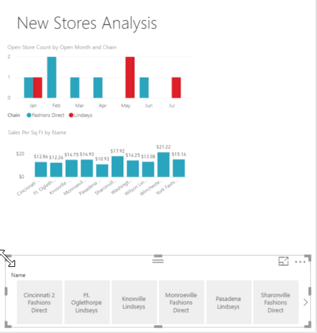

# Create a responsive slicer you can resize in Power BI
With the **responsive slicer**, you can resize it to a variety of different sizes and shapes, from horizontal to square to vertical, and the selections in the slicer rearrange themselves as you do. You can create them in Power BI Desktop and in the Power BI service.

## Create a slicer

The first step to creating a dynamic slicer is to create a basic slicer. 

1. Select the **Slicer** icon  in the **Visualizations** pane.
2. Drag the field you want to filter on to **Field**.

    

## Convert it to a horizontal slicer

## Make it a responsive slicer

## Limitations and considerations

## Next steps