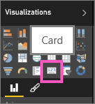
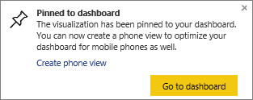

# Create a big number tile from a Power BI report
Sometimes a single number is the most important thing you want to track in your Power BI dashboard, such as total sales, market share year over year, or total opportunities. You can create a big number tile by [asking a question in the Q&A box](power-bi-visualization-big-number.md), or in a Power BI report. This article explains how to create one in a report.

1. Create a [dashboard](service-dashboards.md) and [get data](service-get-data.md).
   
   If you want data to practice on, [download the Retail Analysis sample](sample-retail-analysis.md). 
2. Open the report in [Editing view](service-reading-view-and-editing-view.md).
3. In the report, find a page with some blank space, or [add a new page to the report](power-bi-report-add-page.md).
4. In the Fields list, select the number field you want to display.
   
   In this example, **Open Store count** in the **Store** table. Power BI creates a column chart with the one number.
   
   
5. In the Visualizations pane, select the Card icon.
   
   
6. Hover over the card and select the pin icon  to add the tile to the dashboard. 
   
   
7. Pin the tile to an existing dashboard or to a new dashboard. 
   
   * Existing dashboard: select the name of the dashboard from the dropdown.
   * New dashboard: type the name of the new dashboard.
8. Select **Pin**.
   
   A Success message (near the top right corner) lets you know the visualization was added, as a tile, to your dashboard.
   
   
9. Select **Go to dashboard**. There, you can [edit and move](service-dashboard-edit-tile.md) the pinned visualization.

## Next steps
[Dashboard tiles in Power BI](service-dashboard-tiles.md)

[Dashboards in Power BI](service-dashboards.md)

[Power BI - Basic Concepts](service-basic-concepts.md)

More questions? [Try the Power BI Community](http://community.powerbi.com/)

