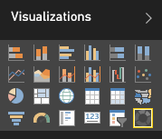

# Doughnut charts in Power BI (Tutorial)
A  doughnut chart is similar to a pie chart in that it shows the relationship of parts to a whole. The only difference is that the center is blank and allows space for a label or icon.

## Create a doughnut chart
To follow along, sign in to Power BI and select **Get Data** \> **Samples** \> **Retail Analysis Sample** \> **Connect**. 

1. From the dashboard, select the **Total Stores** tile to open the "Retail Analysis Sample" report.
2. Select **Edit Report** to open the report in Editing View.
3. [Add a new report page](power-bi-report-add-page.md).
4. Create a Doughnut chart that displays this year's sales by category.
   
   * From the **Fields** pane, select **Sales** \> **Last Year Sales**.
   * Convert to a doughnut chart. If Last Year Sales is not in the **Values** area, drag it there.
     
       
   * Select **Item** \> **Category** to add it to the **Legend** area. 
     
       

## Considerations and troubleshooting
* The sum of the doughnut chart values must add up to 100%.
* Too many categories make it difficult to read and interpret.
* Doughnut charts are best used to compare a particular section to the whole, rather than comparing individual sections with each other. 

## Next steps
[Reports in Power BI](service-reports.md)

[Visualization types in Power BI](power-bi-visualization-types-for-reports-and-q-and-a.md)

[Visualizations in Power BI reports](power-bi-report-visualizations.md)

[Power BI - Basic Concepts](service-basic-concepts.md)

More questions? [Try the Power BI Community](http://community.powerbi.com/)

