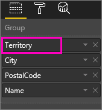

# Drill down in a visualization in Power BI
## Drill down requires a hierarchy
When a visual has a hierarchy, you can drill down to reveal additional details. For example, you might have a visualization that looks at Olympic medal count by a hierarchy made up of sport, discipline, and event. By default, the visualization would show medal count by sport -- gymnastics, skiing, aquatics, and so on. But, because it has a hierarchy, selecting one of the visual elements (such as a bar, line, or bubble), would display an increasingly more-detailed picture. Select the **aquatics** element to see data for swimming, diving, and water polo.  Select the **diving** element to see details for springboard, platform, and synchronized diving events.

You can add hierarchies to reports you own, but not to those shared with you.
Not sure which Power BI visualizations contain a hierarchy?  Hover over a visualization and if you see these drill controls in the top corners, your visualization has a hierarchy.

    
   

Dates are an unique type of hierarchy. When you add a date field to a visualization, Power BI automatically adds a time hierarchy that contains year, quarter, month, and day. For more information see [Visual hierarchies and drill-down behavior](guided-learning/visualizations.yml#step-18) or watch the video below.

  <iframe width="560" height="315" src="https://www.youtube.com/embed/MNAaHw4PxzE?list=PL1N57mwBHtN0JFoKSR0n-tBkUJHeMP2cP" frameborder="0" allowfullscreen></iframe>

> [!NOTE]
> To learn how to create hierarchies using Power BI Desktop, watch the video [How to create and add hierarchies](https://youtu.be/q8WDUAiTGeU)
> 
> 

## Two methods to drill down
You have two ways to drill down (and up) in your visualization.  Both are described in this article. Both methods accomplish the same thing, so use whichever one you enjoy most.

> [!NOTE]
> To follow along, [open the Retail Analysis sample](sample-datasets.md) in Power BI service and create a treemap that looks at **Total Units This Year** (Values) by **Territory**, **City**, **PostalCode**, and **Name** (Group).  
> 
> 

## Method One for drill down
This method uses the drill icons that appear in the top corners of the visualization itself.

1. In Power BI, open a report in [Reading view or Editing view](service-reading-view-and-editing-view.md). Drill requires a visualization with a hierarchy. 
   
   A hierarchy is shown in the animation below.  The visualization has a hierarchy made up of territory, city, postal code, and city name. Each territory has one or more cities, each city has one or more postal codes, and so on. By default, the visualization displays only the territory data, because *Territory* appears first in the list.
   
   
2. To enable drill down, select the arrow icon in the upper-right corner of the visualization. When the icon is dark, drill is enabled. If you don't turn on drill, selecting a visual element (such as a bar or bubble) will cross-filter the other charts on the report page.    
   
   
3. To drill down **one field at a time**, select one of the elements in your visualization. In a bar chart, this means clicking one of the bars. In a treemap, this means clicking one of the **leaves**. Notice that the title changes as you drill down and back up again. In this animation, it changes from "Total Units This Year by Territory" to "Total Units This Year by Territory and City" and then to "Total Units This Year by Territory, City and Postal Code" to "Total Units This Year by Territory, City, Postal Code, and Name. And to drill back up, select the **Drill Up** icon  in the upper-left corner of the visualization as shown below.
   
   
4. To drill down ***all fields at once***, select the double arrow in the upper-left corner of the visualization.
   
   
5. To drill back up, select the up arrow in the upper-left corner of the visualization.
   
   

## Method Two for drill down
This method uses the **Explore** dropdown from the top Power BI menu bar.

1. In Power BI, open a report in [Reading view or Editing view](service-reading-view-and-editing-view.md). Drill requires a visualization with a hierarchy. 
   
   A hierarchy is shown in the image below.  The visualization has a hierarchy made up of territory, city, postal code, and city name. Each territory has one or more cities, each city has one or more postal codes, and so on. By default, the visualization displays only the territory data, because *Territory* appears first in the list.
   
   
2. To enable drill down, select a visualization to make it active and from the Power BI top menu bar, select **Explore** > **Drill Down**. The drill-down icon in the upper-right corner of the visualization changes to a black background.   
   
   
3. Once enabled, drill down one field at a time by selecting one of the treemap leaves. In this example, the territory named **NC** is selected to see total units sold this year in North Carolina by city.
   
   
4. To drill down all fields at once, select **Explore** > **Show Next Level**.
   
   
5. To drill back up, select **Explore** > **Drill Up**.
   
   

6. To see the data in use for creating the visual, select **See data**. The data displays in a pane underneath the visual. This pane remains as you continue drilling through the visual. For more information, see [Show data used to create the visual](service-reports-show-data.md).

## Understanding the hierarchy axis and hierarchy group
You can think of the hierarchy axis and the hierarchy group as the mechanisms that you can use to increase and decrease the granularity of data you want to view. Any data that can be organized into categories and subcategories qualifies as having a hierarchy. This, of course, includes dates and times.

You can create a visualization in Power BI to have a hierarchy by selecting one or more data fields to add to either the **Axis** well or the **Group** well, along with the data you want to examine as data fields in the **Values** well. You'll know if your data is hierarchical if Drill Mode icons appear on the upper-left and right corners of your visualization. 

Essentially, its convenient to think of two types of hierarchical data:
- Date and time data - If you have a data field with a DateTime data type, you already have hierarchical data. Power BI automatically creates a hierarchy for any data field whose values can be parsed into a [DateTime](https://msdn.microsoft.com/library/system.datetime.aspx) structure. You only need to add one DateTime field to the **Axis** or **Group** well.
- Categorical data - If your data is derived from collections that contain sub-collections, or otherwise has rows of data that share common values, you have hierarchical data.

Power BI enables you to expand by one or by all subsets. You can drill down through your data to see a single subset at each level, or to see all of the subsets simultaneously at each level. For example, you can drill down for a specific year, or see all of the results for each year as you go down the hierarchy. 
Conversely, you can drill up in the same manner.

The following sections describe drilling down from the highest view, middle view, and lowest view.

### Hierarchical data and time data
For this example, follow along with the [Retail Analysis sample](sample-datasets.md) and create a stacked column chart visualization that looks at **Month** (Axis) by **TotalSales** (Values).  

Even though the Axis data field is **Month**, it still creates a **Year** category in the **Axis** well. This is because Power BI provides the full DateTime structure for all the values it reads. The top of the heirarchy shows data for the year.

With Drill Down mode on, click the bar in the chart to go down one level of the hierarchy. You will see three bars for the data of the quarters available. 
Then from the upper left icons, choose **Expand all down one level of the hierarchy**. Then do that again to get to the lowest level of the hierarchy, that shows results for each month.

Apart from the visualization, we can see the hierarchy reflected in the data rendered for each report. The following table shows the results of **Show Data** in a report drilling down from a single month or all months. 

Notice that the data is the same for quarter and year reports, but after you drill down to the level of detail specified for **Values**, you can see how the single report gets more specific and the "all months" report has more data.

|Expand mode|Year|Quarter|Month|Day|
| ---|:---:|:---:|:---:|---|
|Single|||||
|All|||||

### Hierarchical category data
Data that has modeled from collections and sub-collections is hierarchical. 
A good example of this is location data. Consider a table in a data source whose columns are Country, State, City, and Zip. Data that shares the same Country, State, and City are hierarchical.

For this example, follow along with the [Retail Analysis sample](sample-datasets.md). Create a stacked column chart visualization that looks at **Total Units This Year** (Values) by **Territory**, **City**, **PostalCode**, and **Name** (Group).  

With Drill Down mode on, from the upper left icons, choose **Expand all down one level of the hierarchy** three times.
You should be at the lowest level of the hierarchy.

Apart from the visualization, we can see the hierarchy reflected in the data rendered for each report. The following table shows the results of **Show Data** in a report drilling down for a single territory or all territories. As you drill down, you can see how the single report gets more specific and the "all territories" report has more data.

| Expand mode|Territory|City|Postal|Name|
| ---|:---:|:---:|:---:|---|
|Single|||||
|All|||||

## Considerations and limitations
* If adding a date field to a visualization does not create a hierarchy, it may be that the "date" field is not actually saved as a date. If you own the dataset, open it in *Data* view in Power BI Desktop, select the column that contains the date, and in the Modeling tab, change the **Data Type** to **Date** or **Date/Time**. If the report has been shared with you, contact the owner to request the change.  
  
  

## Next steps
[Visualizations in Power BI reports](power-bi-report-visualizations.md)

[Power BI reports](service-reports.md)

[Power BI - Basic Concepts](service-basic-concepts.md)

More questions? [Try the Power BI Community](http://community.powerbi.com/)

