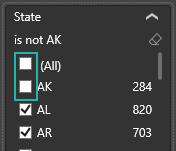
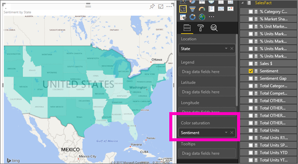

# Filled maps (choropleths) in Power BI
A filled map uses shading or tinting or patterns to display how a value differs in proportion across a geography or region.  Quickly display these relative differences with shading that ranges from light (less-frequent/lower) to dark (more-frequent/more).    

## What is sent to Bing
Power BI integrates with Bing to provide default map coordinates (a process called geo-coding). When you create a map visualization in Power BI service or Power BI Desktop, the data in the **Location**, **Latitude**, and **Longitude** buckets (that is being used to create that visualization) is sent to Bing.

You, or your administrator, may need to update your firewall to allow access to the URLs Bing uses for geocoding.  Those URLs are:
* https://dev.virtualearth.net/REST/V1/Locations
* https://platform.bing.com/geo/spatial/v1/public/Geodata
* https://www.bing.com/api/maps/mapcontrol

For more information about the data being sent to Bing, and for tips to increase your geo-coding success, see [Tips and tricks for map visualizations](power-bi-map-tips-and-tricks.md).

## When to use a filled map
Filled maps are a great choice:

* to display quantitative information on a map.
* to show spatial patterns and relationships.
* when your data is standardized.
* when working with socioeconomic data.
* when defined regions are important.
* to get an overview of the distribution across the geographic locations.

### Prerequisites
- Power BI service or Power BI Desktop
- Sales and Marketing Sample

To follow along, the tutorial uses Power BI service, not Power BI Desktop.

## Create a basic filled map
In this video, Kim creates a basic map and converts it to a filled map.

<iframe width="560" height="315" src="https://www.youtube.com/embed/ajTPGNpthcg" frameborder="0" allowfullscreen></iframe>

1. To create your own filled map, [download the Sales and Marketing sample](sample-datasets.md) by signing in to Power BI and selecting **Get Data \> Samples \> Sales and Marketing \> Connect**.
2. When the success message appears, select **View dataset**.

   
3. Power BI opens a blank report canvas in [Editing View](service-interact-with-a-report-in-editing-view.md).

    
4. From the Fields pane, select the **Geo** \> **State** field.    

   
5. [Convert the chart](power-bi-report-change-visualization-type.md) to a filled map. Notice that **State** is now in the **Location** well. Bing Maps uses the field in the **Location** well to create the map.  The location can be a variety of valid locations: countries, states, counties, cities, zip codes or other postal codes etc. Bing Maps provides filled map shapes for locations around the world. Without a valid entry in the Location well, Power BI cannot create the filled map.  

   
6. Filter the map to display only the continental United States.

   a.  At the bottom of the Visualizations pane, look for the **Filters** area.

   b.  Hover over **State** and click the expand chevron  
   

   c.  Place a checkmark next to **All** and remove the checkmark next to **AK**.

   
7. Select **SalesFact** \> **Sentiment** to add it to the **Color saturation** well. The field in the **Color saturation** well controls the map shading.  
   
8. The filled map is shaded in green, with light green representing the lower sentiment numbers and dark green representing the higher, more-positive sentiment.  Here I've highlighted the state of Wyoming (WY) and see that Sentiment is very good, 74.  
   
9. [Save the report](service-report-save.md).

## Highlighting and cross-filtering
For information about using the Filters pane, see [Add a filter to a report](power-bi-report-add-filter.md).

Highlighting a Location in a Filled Map cross-filters the other visualizations on the report page... and vice versa.

To follow along, copy and paste your Filled map onto the **Sentiment** page of the *Sales and Marketing* report.

1. On the filled map, select a state.  This highlights the other visualizations on the page. Selecting **Texas**, for example, shows me that Sentiment is 74, Texas is in the Central District \#23, and that most of the sales volume comes from the Moderation and Convenience segments.   
   
2. On the line chart, toggle between **No** and **Yes**. This filters the Filled Map to show Sentiment for VanArsdel and for VanArsdel's competition.  
   

## Considerations and troubleshooting
Map data can be ambiguous.  For example, there's a Paris, France, but there's also a Paris, Texas. Your geographic data is probably stored in separate columns – a column for city names, a column for state or province names, etc. – so Bing may not be able to tell which Paris is which. If your dataset already contains latitude and longitude data, Power BI has special fields to help make the map data unambiguous. Just drag the field that contains your latitude data into the Visualizations \> Latitude area.  And do the same for your longitude data.  

If you have permissions to edit the dataset in Power BI Desktop, watch this video for help addressing map ambiguity.

<iframe width="560" height="315" src="https://www.youtube.com/embed/Co2z9b-s_yM" frameborder="0" allowfullscreen></iframe>

If you do not have access to latitude and longitude data, [follow these instructions to update your dataset](https://support.office.com/article/Maps-in-Power-View-8A9B2AF3-A055-4131-A327-85CC835271F7).

For more help with Map visualizations, see [Tips and tricks for map visualizations](power-bi-map-tips-and-tricks.md).

## Next steps
[Add the filled map as a dashboard tile (pin the visual)](service-dashboard-tiles.md)    
 [Add a visualization to a report](power-bi-report-add-visualizations-i.md)  
 [Visualization types in Power BI](power-bi-visualization-types-for-reports-and-q-and-a.md)    
 [Change the type of visualization being used](power-bi-report-change-visualization-type.md)      
More questions? [Try the Power BI Community](http://community.powerbi.com/)
