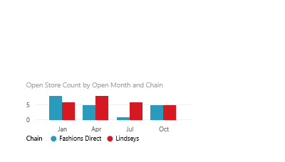

# Move and resize a visualization in a report
## Open the report
In Power BI, open a report in [Editing View](service-reading-view-and-editing-view.md) and [create a visualization](power-bi-report-add-visualizations-i.md) if your report doesn't already have one.

## Move the visualization
* Select (left-click) any area of the visualization and drag to the new location. 

## Resize the visualization
* Select the visualization to display the border and click and drag the dark frame handles to resize.  
  

## Select Focus mode to see more detail.
* Hover over the visualization and select the Focus mode icon.
  

## Next steps
[Resize a visualization on a dashboard](service-dashboard-edit-tile.md)

[Display a dashboard tile in full-screen mode (In-focus)](service-focus-mode.md)

[Visualizations in Power BI reports](power-bi-report-visualizations.md)

[Power BI - Basic Concepts](service-basic-concepts.md)  

More questions? [Try the Power BI Community](http://community.powerbi.com/)

