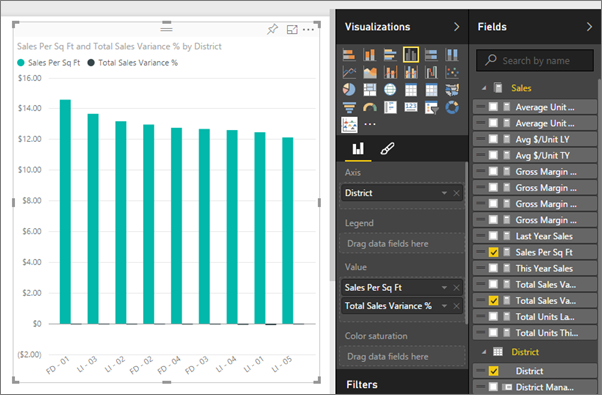
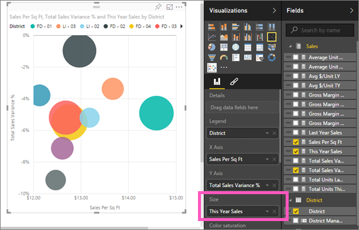

# Scatter charts and bubble charts in Power BI (Tutorial)
A scatter chart always has two value axes to show one set of numerical data along a horizontal axis and another set of numerical values along a vertical axis. The chart displays points at the intersection of an x and y numerical value, combining these values into single data points. These data points may be distributed evenly or unevenly across the horizontal axis, depending on the data.

A bubble chart replaces the data points with bubbles, with the bubble *size* representing an additional dimension of the data.

## When to use a scatter chart or bubble chart
### Scatter charts are a great choice:
* to show relationships between 2 (scatter) or 3 (bubble) **numerical** values.
* To plot two groups of numbers as one series of xy coordinates.
* instead of a line chart when you want to change the scale of the horizontal axis    
* to turn the horizontal axis into a logarithmic scale.
* to display worksheet data that includes pairs or grouped sets of values. In a scatter chart, you can adjust the independent scales of the axes to reveal more information about the grouped values.
* to show patterns in large sets of data, for example by showing linear or non-linear trends, clusters, and outliers.
* to compare large numbers of data points without regard to time    The more data that you include in a scatter chart, the better the comparisons that you can make.

### Bubble charts are a great choice:
* if your data has 3 data series that each contain a set of values.
* to present financial data.  Different bubble sizes are useful to visually emphasize specific values.
* to use with quadrants.

## Create a scatter chart
<iframe width="560" height="315" src="https://www.youtube.com/embed/PVcfPoVE3Ys?list=PL1N57mwBHtN0JFoKSR0n-tBkUJHeMP2cP" frameborder="0" allowfullscreen></iframe>

1. Open the Retail Analysis Sample in [Editing View](service-interact-with-a-report-in-editing-view.md) and [add a new report page](power-bi-report-add-page.md).
2. From the Fields pane, select **Sales** > **Sales Per Sq Ft** and **Sales** > **Total Sales Variance %**.
3. From the Fields pane, select **District > District**.
   
    
4. Convert to a scatter chart. In the Visualization pane, select the Scatter chart icon.
   .
5. Drag **District** from **Details** to **Legend**.
   
    

We now have a scatter chart that plots Total Sales Variance % along the Y axis, and plots Sales Per Square Feet along the X axis.  The data point colors represent districts.  Now let's add a third dimension.

## Create a bubble chart
1. From the Fields pane, drag **Sales** > **This Year Sales** > **Value** to the **Size** area. 
   
   
2. Hover over a bubble.  The size of the bubble reflects the value of **This Year Sales**.
   
    
3. Optionally, [format the visualization colors, labels, titles, background, and more](service-getting-started-with-color-formatting-and-axis-properties.md).

## Considerations and Troubleshooting
### **Your scatter chart has only one data point**
Does your scatter chart have only one data point that aggregates all the values on the X and Y axes?  Or maybe it aggregates all the values along a single horizontal or vertical line?

Add a field to the **Details** area to tell Power BI how to group the values. The field must be unique for each point you want to plot.  
Like a simple row number or ID field:

Or if you don’t have that in your data, create a field that concatenates your X and Y values together into something unique per point:

To create a new field, [use the Power BI Desktop Query Editor to add an Index Column](powerbi-desktop-add-custom-column.md) to your dataset.  Then add this column to the **Details** area of your visualization.

## Next steps
 [Visualization types in Power BI](power-bi-visualization-types-for-reports-and-q-and-a.md)

[Try it out -- it's free!](https://powerbi.com/)  

More questions? [Try the Power BI Community](http://community.powerbi.com/)

