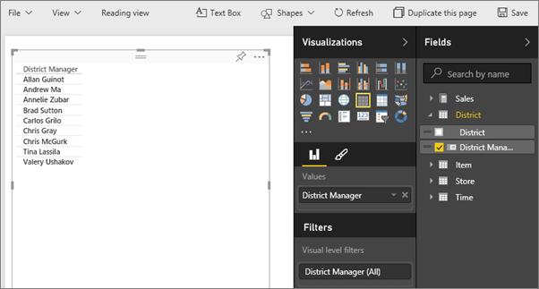
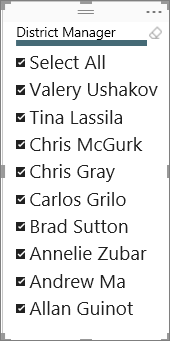

# Slicers in Power BI service (Tutorial)
Your VP of Sales wants to be able to look at a number of metrics, for the entire division and for each individual District Manager. She could create a separate report page for each manager, or she could use a slicer. A slicer narrows the portion of the dataset shown in the other visualizations on the page.  Slicers are an alternate way of filtering.

## When to use a slicer
Slicers are a great choice in the following situations.

* To display commonly-used or important filters on the report canvas for easier access.
* To make it easier to see the current filtered state without having to open a drop-down list to find the filtering details.
* When you want to hide columns you don't need but still be able to use them to filter - this makes for narrower, cleaner tables.
* To create more focused reports - since slicers are floating objects you can put them next to the interesting part of the report you want your users to focus on.

## Create a slicer
<iframe width="560" height="315" src="https://www.youtube.com/embed/zIZPA0UrJyA" frameborder="0" allowfullscreen></iframe>

1. Open the [Retail Analysis Sample](sample-retail-analysis.md) in [Editing View](service-interact-with-a-report-in-editing-view.md) and [add a new report page](power-bi-report-add-page.md).
2. From the Fields pane, select **District > District Manager**.
   
    
3. Convert the visualization to a slicer. In the Visualizations pane, select the slicer icon.
   
    

## Format the slicer
1. With the slicer selected, in the Visualizations pane, select the paint roller icon  to display the Format options.
2. Select **General > Outline color** and choose dark blue and change the **Weight** to **6**.
   
    
3. Under **Selection Controls**, by default, **Select All** is **Off** and **Single Select** is **On**. This means that I have to use the CTRL key to select more than one name at a time. Turn **Select All** to **On** and **Single Select** to **Off**.
   
    
   
   * Notice that the slicer now has a **Select All** option at the top of the list. Toggle **Select All** to select all of the names or to select none of the names.
   * And you can now select more than one name without having to use the CTRL key.
4. Under **Items**, increase the text size to 14pt.  We want to be sure that our colleagues notice this slicer.
5. Lastly, set **Font color** to a dark red.  This will distinguish the selected names from the unselected names in our slicer.
   
    
6. Have fun exploring the other options available for slicers.

## Use the slicer in a report
1. Add some additional visualizations to the report page or open the [Retail Analysis sample report](sample-retail-analysis.md) and select the **District Monthly Sales** tab.
   
    
2. Slice the report page for Carlos. Notice how the other visualizations update to reflect these selections.
   
    
3. Sort the slicer alphabetically by District Manager last name.  Select the ellipses (...) in the top right corner of the slicer and choose **District Manager**.
   
    
   
    

## Control what effect the slicer has on other visuals on the page
Do you want the slicer to only filter some of the visuals on the report page?  Use the **Visual interactions** control to set this up.

**NOTE**: If you don't see **Visual Interactions**, look for its icon instead . If you don't see either, make sure you are in report [Editing view](service-reading-view-and-editing-view.md).

1. Select the slicer to make it active and, from the menu bar, choose **Visual interactions**.
   
    
2. Filter controls will appear above all the other visuals on the page. If the slicer should filter a visual, select the **Filter** icon.  If the slicer should have no effect on the visual, select the **None** icon.
   
    

For more information, see [Visual interactions in a Power BI report](service-reports-visual-interactions.md).

## Considerations and troubleshooting slicers in Power BI
There are a few limitations to using slicers in Power BI, which are the following:

1. Slicers do not support input fields.
2. A single slicer cannot be used across an entire report. A slicer only impacts the current page.
3. Slicers cannot be pinned to a dashboard.
4. Drilldown is not supported for slicers.    
5. Slicers do not support Visual level filters.

Do you have ideas for how to improve Power BI? [Submit an idea](https://ideas.powerbi.com/forums/265200-power-bi-ideas).

## See also
 [Add a visualization to a report](power-bi-report-add-visualizations-i.md)

 [Visualization types in Power BI](power-bi-visualization-types-for-reports-and-q-and-a.md)

 [Power BI - Basic Concepts](service-basic-concepts.md)

[Try it out -- it's free!](https://powerbi.com/)

More questions? [Try the Power BI Community](http://community.powerbi.com/)

