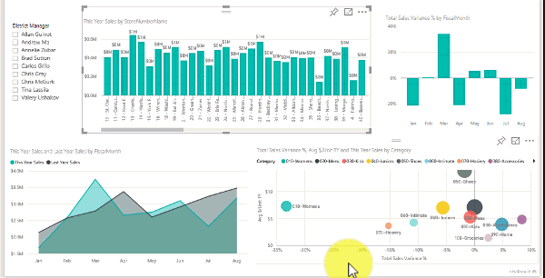

# Slicers in Power BI (Tutorial)
A VP of Sales wants to be able to look at several metrics for the entire division and for each individual District Manager. She could create a separate report for each manager, or she could use a slicer. A slicer narrows the portion of the dataset shown in other visualizations in a report. Slicers are an alternate way of filtering.

This tutorial uses the free [Retail Analysis Sample](sample-retail-analysis.md) to walk you through creating and formatting a slicer and using it to filter a report. Have fun discovering ways to format and use slicers. 

## When to use a slicer
Slicers are a great choice when you want to:

* Display commonly-used or important filters on the report canvas for easier access.
* Make it easier to see the current filtered state without having to open a drop-down list. 
* Filter by columns that are unneeded and hidden in the data tables.
* Create more focused reports by putting slicers next to important visuals.

Power BI slicers have the following limitations:

- Slicers do not support input fields.
- Slicers cannot be pinned to a dashboard.
- Drilldown is not supported for slicers.
- Slicers do not support visual level filters.

## Create a slicer
<iframe width="560" height="315" src="https://www.youtube.com/embed/zIZPA0UrJyA" frameborder="0" allowfullscreen></iframe>

1. In Power BI Desktop or Power BI service, open the [Retail Analysis Sample](sample-retail-analysis.md) in [Editing View](service-interact-with-a-report-in-editing-view.md) and [add a new report page](power-bi-report-add-page.md).
2. From the Fields pane, under District, select **District Manager** to create a new visualization.
    

3. Select the Slicer icon  in the Visualizations pane to convert the new visualization to a slicer. 
    

You can also select the slicer icon directly to create a new slicer, and then select or drag the data field to the Field box to populate it.

>[!NOTE]
>Depending on the field data type, list, dropdown, or range slicer types may be available. To change the slicer type, click the carat dropdown in the top right corner of the slicer and select a different type. Formatting and sorting options are different depending on slicer type. See [Use the numeric range slicer in Power BI Desktop](desktop-slicer-numeric-range.md) for information about range slicers.

>[!TIP]
>You can sort list slicer items by data field values. To sort slicer items, select the ellipses (...) in the top right corner of the slicer and choose **Sort by District Manager**. The setting toggles between ascending and descending alphabetical values. 

## Format the slicer
Apply visual formatting to the District Manager slicer.
1. With the slicer selected, in the Visualizations pane, select the Format icon  to display the formatting controls. 
    
2. Click the dropdown arrows next to each category to display and edit the options. 

### General options
1. Select red under **Outline color** and change **Outline weight** to "2". This sets the color and thickness of the Header and Items outlines or underlines, when enabled. 
    
    >[!NOTE]
    >Any border around the slicer itself is set under Border. 
    
2. Under Orientation, Vertical is the default, creating a vertical list slicer with selection boxes before the items. Choose **Horizontal** to produce a slicer with horizontally arranged items. Horizontal orientation can produce various arrangements of buttons or tiles, depending on slicer size and shape and item formatting. 
    
    
    
3. Turn on **Responsive** layout, which changes the size and arrangement of horizontal slicer items depending on viewscreen size. At a very small size, the slicer becomes a filter icon. 
    
    
    >[!NOTE]
    >Responsive layout changes may override Heading and Item formatting that you set. 
4. Set the slicer position and size with numeric precision under **X Position**, **Y Position**, **Width**, and **Height**, or move and resize the slicer directly on the canvas, to produce different item sizes and arrangements. 
    

See [Create a responsive slicer you can resize in Power BI](power-bi-slicer-filter-responsive.md) for more about horizontal orientation and responsive formatting.

### Selection Controls options
1. Show Select All is Off by default. Turn it to **On** to add a Select All item to the slicer that selects or deselects all items when toggled. When all items are selected, clicking one item deselects it, allowing an "is-not"-type filter. 
    
2. Single Select is On by default. Clicking each item selects it, and holding down the CTRL key while clicking selects multiple items. Turn Single Select to **Off** to allow selecting multiple items without holding down the CTRL key. Clicking each item again deselects it. 

### Header options
The header is On by default, showing the data field name at the top of the slicer. 
1. Format header text to make the **Font color** red, **Text size** 14 pt, and **Font family** Arial Black. 
2. Under Outline, choose **Bottom only** to produce an underline with the size and color that you set under General options. 

### Item options
1. Format item text and background to make the **Font color** black, **Background** light red, **Text size** 10 pt, and **Font family** Arial. 
2. Under Outline, choose Frame to draw a border around each item with the size and color you set under General options. 
    
    
    
    >[!TIP]
    >- With Horizontal orientation, deselected items show the chosen text and background colors while selected items use the system default, usually black backgrounds with white text. 
    >- With Vertical orientation, items always show the set colors. Selection boxes are always black when selected. 

### Other formatting options
The other formatting options are off by default. When turned **On**: 
- **Title:** Adds and formats a title (in addition to and independent of the header) at the top of the slicer. 
- **Background:** Adds a background color to the overall slicer and sets its transparency.
- **Lock aspect:** Retains the shape of the slicer if it is resized.
- **Border:** Adds a 1-pixel border around the slicer and sets its color. (This slicer border is separate from and unaffected by the General Outline settings.) 

## Sync slicers to other pages
Starting with the February 2018 Power BI update, you can now sync and use a slicer on all pages in a report. 
1. With the District Manager slicer selected, on the View menu, select **Sync slicers** in Power BI Desktop, or turn on **Sync slicers pane** in Power BI service. The Sync Slicers pane appears. 
    
    
    
2. Select the report pages you want the slicer to sync with (left column), or click **Add to all** to select all report pages. 
3. Select the pages on which you want the slicer control to be visible (right column). 

>[!TIP]
>Although a synced slicer is initially identical on all pages, you can move, size, and format it differently on different pages.  

## Control the page visuals affected by a slicer
By default, a slicer on a report page affects all other visualizations on that page. Use **Visual interactions** to prevent some page visualizations from being affected.

1. With the slicer selected:
    - In Power BI Desktop, click the Format menu under Visual Tools and select **Edit interactions**.
    - In Power BI service, drop down **Visual interactions** from the menu bar and turn on **Edit interactions**. 
Filter controls appear above all the visuals on the page. 

2. Select the **None** icon above a visual to make the slicer stop filtering it. Select the **Filter** icon to make the slicer start filtering the visual again. 

See [Visual interactions in a Power BI report](service-reports-visual-interactions.md) for more information about editing interactions.

## Next steps
[Try it out -- it's free!](https://powerbi.com/)

Do you have ideas for how to improve Power BI? [Submit an idea](https://ideas.powerbi.com/forums/265200-power-bi-ideas).

More questions? [Try the Power BI Community](http://community.powerbi.com/)

[Add a visualization to a report](power-bi-report-add-visualizations-i.md)

[Visualization types in Power BI](power-bi-visualization-types-for-reports-and-q-and-a.md)

[Power BI - Basic Concepts](service-basic-concepts.md)

