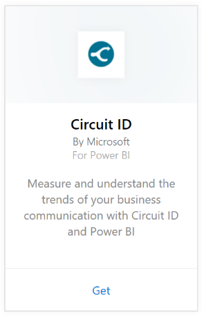

# Connect to Circuit ID with Power BI
Analyzing your communication data from Circuit ID is easy with Power BI. Power BI retrieves your data, then builds a default dashboard and related reports based on that data. After you have created the connection, you can explore your data and customize the dashboard to meet your needs. Data is automatically refreshed every day.

Connect to the [Circuit ID content pack](https://app.powerbi.com/getdata/services/circuitid) for Power BI.

## How to connect
1. Select **Get Data** at the bottom of the left navigation pane.
   
    
2. In the **Services** box, select **Get**.
   
    
3. Select **Circuit ID** \> **Get**.
   
    
4. For Authentication Method, select Basic and provide your username and password. Then hit Sign In.
   
    
5. After Power BI imports the data you will see a new dashboard, report, and dataset in the left navigation pane. New items are marked with a yellow asterisk.
   
    

**What Now?**

* Try [asking a question in the Q&A box](service-q-and-a.md) at the top of the dashboard
* [Change the tiles](service-dashboard-edit-tile.md) in the dashboard.
* [Select a tile](service-dashboard-tiles.md) to open the underlying report.
* While your dataset will be schedule to refreshed daily, you can change the refresh schedule or try refreshing it on demand using **Refresh Now**

### See also
[Get started with Power BI](service-get-started.md)

[Get Data for Power BI](service-get-data.md)

