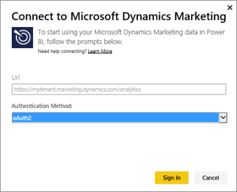

# Connect to Microsoft Dynamics Marketing with Power BI
The Microsoft Dynamics Marketing content pack for Power BI allows you to easily access and analyze your data from Dynamics Marketing. The content pack uses a descriptive model on top of the OData feed, with all the entities and measures needed such as Programs, Campaigns, Marketing Contacts and Companies, Leads, Lead Interactions and Lead Scoring, Email Marketing Messages and Web Sites, behavioral observations, budgets, financial transactions, performance KPIs, and many more. 

Connect to [Dynamics Marketing content pack](https://app.powerbi.com/getdata/services/microsoft-dynamics-marketing) for Power BI.

Note: You need to specify a valid OData URL for a Dynamics Marketing instance (the content pack will not work with an on-premises CRM version). See additional requirements below.

## How to connect
1. Select Get Data at the bottom of the left navigation pane.
   
    
2. In the **Services** box, select **Get**.
   
    
3. Select **Microsoft Dynamics Marketing** \> **Get**.
   
   
4. Provide the OData URL associated with your account.  This will be in the form  "https://[instance\_name].marketing.dynamics.com/analytics."
   
   
5. When prompted, provide your credentials (this step might be skipped if you are already signed in with your browser). For Authentication Method, enter **oAuth2** and click **Sign In**:
   
   
6. After connecting, you'll see a Dynamics Marketing dashboard, populated with your own data. The yellow asterisks mark the new items in the left navigation pane.
   

**What Now?**

* Try [asking a question in the Q&A box](service-q-and-a.md) at the top of the dashboard
* [Change the tiles](service-dashboard-edit-tile.md) in the dashboard.
* [Select a tile](service-dashboard-tiles.md) to open the underlying report.
* While your dataset will be schedule to refreshed daily, you can change the refresh schedule or try refreshing it on demand using **Refresh Now**

## System requirements
* You need to specify a valid OData URL for a Dynamics Marketing instance (the content pack will not work with an on-premises CRM version).  
* An administrator must enable the OData endpoint in the site settings. The address of the OData endpoint can be found by navigating to **Home \> Settings \> Site Settings** in the section **Organization Data Service**.  The OData URL has the format:  https://[instance\_name].marketing.dynamics.com/analytics  
* The user account/identity that you use to access Microsoft Dynamics Marketing must be the same as the one you are signed up for using with Power BI. When logging into Microsoft Dynamics Marketing, you will be auto-signed in with the same identity you are using for Power BI. If you wish to sign into Microsoft Dynamics Marketing with a different account, please register as a Power BI user using that other account. We hope to resolve this issue in an upcoming release.   

## Troubleshooting
If you see a "Login failed" message when trying to connect to your Dynamics CRM acount, confirm that you're signing into Power BI with the same account you would use to access the CRM Online OData feed. Try logging into the feed in your browser as well, to test it there.

Ask your admin to confirm the correct OData URL, and that the OData endpoint is enabled.

Check the version of Dynamics Marketing you're using - there were additional fixes made in 18.0 and 18.1, if you're still hitting issues and are on an older version, you may considered upgrading.

If you're still having issues, open a support ticket to reach the Power BI team:

* While in the Power BI app, select the question mark \> **Contact Support**.
* From the Power BI Support site (where you're reading this article), select **Contact Support** on the right side of the page.

#### See also
[Get Data for Power BI](service-get-data.md)

[Get Started with Power BI](service-get-started.md)

