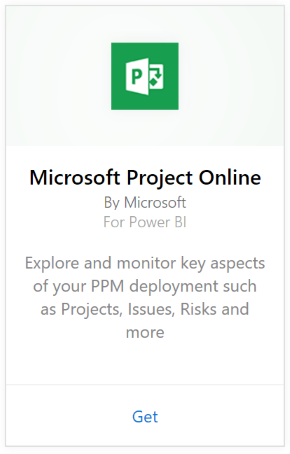

# Connect to Project Online with Power BI
Microsoft Project Online is a flexible online solution for project portfolio management (PPM) and everyday work. Project Online enables organizations to get started, prioritize project portfolio investments and deliver the intended business value. The Project Online content pack for Power BI allows you to explore your project data with out-of-box metrics such as portfolio status and project compliance.

Connect to the [Project Online content pack](https://app.powerbi.com/getdata/services/project-online) for Power BI.

## How to connect
1. Select **Get Data** at the bottom of the left navigation pane.
   
    
2. In the **Services** box, select **Get**.
   
   
3. Select **Microsoft Project Online** \> **Get**.
   
   
4. In the **Project Web App URL** text box, enter the URL for the Project Web Add (PWA) you want to connect to and hit **Next**. Note this may differ from the example if you have a custom domain.
   
    
5. For Authentication Method, select **oAuth2** \> **Sign In**. When prompted, enter your Project Online credentials and follow the authentication process.
   
    
6. You’ll see a notification indicating your data is loading. Depending on the size of your account this may take some time. After Power BI imports the data you will see a new dashboard, report, and dataset in the left navigation pane. This is the default dashboard that Power BI created to display your data. You can modify this dashboard to display your data in any way you want.
   
   

**What Now?**

* Try [asking a question in the Q&A box](service-q-and-a.md) at the top of the dashboard
* [Change the tiles](service-dashboard-edit-tile.md) in the dashboard.
* [Select a tile](service-dashboard-tiles.md) to open the underlying report.
* While your dataset will be schedule to refreshed daily, you can change the refresh schedule or try refreshing it on demand using **Refresh Now**

### See also
[Get started in Power BI](service-get-started.md)

[Get data in Power BI](service-get-data.md)

