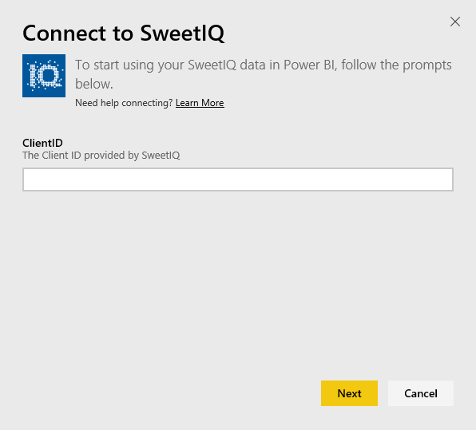
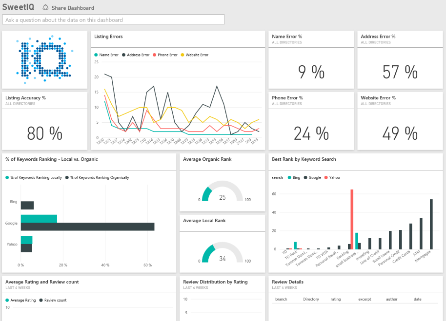

# Connect to SweetIQ with Power BI
The Power BI content pack pulls data from your SweetIQ account and generates set of out of box content allowing you to easily explore your data. Use the SweetIQ content pack to analyze data about your locations, listings, ratings and reviews. The data is set to refresh daily ensuring the data you're monitoring is up to date.

Connect to the [SweetIQ content pack](https://app.powerbi.com/groups/me/getdata/services/sweetiq) for Power BI.

## How to connect
1. In the navigation pane on the left, click **Get Data.**
   
    
2. Select **SweetIQ** and click **Get.**
   
    
3. Provide your SweetIQ Client ID. This is typically an alpha-numeric value. For more details on finding this value, see below.
   
    
4. Select **Key** authentication type and provide your Sweet IQ API Key. This is typically an alpha-numeric value. For more details on finding this value, see below.
   
    
5. Power BI will start loading your data, which may take some time depending on the size of data in your account. Once the load has completed, you'll see a new dashboard, report and dataset in the left navigation pane.
   
    

**What Now?**

* Try [asking a question in the Q&A box](service-q-and-a.md) at the top of the dashboard
* [Change the tiles](service-dashboard-edit-tile.md) in the dashboard.
* [Select a tile](service-dashboard-tiles.md) to open the underlying report.
* While your dataset will be schedule to refreshed daily, you can change the refresh schedule or try refreshing it on demand using **Refresh Now**

## Finding parameters
The Client ID and API key for this content pack is not the same as your SweetIQ username and password.

Select a Client ID for one of the clients your account has access to. You can find the list of clients under "Client Management" in your SweetIQ account.

Talk to your administrator for your API key, to access the data for specific client.

### See also
[Get started with Power BI](service-get-started.md)

[Get Data for Power BI](service-get-data.md)

