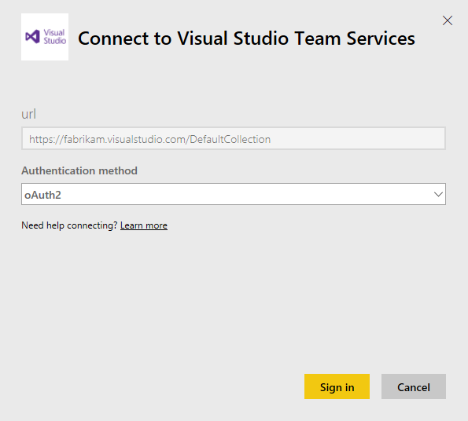

# Connect to Visual Studio Team Services with Power BI
Use the Visual Studio Team Services content pack for Power BI to gain insights into your git and TFVC team projects. After you make a connection, your data comes to you automatically on a dashboard and in reports. 

Connect to the [Visual Studio Team Services content pack](https://app.powerbi.com/getdata/services/visual-studio-online) or read more about the [Visual Studio Team Services integration](https://powerbi.microsoft.com/integrations/visual_studio_online) with Power BI.

Note: This content pack requires access to an account which has OAuth enabled. More details on requirements below.

## How to connect
1. Select **Get Data** at the bottom of the left navigation pane.  
    
2. In the **Services** box, select **Get**.  
    
3. Select the **Visual Studio Team Services** content pack and click **Get**.     
   
4. Enter information about your Visual Studio Team Services account. See details on [finding these parameters](#FindingParams) below.
   
   
   
   Your account name is the front of your URL to visualstudio.com:    
   
   
   Your Project name is the name you see at the top of every page in Visual Studio Team Services:  
   
5. Authenticate with Visual Studio Team Services using oAuth2. You may see a VSTS sign-in dialog box as a result. 
   
   > **Important:** Some Visual Studio Team Services deployments don't support oAuth2.  Follow the guidance in the Troubleshooting section if sign-in fails.
   > 
   > 
   
   
6. Follow the Visual Studio Team Services authentication screens to grant the Visual Studio content pack for Power BI permission to your team project data.   
   
7. After you connect to your Visual Studio Team Services project, you see a new dashboard, report, and dataset in the left navigation pane. New items are marked with a yellow asterisk \*.  
    

**What Now?**

* Try [asking a question in the Q&A box](service-q-and-a.md) at the top of the dashboard
* [Change the tiles](service-dashboard-edit-tile.md) in the dashboard.
* [Select a tile](service-dashboard-tiles.md) to open the underlying report.
* While your dataset will be schedule to refreshed daily, you can change the refresh schedule or try refreshing it on demand using **Refresh Now**

## What's included
Visual Studio Team Services in Power BI provides a variety of tables and fields for your reporting. The full list of what is included in the content pack can be found here:  <https://www.visualstudio.com/get-started/report/vso-pbi-whats-available-vs>

## System requirements
* Access to the Visual Studio Team Services account with permission to collect the data using the REST API.  
* Permission granted to the “Power BI” application during initial connection. To disconnect Power BI and remove its authorization to access your Visual Studio Team Services account, you can Revoke access in Visual Studio Team Services. See <https://www.visualstudio.com/get-started/setup/change-application-access-policies-vs>.  

More details can be found at <https://www.visualstudio.com/en-us/get-started/report/connect-vso-pbi-vs>.

## Finding parameters
Your account name is the front of your URL to visualstudio.com:    
    

Your Project name is the name you see at the top of every page in VSTS:  
    

You can also use wildcards to select multiple projects. For example, you can select all projects by entering just “\*”, or all projects that start with “Azure” by entering “Azure\*”.

## Troubleshooting
When you attempt to login to your Visual Studio Team Services, you may receive a Login failed message.

There are two common reasons why you may not be able to authenticate successfully:

1) You are signed in with a personal account, rather than your work or school account  

2) Your Visual Studio Team Services deployment does not support oAuth 

**Signing in with your work or school account**  
If you see this issue, it may mean that you’re already authenticated with Visual Studio Team Services under a different account than the account you’re trying to load data from – for example, if you have connected to Visual Studio Team Services with a personal Microsoft account, and connected to PowerBI with a work or school account.

To resolve this:  

* Cancel out of the configuration dialog  
* Sign out of Visual Studio Team Services under your personal account  
* Sign into Visual Studio Online using your work or school account  
* Restart the “Get data” process above 

Connecting with your work or school account (Azure Active Directory / AAD):  
    

If you see this dialog, and you want to connect with your work or school account (Azure Active Directory), make sure to click the link on the left to sign in with that account – do not provide your AAD credentials on the right hand side, as that is expecting a Microsoft account (your personal account).

**Visual Studio Team Services deployments that do not support oAuth2**  
Your VSTS administrator may have disabled oAuth for your Visual Studio Team Services deployment.  When this happens you will not be able to use the Visual Studio content pack for Power BI at this time. 

### See also
* [Get started with Power BI](service-get-started.md)
* [Get data](service-get-data.md)

